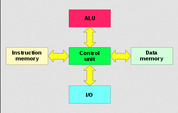

**Main Source:**

- **[Harvard architecture — Wikipedia](https://en.wikipedia.org/wiki/Harvard_architecture)**

**Harvard architecture** is another computer architecture design, the characteristics is that it has separate storage for program's instructions and data. In contrast, [von Neumann](/computer-organization-and-architecture/von-neumann#architecture) architecture combines them both.

  
Source: https://en.wikipedia.org/wiki/Harvard_architecture

Characteristics of Harvard architecture:

- **Separate Instruction and Data Memory**: The Harvard architecture has physically distinct memory systems for storing instructions and data. Instructions are stored in an instruction memory, data is stored in a separate data memory. The distinct memory system makes the addressing different, the same address in the data memory corresponds to a different value in the instruction memory.

- **Independent Access**: The instruction memory and data memory have separate buses or pathways for accessing their respective memories. In contrast, von Neumann architecture uses a shared bus for both. By using separate buses, this allows simultaneous and independent access to instructions and data, enabling the CPU to fetch and process instructions while simultaneously accessing or manipulating data.

- **Parallel Reading/Writing**: In von Neumann architecture, the CPU is required to wait for some time during memory access operations, because they are located in the same place. While in Harvard architecture, the CPU can read and write data simultaneously.

In general, the Harvard architecture is used in scenarios where cache is not reliable. This occurs when there is a need for frequent data modifications over time, making the previously stored data irrelevant. Another situation where the Harvard architecture is advantageous is when performance is important, having concurrent access to both instructions and data will be beneficial.

### Modified Harvard Architecture

The modified Harvard architecture combines the original Harvard architecture with some element of von Neumann architecture. The ability of treating data and instruction in the same way can be beneficial in some cases, such as the scenario where the data is from user input and that input will be used to generate code.

Modified Harvard architecture has less strict separation between the instructions and data. Some modifications are:

- **Split-cache**: Modified Harvard architecture has a cache system for both instruction and data memory. The instructions and data caches are combined, which means they have a single address space. Although they may share the same physical cache memory, they are organized and accessed as separate caches.
- **Data-Instruction Interchangeability**: We can treat data in the data memory as instruction, and treat instruction in instruction memory as data. This allows for instruction generated from data, or instruction driven by data.
