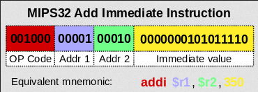
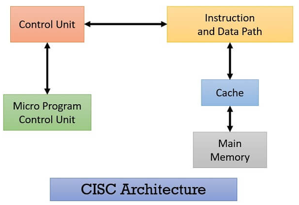
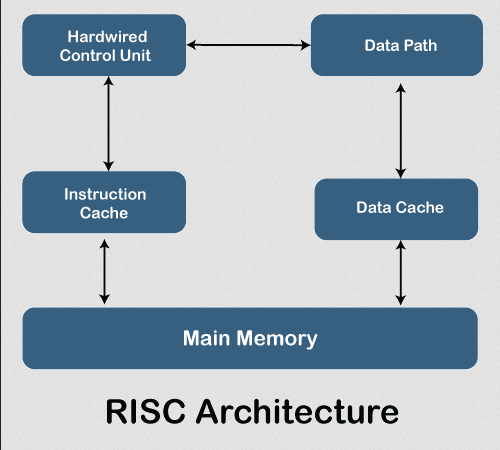

**Main Source:**

- **[Instruction set architecture — Wikipedia](https://en.wikipedia.org/wiki/Instruction_set_architecture)**
- **[Complex instruction set computer — Wikipedia](https://en.wikipedia.org/wiki/Complex_instruction_set_computer)**
- **[x86 — Wikipedia](https://en.wikipedia.org/wiki/X86)**
- **[Reduced instruction set computer](https://en.wikipedia.org/wiki/Reduced_instruction_set_computer)**
- **[ARM architecture family — Wikipedia](https://en.wikipedia.org/wiki/ARM_architecture_family)**

**Instruction Set Architecture (ISA)** is an interface between the hardware and software of a computer system. It is an abstract model of computer that specify the format of instructions, in which the processing unit (CPU) can execute.

ISA is not just a set of instructions, but also encompasses the overall design and structure of a computer system. It includes the instruction formats, data types, memory organization, addressing modes, and other architectural features that define how the hardware and software components interact.

### Instructions

Each instruction in an ISA has a specific format that defines how the instruction is encoded in binary. The format typically consist of two, the **opcode**, or operation code, which is the instruction to be performed, and some number **operands**, which are the value to be operated on. The operands can be [registers](/computer-organization-and-architecture/registers-and-ram#registers), immediate value, or memory address if accessing data from memory.

  
Source: https://en.wikipedia.org/wiki/Instruction_set_architecture#Instruction_encoding

It's important to note that ISA is just an interface, different hardware may have different way to implement it, but it must suit the specification.

Instructions have specific types, each serving a specific purpose:

- **Arithmetic Instructions**: Perform arithmetic operations such as addition, subtraction, multiplication, and division on data values.
- **Logical Instructions**: Perform logical operations such as bitwise AND, OR, XOR, and shift operations on data values.
- **Data Transfer Instructions**: Move data between registers and memory or between different memory locations.
- **Load/Store Instructions**: Load data from memory into registers or store data from registers into memory.
- **Control Flow Instructions**: Control the program flow, including branching and jumping to different parts of the program based on conditions or unconditional transfers.
- **System Instructions**: Access privileged operations and interact with the underlying operating system.
- **Floating-Point Instructions**: It is considered as a more complex instruction, it may take several steps on normal computers. This instruction performs a floating-point arithmetic operations on floating-point data.

Other ISA specification:

- **Registers**: A set of registers that the processor uses to store and manipulate data during execution. This may include the number of registers, their sizes, and their specific purposes (e.g., general-purpose registers, special-purpose registers).

- **Addressing Modes**: This defines the different addressing modes to specify how memory operands are accessed. Common addressing modes include direct addressing, immediate addressing, register addressing, indirect addressing, and indexed addressing. The addressing mode determines how the memory addresses or offsets are calculated and how the data is fetched from or stored into memory.
  - **Direct Addressing**: Operand of an instruction directly specifies the memory address where the data is located.
  - **Immediate Addressing**: Operand of an instruction is a constant or immediate value.
  - **Register Addressing**: Operand of the instruction is a register or a set of registers.
  - **Indirect Addressing**: Operand of an instruction contains a memory address that points to the actual memory location where the data is stored. In other word, the operand is not the actual value, the operand is another memory location which contains the memory address of the actual value (similar to concept of [pointers](/computer-and-programming-fundamentals/memory#pointer--reference)).
  - **Indexed Addressing**: Operand of an instruction is a memory address that is calculated by adding an index value to a base address, where the index value can be a constant or stored in a register.

### Classification

ISA can be classified in many ways, one of them is based on architecture complexity, which is CISC and RISC.

#### 32-bit vs 64-bit Computing

Before knowing the classification, it's important to know about 32-bit and 64-bit computing. When we say refer to the term 32-bit or 64-bit computer, it refers to how large is the data the computer processes in one go. The processor of a 32-bit computer can work with data in 32-bit chunks, meaning it can process and manipulate data in units of 32 bits at a time. Similarly, with 64-bit computer, it can process in a chunk of 64-bit.

The number of bit in the computer also determine the size of memory. Memory is accessed by referring its addresses, the length of its addresses depend on how large is the memory is. If the memory has a size of 4 GB or $2^{32}$ bit, it must have $2^{32}$ unique memory address as well. To be able to encode all different memory address ranging from $0$ to $2^{32}$, the memory address length must be the maximum amount, which is 32 length.

In conclusion, 32-bit computer can only have maximum of $2^{32}$ bit memory or 4 GB, and 64-bit computer can only have maximum of $2^{64}$ bit memory or 18.4 million TB.

#### CISC

**Complex Instruction Set Computer (CISC)** is a computer architecture where a single instruction can execute multiple simple operation (e.g., loading from memory or arithmetic operation), or executing complex tasks in a single instruction.

CISC architectures aim to reduce the number of instructions required to perform a particular task, which can be advantageous in certain situations. CISC instructions typically have a variable length and can encompass several micro-operations within a single instruction.

So, instead of having a single instruction that only loads from memory or adding number between two registers, a single instruction can perform them both.

For example, consider an instruction called "HIGH_LEVEL_ADD" can be:

1. Load a value from memory into a register.
2. Perform an arithmetic operation between two registers.
3. Store the result back to memory.

By just using `HIGH_LEVEL_ADD R1, [R2], R3`, we can load a value from memory pointed by the address stored in register R2, into register R1, performs arithmetic operation between the values in registers R1 and R3 and storing the result back to memory, all in one instruction.

Composing multiple simple operation to a more complex operation provide a level of abstraction, which simplify programming for a particular task. However, the complexity of CISC instructions can make hardware design and instruction decoding more challenging.

CISC architectures often utilize **microcode** to implement complex instructions. Microcode is a low-level, machine-specific code that breaks down complex instructions into a sequence of simpler micro-operations. These micro-operations are executed by the processor's control unit to carry out the desired tasks.

CISC is said to be "hardware-based", because they rely on specialized hardware components and microcode to execute complex instructions efficiently.

  
Source: https://binaryterms.com/cisc-processors.html

##### x86

**x86** refers to a family of computer processor architectures that are based on the Intel 8086 microprocessor. The x86 architecture defines a specific set of instructions and programming conventions that processors compatible with the x86 family must support.

x86 is based on CISC design philosophy, which is characterized by capable of doing multiple low-level operations or complex instructions in a single instruction. The number of bit for x86 architecture can vary, for example, the **x86-16** is the 16-bit processor that implements the x86 architecture. **IA-32** is the 32-bit version, and **x86-64**, which is also known as x64 AMD64, Intel64, is the 64-bit version.

There are many processors that implements the x86 architecture:

- **x86-16**: Originated from the Intel 8086 and 8088 processors, which were the first members of the x86 family. The x86-16 architecture features a 16-bit data bus and a 20-bit address bus, allowing it to address up to 1 MB of memory. This implementation was commonly used in early personal computers and operating systems, such as MS-DOS.
- **IA-32**: It was introduced with the Intel 80386 processor (often referred to as the 386). IA-32 processors were widely used in desktop and server systems, and they supported various operating systems like Windows, Linux, and BSD.
- **x86-64**: Popular processor such as AMD Ryzen and Intel Core i7. It introduced 64-bit registers, expanded memory addressing capabilities, and support for larger amounts of physical memory. They also maintained backward compatibility with 32-bit x86 software, allowing both 32-bit and 64-bit applications to run on x86-64 processors. x86-64 is currently the most prevalent implementation of the x86 architecture and is widely used in desktops, laptops, servers, and data centers.

#### RISC

**Reduced Instruction Set Computer (RISC)** is a type of computer architecture that emphasizes simplicity and efficiency in the design of the instruction set. In contrast, CISC combine low-level operation into a single instruction, RISC might require multiple instruction just to execute a single instruction.

Characteristics of RISC:

- **Load-Store Architecture**: This is an ISA that divides instruction into two categories, which are memory access and ALU operations. Memory access is when data is loaded or stored between memory and registers, while ALU operations consist of arithmetic and logical operations which is operated on data stored in registers.
- **Simple Encoding & Fixed-Length Instructions**: RISC architectures often use fixed-length instruction formats, where each instruction is a uniform size. This simplifies the instruction-fetch and decode stages of the processor pipeline.
- **Pipeline-Friendly Design**: Because RISC architectures are typically simple, they are pipeline-friendly, meaning that instructions can be executed in a pipeline with multiple stages, allowing for efficient and overlapping execution of different instructions.
- **Register-Rich Design**: RISC architectures typically have many general-purpose registers available for storing intermediate results and operands. This reduces the need for memory accesses, also simpler addressing modes, and predictable instruction times.

RISC is typically hardware-friendly and more software-based. The simplification of instruction allows for easier decoding and execution of instructions in hardware, which reduce the complexity of the hardware. RISC often encourage on software-based implementation such as compiler optimizations. The simplified instruction set provide a clear guidelines for code generation, RISC architectures allow compilers to generate efficient code that can take advantage of the architecture's features.

  
Source: https://www.javatpoint.com/risc-vs-cisc

##### ARM

**Advanced RISC Machine (ARM)** is a family of RISC architectures. Due to the design philosophy of RISC, ARM architectures are widely used in various embedded systems, mobile devices, and other low-power applications.

Example of ARM processors:

- 32-bit ARM Processors:

  - **ARM Cortex-A7**: Low-power and cost-sensitive applications.
  - **ARM Cortex-A9**: Mid-range performance for smartphones and embedded systems.
  - **ARM Cortex-A15**: High-performance processor for smartphones, tablets, and networking devices.
  - **ARM11**: Previous-generation processor used in smartphones, feature phones, and embedded systems.

- 64-bit ARM Processors:

  - **ARM Cortex-A53**: Power-efficient processor commonly used in smartphones and tablets.
  - **ARM Cortex-A57**: High-performance processor often paired with Cortex-A53 for a balance of power efficiency and performance.
  - **ARM Cortex-A72**: Advanced processor with high performance and efficiency for flagship devices.
  - **ARM Cortex-A73**: Successor to Cortex-A72, offering improved performance and power efficiency.
