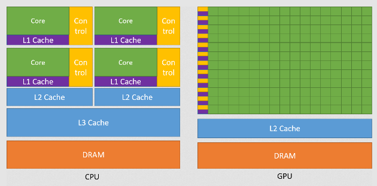
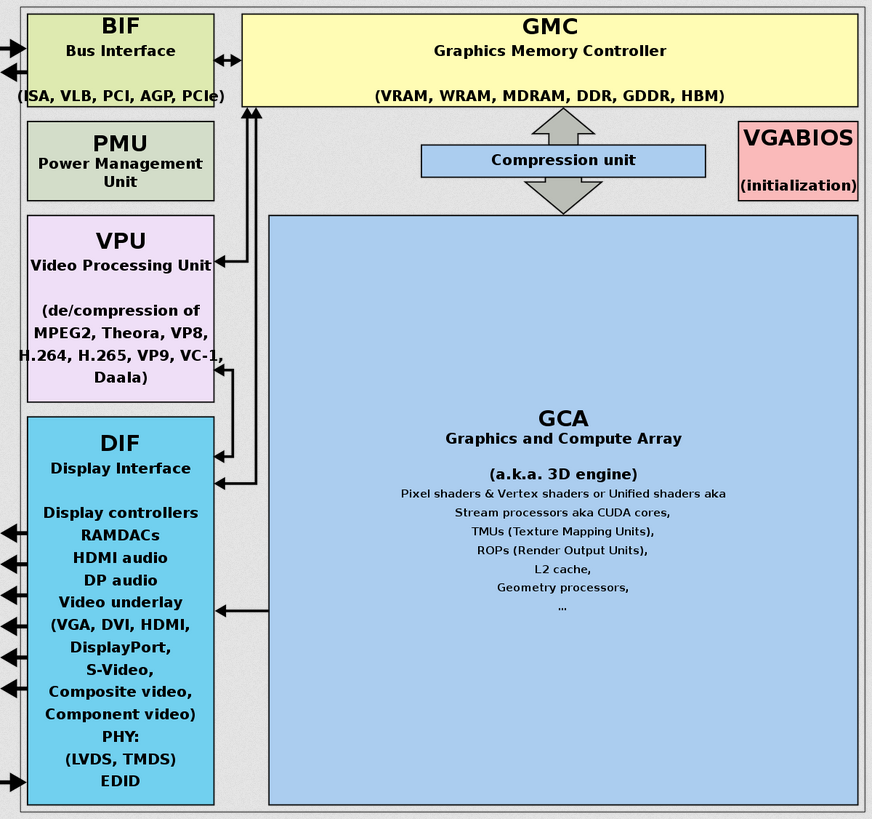

**Main Source :**

- **[Graphics processing unit - Wikipedia](https://en.wikipedia.org/wiki/Graphics_processing_unit)**
- **[Graphics Processor Unit (GPU) - Teach Computer Science](https://teachcomputerscience.com/graphics-processor-unit/)**
- **[Why an “if-else” statement (in GPUs code) will cut the performance in half - stackoverflow](https://stackoverflow.com/questions/45734138/why-an-if-else-statement-in-gpus-code-will-cut-the-performance-in-half)**

**Graphics Processing Unit (GPU)** is a specialized processor designed to handle and accelerate the rendering, creation, and manipulation of images, videos, and graphics data.

Some aspects of GPU that makes it specialized :

- **Parallel Processing** : GPU are designed with many cores that can execute multiple tasks simultaneously. In contrast, CPU has less core, but each is more powerful. The parallel architecture enables GPUs to process data in parallel, making them highly efficient for tasks that can be broken down into smaller computational units.

- **Dedicated Memory** : Some GPU have their own dedicated memory called **VRAM (Video RAM)** or **GDDR (Graphics Double Data Rate)** memory. This memory is optimized for high-speed data access and is used to store textures, frame buffers, and other graphics-related data.

- **Graphics Rendering Optimization** : GPUs are specifically optimized for graphics rendering tasks. They have dedicated hardware components, such as texture mapping units, rasterizers, and shader cores, that accelerate the [rendering pipeline](/computer-graphics/gpu-pipeline).

  
Source : https://docs.nvidia.com/cuda/cuda-c-programming-guide/index.html

Other than graphics processing, GPU is also used for other tasks that involves a lot of computation that can be done on parallel such as [neural networks](/deep-learning/neural-network).

### GPU Components

GPU consists of several components :

- **Graphics and Compute Array (GCA)** : GCA contains the core processing unit of a GPU. It consists of multiple streaming multiprocessors (SM) or compute units that perform parallel computations.
- **Compression Unit** : Some GPUs incorporate compression units that can compress and decompress data to reduce memory bandwidth requirements. This can help improve performance by reducing memory bottlenecks and improving memory access efficiency.
- **Graphics Memory Controller (GMC)** : GMC manages the interaction between the GPU and its dedicated graphics memory. It handles tasks such as memory allocation, data transfer, and memory bandwidth management.
- **VGA BIOS** : VGA BIOS is a firmware component stored on the GPU. It provides low-level initialization and configuration routines for the GPU during system boot-up. It is responsible for setting up the GPU's initial state and ensuring compatibility with the system's display capabilities.
- **Bus Interface** : Bus Interface is the component that connects the GPU to the computer's system bus. It enables data transfer between the GPU and other system components, such as the CPU and system memory.
- **Power Management Unit (PMU)** : The Power Management Unit is responsible for managing and regulating the power consumption of the GPU. It monitors power usage, adjusts clock frequencies, controls voltage levels, and implements power-saving features to optimize performance while minimizing power consumption.
- **Video Processing Unit (VPU)** : VPU is a specialized component within some GPUs that handles video-related tasks. It includes functions such as video decoding, encoding, and post-processing.
- **Display Interface** : GPUs include display interfaces, such as HDMI, DisplayPort, or DVI. These interfaces provide the necessary signals and protocols for connecting monitors or other display devices to the GPU. They transmit video and audio data from the GPU to the display.

  
Source : https://en.wikipedia.org/wiki/Graphics_processing_unit

- **Memory Hierarchy** : GPUs have multiple levels of memory hierarchy :

  - **Global Memory** : Global memory is the largest memory space in a GPU and is accessible by all threads. It is used to store data that needs to be shared across different threads.
  - **Shared Memory** : Shared memory is a fast, low-latency memory space, but smaller than global memory, that is shared among threads within a thread block. It enables efficient data sharing and inter-thread communication.
  - **Texture Memory** : Texture memory is a specialized read-only memory used for efficient texture mapping operations in graphics applications. It provides fast access to texture data for texture sampling.
  - **Constant Memory** : Constant memory is a read-only memory space used for storing data that remains constant during kernel execution. It provides fast access to frequently used constants or configuration data.

- **Rasterizer** : The rasterizer is a component responsible for converting geometric primitives (such as triangles) into pixels for display. It performs operations like clipping, culling, and interpolation of vertex attributes.
- **Texture Units** : Texture units handle texture-related operations such as filtering, sampling, and interpolation. They are specialized hardware components designed for efficient texture mapping in graphics applications.
- **Frame & Pixel Buffer** : These are temporary memory to store graphical data. The frame buffer represent the complete image on the screen, which is displayed currently, while the pixel buffer store pixel data temporarily during graphics processing tasks. The GPU continuously updates the buffer with new pixel data as it performs calculations and renders the scene.

:::tip
More about [computer graphics](/computer-graphics)
:::

:::note
Not all GPU has all those specialized features. There are two types of GPU, **integrated** and **dedicated**. Integrated GPU is integrated with the CPU, they typically share the system memory. They are mostly used for basic graphics tasks. On the other hand, a dedicated GPU has its own dedicated memory called Video RAM (VRAM).
:::

### GPU Programming

Traditional programming often rely on sequential processing, which utilizes a single processor core or a few cores. It focuses on optimizing the execution of instructions on a single thread or a limited number of threads.

The nature of parallelism in GPU architecture opens up a new field, GPU programming. Programmers can take advantage of the parallel architecture of GPU by breaking down tasks into smaller, independent units that can be executed in parallel, instead of sequential processing.

**Compute Unified Device Architecture (CUDA)**, which is provided by NVIDIA, is an API that allow programmers to write code specifically for GPUs, these frameworks provide additional functionality and optimization techniques tailored for GPU architectures.

GPU programming typically uses less control flow construct like "if-else" statement. If-else statement is used to make a conditional branch based on some condition. GPU executes threads parallelly in a group called **warps**. When the processing encounter a branch, the threads may take different paths based on the condition. This leads to divergent execution, where threads within the same warp follow different code paths. Divergence can impact performance because threads that are not executing the same path are effectively serialized, leading to decreased parallelism.

Some branch may also take longer than the other branch, this will lead some thread idling to wait the other thread to finish, due to the parallelism of GPU.
