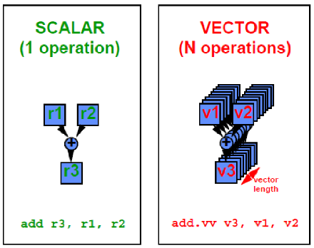
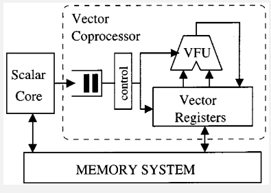
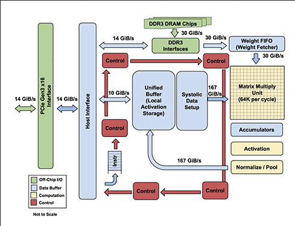

**Main Source :**

- **[Vector processor - Wikipedia](https://en.wikipedia.org/wiki/Vector_processor)**
- **[Single instruction, multiple data - Wikipedia](https://en.wikipedia.org/wiki/Single_instruction,_multiple_data)**
- **[Tensor Processing Unit - Wikipedia](https://en.wikipedia.org/wiki/Tensor_Processing_Unit)**

**Vector Processor** is a type of CPU or processing unit that specializes in executing operations on vectors or arrays of data. There is also processor called **scalar processors**, which operate on single data element instead, like an integer or floating point number, while vector processors are designed to process multiple data elements simultaneously using vector instructions.

Vector processors excel at performing repetitive, data-parallel computations that can be efficiently executed in parallel. They are particularly well-suited for tasks that involve large-scale mathematical calculations, such as scientific simulations, computational physics, and data analytics.

  
Source : https://www.cs.uic.edu/~ajayk/c566/VectorProcessors.pdf

:::tip
[GPU](/computer-organization-and-architecture/gpu) can be considered as a type of vector processor. While GPUs are primarily designed for graphics processing, they have evolved to include significant vector processing capabilities.
:::

### SIMD

**Single Instruction, Multiple Data (SIMD)** is parallel computing technique that allows a single instruction to be applied to multiple data elements simultaneously.

In SIMD processing, a single instruction is broadcasted to multiple processing units or execution lanes, each capable of processing a different data element from a vector or array.

Similar to GPU, SIMD is typically used for heavy computation tasks, but not for flow-control-heavy task that involves many conditional branches.

### Vector Processor Architecture

Vector processors implement an instruction set for handling large one-dimensional data. Some features of vector processor :

- **Vector Registers** : Vector processors have dedicated vector registers that can hold multiple data elements in a single register. These registers are wider than traditional scalar registers to accommodate vector data. The number of elements that can be stored in a vector register is referred to as the **vector length** or **vector width**.
- **Vector Instructions** : Vector processors have specialized instructions, that can operate on the entire vector of data elements in a single instruction. These instructions define the operations to be performed on the vector data, such as arithmetic operations, logical operations, and data movement operations.
- **Vector Functional Unit (VFU)** : VPU is the component in a vector processor that is responsible for executing specific arithmetic or logical operations on vector data. The VFU is a specialized hardware components optimized for vector operations.
- **Vector Pipelines** : Vector processors often include vector pipelines, which are composed of multiple stages that can process vector instructions in parallel. The pipeline stages are designed to carry out different phases of instruction execution, such as fetching instructions, decoding them, executing the operations, and writing back the results.

  
Source : https://www.researchgate.net/figure/Simplified-view-of-a-vector-processor-with-one-functional-unit-for-arithmetic-operations_fig10_2985917

### TPU

**Tensor Processing Unit (TPU)** is a specialized hardware accelerator developed by Google for accelerating machine learning workloads, particularly those involving [neural networks](/deep-learning/neural-network).

Data used in machine learning based task often represented in matrix, or higher-dimensional array, in conclusion :

- Scalar processors : zero-dimensional data, such as "5"
- Vector processors : one-dimensional data, such as "[5, 3, 2]"
- TPU : n-dimensional data, such as "[[1, 2], [3, 5], [7, 8]]", for two-dimensional data.

Some specialization TPU has :

- **Reduced Precision** : TPU are designed to perform computation that doesn't require high precision, such as 8-bit or 16-bit [floating-point formats](/computer-and-programming-fundamentals/floating-number#part-of-floating-number--precision), which is suitable for ML-based tasks. Using lower precision, we can reduce the memory bandwidth and storage requirements, which results in faster data transfer and processing times.
- **Specialized Hardware & Architecture** : TPU has hardware specific for doing machine learning tasks, it supports operations like normalization and pooling, which are commonly used in neural networks. TPU has special memory for storing learned weights that may be accessed frequently. Another key component of the hardware is the **Matrix Multiply Unit (MMU)**, it is highly optimized processing unit for matrix computations, including convolution operations.

  
Source : https://semiengineering.com/knowledge_centers/integrated-circuit/ic-types/processors/tensor-processing-unit-tpu/
