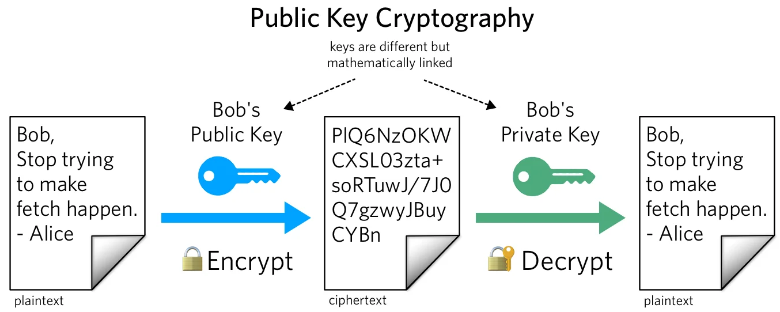
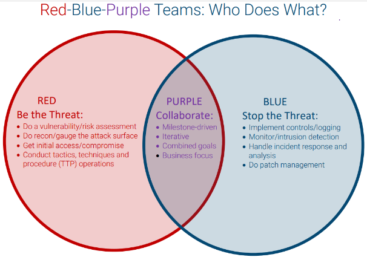
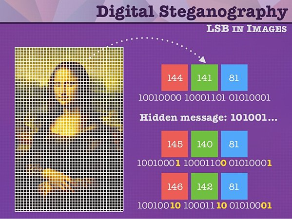

**Main Source :**

- **[Computer security - Wikipedia](https://en.wikipedia.org/wiki/Computer_security)**
- **[Cryptography - Wikipedia](https://en.wikipedia.org/wiki/Cryptography)**
- **Various Google search & Chatbot**

**Computer Security** is the practice of protecting of computer systems from malicious or unauthorized actors that results in damage to the system to ensure the confidentiality, integrity, and availability of computer systems and data.

### Essence of Computer Security

#### Vulnerability & Threats

Vulnerability refers to the weakness of a computer system, including network, software, or configuration which can be exploited. It can be user's fault such as weak password, or the programmer's fault, in the case of vulnerability in an application. These potential dangers or harmful events are called **threats**.

#### Malicious Actors

Malicious actors are any individuals, groups, or organizations that intent to cause harm and exploit vulnerability in a computer system. There are various motivation for this, including financial reasons, unhealthy competition, political, ideological, or personal reasons, etc.

#### Goal of Computer Security

In computer security, a common model to understand goals and principles of computer security is the **CIA triad**, which stands for **Confidentiality**, **Integrity**, and **Availability**.

1. **Confidentiality** : Ensures that sensitive data is accessible only to authorized individuals or entities. Access preventation such as [encryption](/computer-security/encryption), access controls, and secure communication protocols are implemented.

2. **Integrity** : Ensures data remains accurate, reliable, and unaltered throughout its lifecycle. It involves protecting data from unauthorized modification, deletion, or [tampering](/computer-security/other-attack-and-exploit#tampering). Techniques such as data validation, [checksums](/computer-security/hash-function#checksums), [digital signatures](/computer-security/computer-security-fundamentals#digital-signature), and secure storage mechanisms are used to maintain data integrity and prevent unauthorized changes.

3. **Availability** : Ensures that computer systems are accessible and operational when needed. It involves preventing disruptions or unauthorized [denial of service (DoS)](/computer-security/network-security#ddos-attack). Various technique such as backup systems, fault tolerance, and distance recovery plans are implemented to maximize system availability and minimize downtime.

To ensure computer systems are not disrupted by malicious actors, **authentication** and **authorization** techniques are employed.

- **[Authentication](/backend-system/authentication)** : Authentication is the process of verifying identity of users attempting to access a computer system. A simple authentication mechanism used in our daily life is the password mechanism.
- **[Authorization](/backend-system/authorization)** : Authorization is the process of giving appropriate level of access to users. We need to ensure authenticated users are only allowed to perform specific actions. For example, in a blog website, a regular user may not have the permission to delete blog posts or delete other user's comments.

### Cryptography

**Cryptography** is the practice of securing communication and data transmission by converting it into a form that is not understandable by unauthorized individuals. The main goal is to protect sensitive information such as user's data while communicating over insecure networks in various applications, including secure messaging, online transactions, etc.

The process of transforming readable data (plaintext) into unreadable data (ciphertext) is called **encryption**. In encryption, the plaintext is processed through mathematical algorithm along with a **"key"**, resulting in ciphertext. A key is like extra information that sender and receiver has to transform plaintext into a ciphertext or vice versa. This key is a crucial secret, as the data encryption depends on it.

Cryptography is heavily based on mathematical concepts, mathematical proofs and techniques are used to analyze the strength of encryption algorithms. Besides mathematics, cryptography includes concepts from other topics like information security, electrical engineering, signal processing, physics, etc.

#### One-way Function

A one-way function is a mathematical function that is relatively easy to compute in one direction but computationally difficult to reverse. In other words, given an input, it is easy to compute the output, but given the output, it is difficult to determine the original input.

One-way functions are heavily used in cryptography, it makes it extremely difficult for attackers to determine the original input from the output. For example, when storing a user's password, it will go through a one-way function before being stored. Even if attackers gain access to the storage, they cannot easily retrieve the original password. During login, to actually verify the password correctness, the input password is processed again to the function and compared to the one stored in the storage.

  
Source : https://www.twilio.com/blog/what-is-public-key-cryptography

### Terminology

#### Penetration Testing

Penetration testing is the practice of simulating real-worlds attacks toward a computer system. It is done to evaluate the effectiveness of the security system. Penetration testing is done systematically with defined methodology and involves a series of steps.

#### Ethical Hacking

Ethical hacking is a more general term for a cybersecurity practice that identifies vulnerabilities and weaknesses in computer systems. Ethical hackers are "good" hacker, they use the same methodologies as malicious hackers, but with the explicit permission and legal authority to conduct their activities. They will try to identify security flaws and provide recommendations for improving the overall security.

#### Blue, Red, Purple Team

They are different roles in cybersecurity :

- **Blue Team** : Defensive side of security, they analyze, implement, monitor security systems.
- **Red Team** : Offensive side of security, they conduct activities such as penetration testing, vulnerability assessments, and targeted attacks to test a computer system.
- **Purple Team** : The combination of both red and blue elements. They collaborate and shares knowledge between the defensive and offensive teams.

  
Source : https://www.iansresearch.com/resources/all-blogs/post/security-blog/2022/04/19/understand-the-roles-of-red-blue-and-purple-teams

#### Zero-Day Attack

Many new attacks and exploits are discovered all the time, the attacks that are done on the same day they are discovered is called a **zero-day attack**. Zero-day attack is indeed very dangerous, because it leaves no time for the affected party to develop a protection implementation. Attackers have a significant advantage at the moment when security professionals and software developers are not yet aware of them.

#### Breach

**Breach** refers to an unauthorized or unintended access to, use of, or disclosure of sensitive information. It can be a **security breach**, which is when unauthorized party gains access to some computer systems, bypassing security measures. Another one is **data breach**, which is the unauthorized access to sensitive or confidential data such as financial records, health records, intellectual property, etc.

#### Sandboxing

When accessing specific systems, often times they are potentially harmful. For example, downloading specific file from untrusted website, it may contain malicious software inside. **Sandboxing** is the process of mitigating potential impact of malicious or vulnerable software.

It isolates an application or process from the rest of the system or network environment. It creates a controlled and restricted environment where an application can run, limiting its access to system resources and potentially harmful actions. Sandboxing can be implemented using [virtualization](/cloud-computing-and-distributed-systems/virtualization) or [containerization](/cloud-computing-and-distributed-systems/containerization).

#### Obfuscation

Obfuscation is the process of making code or data difficult to understand or analyze. It prevents an application to be [reverse engineered.](/computer-security/reverse-engineering), or intellectual property theft by making the code or data less comprehensible to human readers or automated analysis tools.

Technique can include changing variable, function, class name to some arbitrary or non-descriptive name, encrypting a section of code, changing a structure of code without changing its functionality.

#### Digital Signature

A digital signature is basically a signature which is used to provide authentication and integrity for digital documents. It uses the concept of [encryption](/computer-security/encryption), specifically the [private and public key](/computer-security/encryption#public--private-key).

A digital signature is unique to the sender. It is created using special mathematical algorithms and a secret code known as a **private key**. This private key is kept secure and known only to the signer. To verify the content, another key called **public key** will be used. The public key will also produce some code, the resulting code will be the same as the resulting code produced by private key.

#### Certificate

Certificate is a digital document issued by a trusted third-party organization known as a **Certificate Authority (CA)**. It is used to verify the authenticity and integrity of digital entities such as websites, individuals, organizations, or software. It contains subject, issuer, validity period, and digital signature.

#### Steganography

Steganography is the practice of hiding information in a media such as images or videos. An image contains a sequence of RGB pixels, which is encoded in bits (e.g., 8-bit for each color). Hiding information involve changing one of the bits which has the lowest significance (called the [least significant bits (LSB)](/computer-and-programming-fundamentals/binary-representation#least--most-significant-bit)) to the hidden information. Changing the least significant bits make the embedded information doesn't affect the overall data significantly.

The inserted information will need to be encoded in number as well, the point is, it must fit within the color. For example, we can transform a hidden message in plain text to number using the [ASCII encoding](/computer-and-programming-fundamentals/data-representation#ascii), which is 8-bit, making it suitable for RGB color representation (e.g., in ASCII decimal form, "goodbye" can be encoded to 01100111). We will then insert each binary bit into the image by modifying each LSB of the color. To further ensure no significant change are visible, we can solely use one color channel. To signal the conclusion of the message, we can easily designate the succeeding pixel following the message's end as the ending sequence.

  
Source : https://www.quora.com/What-is-steganography-and-what-is-it-used-for
