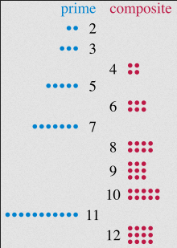
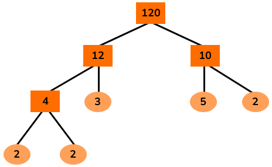
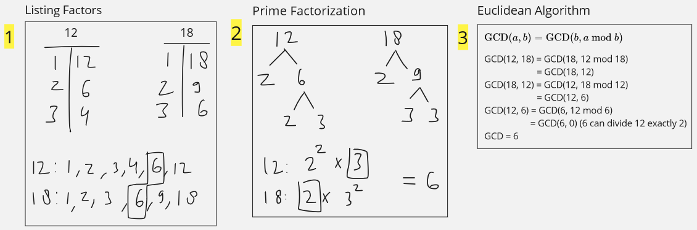
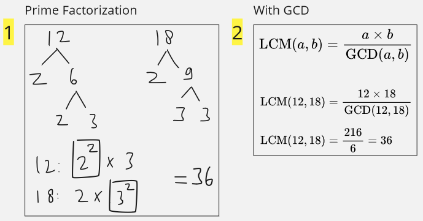
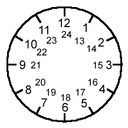
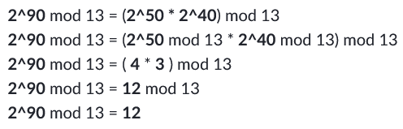
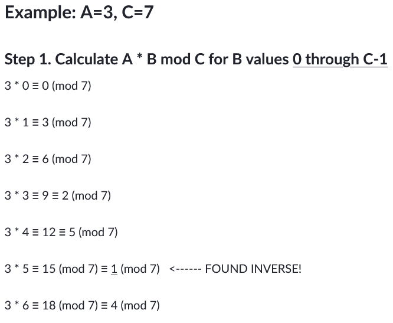
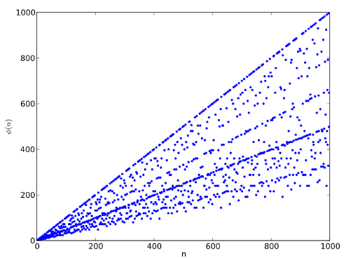

**Main Source:**

- **[Factorization — Wikipedia](https://en.wikipedia.org/wiki/Factorization)**
- **[The Mathematics of Cryptography — Zach Star](https://youtu.be/uNzaMrcuTM0?si=yX2iwAc3kQ_oybFx)**
- **[Some Khan Academy's CS articles](https://www.khanacademy.org/computing/computer-science/cryptography)**
- **Various Google search**

### Factorization

**Factorization** is the process of decomposing a number into several numbers that, when multiplied together, result in the original number. In other words, it is a way to represent a number as a product of several numbers.

#### Integer Factorization

**Integer factorization** is the factorization of a number into their integer product. For example, we can represent the number 24 as the multiply of:

- $1 \times 24$
- $2 \times 12$
- $3 \times 8$
- $4 \times 6$

When we ask, what is the factors of 24? They are going to be 1, 2, 3, 4, 6, 12, 24. When we can represent a number with the multiply of two or more number smaller than the number itself, they are called **composite number**.

#### Prime Factorization

To review, **prime number** is a natural number greater than 1 that is divisible only by 1 and itself, with no other positive divisors. Prime number is the opposite of composite number, we can only represent them in two number, which is 1 and itself.

  
Source: https://en.wikipedia.org/wiki/Prime_number

**Prime factorization** is the factorization using prime numbers, in other word, we represent a number in a product of prime numbers. We can get a prime factorization of a number by continuing their integer factorization. For example, number 24, we can continue with one of the factor: $2 \times 12$. $2$ is already a prime, we can still break down $12$ further into $2 \times 6$, further again into $2 \times 2 \times 3$. This result in $24 = 2 \times 2 \times 2 \times 3$, therefore, the prime factorization of $24$ is $2^3 \times 3$.

One of the way to find the prime factorization is to decompose a number into some number multiplied by a prime number. The prime number will start from $2$, increasing to $3$, $5$, and so on. While the technique is simple, it can be quite inefficient for large number like $770$. First, we can factor it by $2$, resulting in $385$, then we will try dividing $385$ by $2$, which is not possible. Divide it by $3$, also not possible, until $5$, which result in $77$.

In the worst case, the technique will be more inefficient when we encounter a prime number, this mean we will need to brute force every single prime number smaller than the number itself.

  
Source: https://thirdspacelearning.com/gcse-maths/number/factor-tree/

A better way would to decompose the number into a multiply of larger number first, just like the image above.

### Greatest Common Divisor (GCD)

**Greatest Common Divisor (GCD)**, also known as **Greatest Common Factor (GCF)**, is the largest positive integer that divides two or more integers, exactly without remainder, where the two or more integers are not zero.

When we ask the GCD of $12$ and $18$, we are asking what is the largest number that divides both number. Number $2$ can indeed divide both of them, but there is an integer larger than $2$. The GCD of $12$ and $18$ is $6$, $12$ divided by $6$ is $2$ and $18$ divided by $6$ is $3$. Further division cannot be performed on both $2$ and $3$, indicating that $6$ is the final answer.

There are several methods to find the GCD:

1. **Listing Factors**: To use this method, we will find the factor of each number. For example, the factor of $12$ is [$1$, $2$, $3$, $4$, **$6$**, $12$] and the factor of $18$ is [$1$, $2$, $3$, **$6$**, $9$, $18$]. To actually find the GCD, we will take the largest common factors shared by both numbers, which is $6$.

2. **Prime Factorization**: Find the prime factorization of each number. The prime factorization of $12$ is $2^2 \times 3$, prime factorization of $18$ is $2 \times 3^2$. To find the GCD, we will multiply the common factors shared by both numbers. When there are duplicate (e.g., there are $2^2$ and $2$, also $3^2$ and $3$), we will take the lowest one. The common factors are $2$ and $3$, we are ignoring the $2^2$ and $3^2$. Multiplying $2$ and $3$ will result in $6$, which is the GCD.

3. **Euclidean Algorithm**: The Euclidean algorithm is a [recursive](/data-structures-and-algorithms/recursion) formula to find the GCD. The formula is $\text{GCD}(a, b) = \text{GCD}(b, a \text{ mod } b)$, where "mod" represents the **modulus operation**, which gives the remainder when $a$ is divided by $b$. $6$ divided by $4$ will have remainder of $2$, therefore, $6 \text{ mod } 4 = 2$.

   This algorithm is recursive because it will repeatedly apply the formula until it reaches the base case, which is when any of the number becomes zero. At that point, the algorithm terminates, and the GCD is found to be the non-zero value.

   

#### Relative Prime

Also known as **coprime**, when two numbers are **relatively prime**, it means they have no common positive integer divisors other than 1. In other words, the greatest common divisor (GCD) of the two numbers is 1.

For example, consider the numbers 15 and 28. The GCD of 15 and 28 is 1, which means they are relatively prime. There is no positive integer greater than 1 that can divide both 15 and 28 without leaving a remainder.

### Least Common Multiply (LCM)

**Least Common Multiply (LCM)** is the smallest positive integer that is divisible by two or more given numbers without leaving a remainder. When we ask for LCM of $12$ and $18$, we are asking what is the smallest number that can be divided by both $12$ and $18$ exactly, the answer is $36$.

Finding LCM:

1. **Prime Factorization**: This method is very similar to the prime factorization method to find GCD. We will take the common factor shared by both numbers, the difference is, instead of taking the lowest number, we will instead take the highest number. To actually find the LCM, we will multiply that number.
2. **With GCD**: This method uses a formula: $\text{LCM}(a,b)=\dfrac{a\times b}{\text{GCD}(a,b)}$, it needs the GCD of two numbers.



### Modular Arithmetic

Modular arithmetic is a branch of mathematics that deals with the arithmetic operations performed on remainders. It involves working with numbers in a specific modulus or modulo. Modulo, as we know before, is a remainder of a division. Modular arithmetic focuses on the operations that can be performed within a specific modulus or modulo.

#### Congruence

The key concept is the **congruence**, two numbers are said to be congruent modulo of a given modulus if they have the same remainder when divided by that modulus. This is denoted by the symbol $\equiv$. For example, $10 \equiv 3 \space (\text{mod } 7)$ means that $10$ and $3$ have the same remainder when divided by $7$.

In other word, when we say two numbers are congruent within some modulo, it means they will have the same remainder when divided by the modulo number. $10$ divided by $7$ left out $3$, which is the same remainder as $3$ divided by $7$ (we can't divide $3$ by $7$, therefore the remainder is 3 itself).

One way to think about modular arithmetic is to visualize it in terms of clock. A clock starts from 1 to 12, then in 13:00 PM, it will repeat to 1 again up to 12 in 00:00 PM. The repeating behavior of clock can be thought as the modulo operator. For example, in a clock with a 12-hour format, if it is currently 8 o'clock, and we add 5 hours, we can use the modulo operator ($\%$) to determine the resulting hour: $(8 + 5) \space \% \space 12 = 1$.

In the context of a clock analogy, being congruent of modulo 12 would mean that two numbers would occupy the same position on the clock face (e.g., $14 \equiv 2 \space (\text{mod } 12)$).

  
Source: https://mathsbyagirl.wordpress.com/2016/06/20/modular-arithmetic-whats-the-point/

In modular arithmetic, it can be thought that the numbers "wrap around" a fixed modulus. The modulus defines the range of values that can be represented within the arithmetic system.

#### Quotient Remainder Theorem

The theorem states that, given two integers $a$ and $b$, where $b$ is not zero, there exist unique integers $q$ (the quotient) and $r$ (the remainder) such that:

$a = b \times q + r$

When you divide one integer (a) by another integer (b), you can express the dividend (a) as the product of the divisor (b) and the quotient (q), plus a remainder (r). This theorem is closely related to the modulo operator.

The above theorem can be expressed in terms of modulo and division:

$a = b \times (a \space // \space b) + (a \space \% \space b)$

Where $a \space // \space b$ is integer division or the quotient obtained when dividing $a$ with $b$. Integer division is an operation that returns the largest whole number that is less than or equal to the quotient obtained when dividing one integer by another. For example, $5 \space // \space 2$ would be just $2$ instead of $2.5$.

#### Modular Addition & Subtraction

These are the addition and subtraction performed under modular arithmetic system.

Modular addition involves adding two numbers and then taking the remainder when divided by the modulus. Mathematically, given two numbers $a$ and $b$, the modular sum $(a + b) \text{ mod } n$ is computed by performing the addition of $a$ and $b$, and then taking the remainder when divided by $n$.

For example, let's consider modular addition with a modulus of $5$. If we want to calculate $(3 + 4) \text{ mod } 5$, we simply add $3$ and $4$, which gives us $7$. Then, when we divide $7$ by $5$, the remainder is $2$. Therefore, $(3 + 4) \text{ mod } 5$ is equal to $2$.

It is similar for subtraction, basically we subtract instead of adding the number. When we are taking the modulo of negative number, we can simply ignore the minus sign. For example, $-7 \text{ mod } 3 = 1$ and $-10 \text{ mod } 4 = 2$.

Here are two properties of modular addition and subtraction:

- $(A + B) \text{ mod } C = (A \text{ mod } C + B \text{ mod } C) \text{ mod } C$
- $(A - B) \text{ mod } C = (A \text{ mod } C - B \text{ mod } C) \text{ mod } C$

#### Modular Multiplication

Similar to addition and subtraction, doing modulo operator that involve multiplication, we are going to do the multiplication first.

For example, consider modular multiplication with a modulus of $7$. If we want to calculate $(3 \times 4) \text{ mod } 7$, we multiply $3$ and $4$, which gives us $12$. Then, when we divide $12$ by $7$, the remainder is $5$. Therefore, $(3 \times 4) \text{ mod } 7$ is equal to $5$.

The properties of modular multiplication:

- $(A \times B) \text{ mod } C = (A \text{ mod } C \times B \text{ mod } C) \text{ mod } C$

#### Modular Exponentiation

**Modular exponentiation** is another operation similar to addition, subtraction, and multiplication. We will complete the number raised to the power first before taking the modulo. However, often times the power become very large, therefore, making it hard to calculate. One way to tackle this is to use exponent properties and use the modular multiplication.

  
Source: https://www.khanacademy.org/computing/computer-science/cryptography/modarithmetic/a/modular-exponentiation

We break down the large power into smaller power and then calculate it independently, at the end, we will multiply them together. This technique is called [divide and conquer](/data-structures-and-algorithms/divide-and-conquer), that is, breaking down a big problem into smaller problem, solving them independently, and then combining the result to solve the overall problem.

There are also more efficient algorithm to calculate the modulo of exponentiation.

Properties of modular exponentiation:

$A^B \text{ mod } C = ( (A \text{ mod } C)^B ) \text{ mod } C$

#### Modular Inverse

Inverse of a number is $1$ divided by that number. For example, the inverse of number $5$ is $\dfrac{1}{5}$, or in exponent, it is the negative power of the number itself (e.g., $2^3 = 8$, inverse is $2^{-3} = \dfrac{1}{8}$). The properties of inverse number is the inverse of a number multiplied by the number itself will always equal to $1$.

Modular arithmetic doesn't have division operator, but we can make it possible by using the exponent properties. Instead of direct division, we can multiply number together with the other number being negative exponent. For example, dividing $4$ by $2$ can be represented as: $4^1 \times 2^{-1}$, which will result in $2^2 \times 2^{-1} = 2^1$.

In modular arithmetic, the modular inverse of a number is another number that, when multiplied with the original number, yields a remainder of $1$ when divided by a given modulus.

Mathematically written as:

$a \times a^{-1} \equiv 1 \space (\text{mod } m)$

Finding the modular inverse involves solving a congruence equation. For example, to find the modular inverse of $a$ modulo $m$, you would need to find a number $b$ such that:

$a \times b \equiv 1 \space (\text{mod } m)$

Finding it using a naive method, trying out every single number:

  
Source: https://www.khanacademy.org/computing/computer-science/cryptography/modarithmetic/a/modular-inverses

The modular inverse of $A \text{ mod } C$ is the $B$ value that makes $A \times B \text{ mod } C = 1$.

##### Extended Euclidean Algorithm

Using the [Euclidean algorithm used to find GCD](/computer-security/math-concepts#greatest-common-divisor-gcd), we can also use the algorithm to find modular inverse more efficiently than the brute force way.

The properties of Euclidean Algorithm:

- $\text{GCD}(A, 0) = A$
- $\text{GCD}(0, B) = B$
- If $A = B \times Q + R$ and $B ≠ 0$ then $\text{GCD}(A, B) = \text{GCD}(B, R)$ where $Q$ is an integer, $R$ is an integer between $0$ and $B - 1$.

For review, the first and second properties is the base case of Euclidean algorithm, the third property is the GCD algorithm formula: $\text{GCD}(a,b) = \text{GCD}(b,a\text{ mod }b)$ combined with the [quotient remainder theorem](/computer-security/math-concepts#quotient-remainder-theorem).

##### Bézout's Identity

**Bézout's Identity** states that for any two integers $a$ and $m$ such that their GCD is equal to 1 (i.e., they are [relatively prime](/computer-security/math-concepts#relative-prime)), there exist integers $x$ and $y$ such that:

$ax + my = 1$

In the context of modular arithmetic, this equation can be written as:

$ax \equiv 1 \space (\text{mod } m)$

##### Using Extended Euclidean Algorithm

Using the Bézout's identity, the extended Euclidean algorithm follows a recursive process to calculate the GCD and the Bézout's identity coefficients $x$ and $y$. It starts with the base case where $m$ is $0$, in which case the GCD is $a$ and the coefficients are (1, 0). If $m$ is not $0$, it recursively calculates the GCD and the coefficients based on the equation: $ax + my = 1$.

The formula for extended Euclidean algorithm in code like:

```
extended_gcd(a, m):
    if m = 0:
        return a, 1, 0
    else:
        gcd, x, y = extended_gcd(m, a % m)
        return gcd, y, x - (a // m) * y
```

#### Euler's Totient Function

The **Euler's Totient function**, denoted as $\phi(n)$, is a mathematical function that counts the number of positive integers less than or equal to $n$ that are relatively prime to $n$. In other words, it calculates the count of numbers between $1$ and $n$ (inclusive) that do not share any common factors with $n$ except for $1$.

For example, consider the number $10$. The positive integers less than or equal to $10$ are $[1, 2, 3, 4, 5, 6, 7, 8, 9, 10]$. Among these numbers, the coprime numbers to $10$ are $[1, 3, 7, 9]$, as they do not share any common factors with $10$ except for $1$, therefore, $\phi(10) = 4$.

  
Source: https://upload.wikimedia.org/wikipedia/commons/thumb/9/9b/EulerPhi.svg/800px-EulerPhi.svg.png

### Primality Test

Primality test is a method or algorithm used to determine whether a given number is prime or composite (not prime). The naive way to determine is to try to divide the number with every single number smaller than the number itself, this method is called **trial division**. However, the method will become inefficient for large number.

#### Fermat's Primality Test

One of the more efficient method is the **Fermat's Primality Test**, it is based on **Fermat's Little Theorem**. It states that if $p$ is a prime number and $a$ is any positive integer less than $p$, then $a^{(p-1)} \equiv 1 \space (\text{mod } p)$.

The test randomly selects values of $a$ and checks if the equality holds. If it fails for any value, the number is composite; otherwise, it is likely prime. This method is a probabilistic primality test, it offers a good balance between efficiency and accuracy when determining the primality of large numbers.
