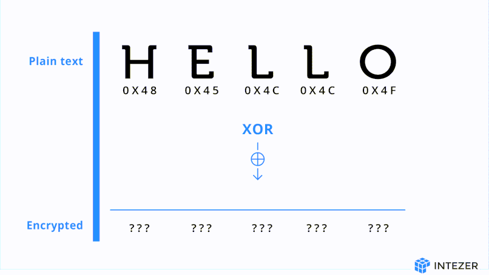
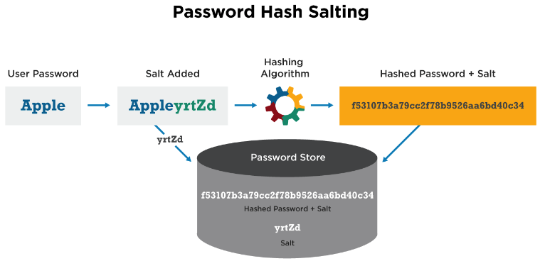
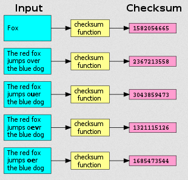

**Main Source :**

- []

**Hash Function** is a mathematical function that takes an input of arbitrary size and produces a fixed-size output, called **hash values/codes**. The exact same input will always produce the same output, which is what makes a hash function used for verification.

An example of using a hash function for verification is to ensure the integrity of data, such as verifying the legitimacy of a document. When a legitimate document is processed through a hash function, it will generate a specific output. By inputting another document into the same hash function and comparing the resulting output to the original, if they match, it indicates that the document is legitimate.

It was also used to make [hash table/map](/data-structures-and-algorithms/hash-table) data structure. Hash function provide a way to map a key into hash codes (some number), which is used to determine where should an element placed. To access an element, the same key is passed through the hash function, generating an output that determines its placement. The efficiency come from the hash function, a hash function is very fast to compute, they typically have constant $O(1)$ time operation.

### Properties & Example

Hash function have some properties :

- **Deterministic** : A hash function must be deterministic, in other word, the same input should always produce the same output.
- **Fixed Output, Variable Input** : While there are some hash function that produces variable-length output, a hash function typically produces fixed output. The thing is, the hash function should be able to take variable input length.
- **Irreversibility** : Hash functions are designed to be [one-way functions](/computer-security/computer-security-fundamentals#one-way-function), meaning it is computationally infeasible to get the original input from the output.
- **Uniformity** : Hash function should uniformly distribute hash values across the output space. This reduces the chance of [collisions](/data-structures-and-algorithms/hash-table#collision), where different inputs produce the same hash value.
- **Avalanche Effect** : A small change in the input should result in a significantly different hash value.
- **Efficiency** : A good hash function should be fast and efficient, capable of processing large amounts of data quickly.

    
   Source : https://signmycode.com/resources/best-hashing-algorithms

A hash function can range from a simple algorithm like **[division hash function](/data-structures-and-algorithms/hash-table#example)** (non-cryptographic hash functions) to a complex algorithm like [SHA](/computer-security/sha) (cryptographic hash functions) that can guarantee a high level of security, in terms of irreversibility and collision resistance.

#### XOR Hash Function

The XOR hash function uses the [bitwise XOR](/computer-and-programming-fundamentals/bitwise-operation#xor) on the individual bits of the input data with some specific key. The idea is, bitwise operation operates on the bit level of the data, the same data which mean they have the same binary representation will produce the same result. Besides that, distinct data will at least have some difference in their binary representation.

  
Source : https://intezer.com/blog/research/unraveling-malware-encryption-secrets/

### Salting

**Salting** is a hash preprocessing technique that involves adding a random or unique value to the input data before it is hashed. The purpose of salting is to provide an additional layer of security.

According to the hash function properties, hash function should have the avalanche effect, a small change in the input should result in a significantly different hash value. However, in some hash function, there is still a chance for collision to occur. By adding a random value to the input data, we can reduce the chance of collision.

Another benefit of salting is to mitigate the [rainbow table attack](/computer-security/other-attack-and-exploit#rainbow-table-attack). Rainbow tables are precomputed lookup tables that map hash values to their original input. Attackers generate these tables in advance to quickly find the original password corresponding to a hash value. However, rainbow tables are only effective for unsalted hashes.

  
Source : https://cyberhoot.com/cybrary/password-salting/

### Checksums

**Checksums** are a form of error detection used to verify the integrity or correctness of data. A checksum is a value that is computed from input data using a specific algorithm. This value is then compared with a previously computed or expected checksum to determine if the data has been modified or corrupted.

  
Source : https://en.wikipedia.org/wiki/Checksum#/media/File:Checksum.svg
