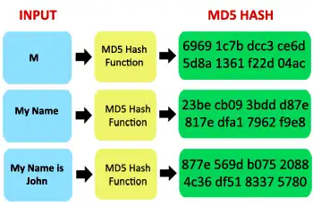
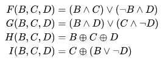

**Main Source:**

- **[MD5 — Wikipedia](https://en.wikipedia.org/wiki/MD5)**

**Message Digest Algorithm 5 (MD5)** is a cryptographic hash function that produces **fixed-size 128-bit** hash value, typically represented in 32-character [hexadecimal number](/computer-and-programming-fundamentals/number-system#hexadecimal).

:::note
Hexadecimal ranges from 0 to 15 (F), it requires 4 bits for a single character. Having 32 character, it will result in total of $4 \text{ bit} \times 32 = 128$ bit value.
:::

  
Source: https://blog.systoolsgroup.com/md5-algorithm-for-forensics/

### Algorithm

The high level description of MD5 algorithm:

1. **Padding & Chunking**: The input message is padded to ensure its length is a multiple of 512 bits. The padding includes a 1-bit followed by zeros and a 64-bit representation of the original message length. The message will be broken up into chunk of 512-bit blocks (sixteen 32-bit words).

2. **Initialization**: MD5 uses four 32-bit registers (A, B, C, and D) as its internal state. These registers are used to store intermediate values during the processing of the input message blocks, they are initialized with predefined values.

3. **Processing**: For each block, a series of rounds are performed, which involve [bitwise logical operations](/computer-and-programming-fundamentals/bitwise-operation), [modular addition](/computer-security/math-concepts#modular-addition--subtraction), and non-linear functions. The rounds modify the internal state (registers) of the algorithm.

     
   Source: https://en.wikipedia.org/wiki/MD5#algorithm

4. **Finalization**: After processing all blocks, the final state of the registers is concatenated to produce the 128-bit hash value. The order of the registers' values is typically little-endian, meaning the least significant byte comes first.
