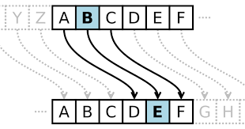
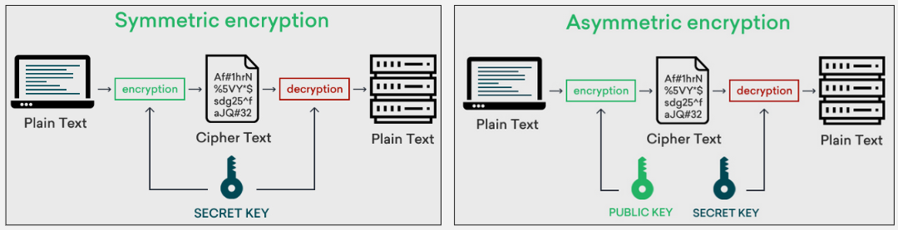
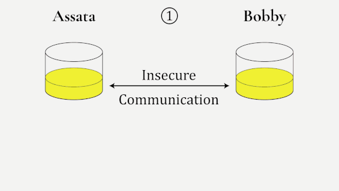

**Main Source :**

- **[Encryption - Wikipedia](https://en.wikipedia.org/wiki/Encryption)**
- **[Caesar cipher - Wikipedia](https://en.wikipedia.org/wiki/Caesar_cipher)**
- **[Key exchange - Wikipedia](https://en.wikipedia.org/wiki/Key_exchange)**

**Encryption** is the process of converting information or data from **plaintext** (readable data) to a **ciphertext** (unreadable data). By "unreadable," it means that the data cannot be understood by humans or computers without knowing how to reverse the process and convert it back to plaintext. The process of converting ciphertext back to plaintext is called **decryption**, this requires understanding on how to reverse it.

### Cipher

**Cipher** is a method or algorithm used to perform encryption and decryption. It is a set of rules or steps that determine the transformation of plaintext into ciphertext or vice versa.

#### Caesar Cipher

The **Caesar cipher** is one of the simplest and oldest known encryption techniques. The method is very simple, it simply transforms the input plaintext by shifting each letter in the plaintext a certain number of positions down or up the alphabet.

A positive shift value corresponds to shifting the letters down the alphabet (to the right), while a negative shift value corresponds to shifting the letters up the alphabet (to the left).

For example, "A" is letter 1 on alphabet, shifting it down by 3 would change it to alphabet "D", 'B' as 'E', 'C' as 'F', and so on. When the end of alphabet is reached, it repeats from the beginning. Here is all the transformation :

Plaintext: ABCDEFGHIJKLMNOPQRSTUVWXYZ
Ciphertext: DEFGHIJKLMNOPQRSTUVWXYZABC

Here is an example of transforming a real message into the cipher text :

Plaintext: THE QUICK BROWN FOX JUMPS OVER THE LAZY DOG
Ciphertext: WKH TXLFN EURZQ IRA MXPSV RYHU WKH ODCB GRJ

To decrypt it, we will do the reverse process, which is shifting each of the letter to the left by 3.

  
Source : https://forum.arduino.cc/t/caesar-cipher-with-arduino-pt-1/189683

#### Decipher vs Decrypt vs Decode

They are commonly used interchangeable, but they have different context.

- Decipher : Converting back ciphertext to plaintext.
- Decrypt : Converting encrypted data to original form, it is used in the context of various encryption schemes such as [symmetric and asymmetric encryption](#symmetric--asymmetric).
- Decode : Converting back encoded data into readable format, it doesn't have to be encrypted data. For example, it can include converting [ASCII](/computer-and-programming-fundamentals/data-representation#ascii) encoded text (in binary) to plaintext.

### Cryptographic Encryption

This types of algorithms are more advanced as it involves [cryptographic algorithms](/computer-security/computer-security-fundamentals#cryptography) and keys. Key is a very crucial component, it is a piece of information or a parameter that is inputted into the encryption algorithm to control the transformation of plaintext into ciphertext and vice versa. In Caesar cipher, the shifting value can be thought as the key.

The key is literally the "key" of decrypting an encrypted data, other than knowing how the algorithm encrypt the data. The encryption algorithm alone is not sufficient for decryption because there are typically multiple possible keys that could have been used with a given algorithm.

In the case of Caesar cipher, there are total of 25 possible key, shifting by 1 up to 25. However, as we are doing cryptographic encryption, brute forcing every single key may not be possible.

#### Public & Private Key

In cryptography, the terms public and private key is often encountered.

- **Public key** : The public key is the key that is intended to be freely distributed and shared with others. The public key is typically used for encrypting the data.
- **Private key** : The private key is kept secret and only known to the owner. It is used for decrypting encrypted data.

As we know, cryptography involve a lot of math. Mathematically, public and private key are related, the public key is derived from the private key. The fundamental concept of cryptography is that anyone can encrypt the data, but only the holder of the private key, which is the target recipient that can decrypt it.

#### Symmetric & Asymmetric Encryption

These are two types of encryption :

- **Symmetric encryption** : Also known as **private key encryption** or **private key cryptography**, it is a form of cryptography where the same key is used for both encryption and decryption. The key must be kept secret for secure communication and is shared between the sender and recipient. However, this increases the risk of the key being stolen by attacker during transmission. Symmetric encryption algorithms are generally faster and more efficient than asymmetric encryption algorithms.
- **Asymmetric encryption** : Also known as **public key encryption** or **public key cryptography**, it is a form of cryptography where both public and private key is used. It enables secure communication between parties without requiring a shared secret key, in exchange for more intensive computation.

  
Source : https://www.clickssl.net/blog/symmetric-encryption-vs-asymmetric-encryption

#### Key Exchange

**Key exchange** is the process of exchanging secret key between parties securely. It involves cryptographic protocols and techniques to exchange keys without revealing them to potential [eavesdroppers](/computer-security/network-security#eavesdropping).

- Symmetric encryption : It can be used in symmetric encryption to securely share the shared private key.
- Asymmetric encryption : It can be used to share the public key of both parties. While the public key is intended to be public, securely exchanging it would ensure both parties receive the legitimate key.

  
Source : https://open.oregonstate.education/defenddissent/chapter/exchanging-keys-for-encryption/

The key exchange protocol involve various mathematical properties, to analogy, it can be thought as combining color. Colors can be combined to create new colors by adding the intensity of each color component. Even if we add different color, because of the additive properties of color, they will end up with the same color.

Similar to the actual key exchange protocol, both parties pick some number and use mathematical properties to derive the key at the end.
