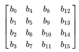
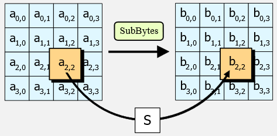
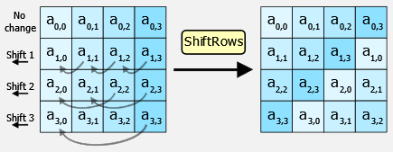
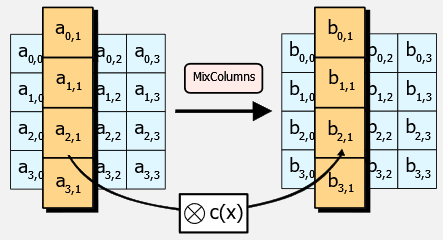
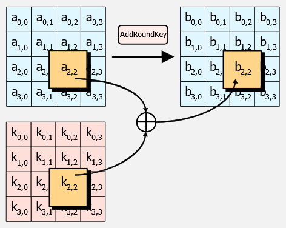
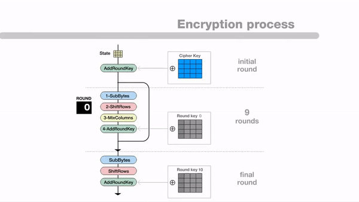

**Main Source :**

- **[Advanced Encryption Standard - Wikipedia](https://en.wikipedia.org/wiki/Advanced_Encryption_Standard)**

**Advanced Encryption Standard (AES)** is a widely used [symmetric encryption](/computer-security/encryption#symmetric--asymmetric-encryption) algorithm, it is the replacement for [DES algorithm](/computer-security/des). By symmetric encryption, a shared [private key](/computer-security/encryption#public--private-key) is used to encrypt and decrypt the data. AES itself supports 128, 192, or 256-bit key, where the security of an AES system increases exponentially with key length.

- 128-bit key size : $2^{128}$ possible keys, which is approximately $3.4 \times 10^{38}$.
- 192-bit key size : $2^{192}$ possible keys, which is approximately $6.3 \times 10^{57}$.
- 256-bit key size : $2^{256}$ possible keys, which is approximately $1.2 \times 10^{77}$.

The larger the key size, the more combinations an attacker needs to try, which is more resistant to [brute-force attacks](/computer-security/other-attack-and-exploit#brute-forcing).

### Algorithm

AES operates on fixed block size of 128 bits and operates in a series of transformations applied in multiple rounds, 10, 12, and 14 rounds for 128-bit, 192-bit, 256-bit keys, respectively.

The 128 bits block is structured in a 4×4 matrix from $b_{0} to b_{15}$, typically called the state.

  
Source : https://en.wikipedia.org/wiki/Advanced_Encryption_Standard#Description_of_the_ciphers

AES is based on **substitution–permutation network (SPN)**, it is a way of mixing up and rearranging information. It involves substitution, where certain letters or characters in the block are replaced with different ones, and permutation, where the order of the remaining letters is shuffled or rearranged. This process is done in the rounds of transformations, each round applies the same operations but with different keys that determine the specific substitutions and permutations.

Here is the high-level overview of AES :

1. **Key Expansion** : The chosen encryption key is divided into a set of **round keys**, which will be used in the SPN process. Each word being 32 bits long in AES, 4 words for 128-bit keys, 6 words for 192-bit keys, and 8 words for 256-bit keys.

2. **Initial Round** : The input data (plaintext) is combined with the first round key using a [bitwise XOR operation](/computer-and-programming-fundamentals/bitwise-operation#xor).

3. **Rounds** : Each round consists of four sub-steps: **SubBytes**, **ShiftRows**, **MixColumns**, and **AddRoundKey**.

   - **SubBytes** : Each byte of the input is substituted with a corresponding byte from a substitution box (S-box), which provides nonlinear substitution. S-box is a specific 16×16 substitution table, it takes an 8-bit input value (byte) and outputs an 8-bit value. The S-box is initialized with specific values based on mathematical operations over the finite field of $GF(2^8)$.

       
      Source : https://en.wikipedia.org/wiki/Advanced_Encryption_Standard#The_SubBytes_step

   - **ShiftRows** : The bytes in each row of the state (the current block being processed) are cyclically shifted. Specifically, the first row is left unchanged. Each byte of the second row is shifted one to the left. Similarly, the third and fourth rows are shifted by offsets of two and three respectively

       
      Source : https://en.wikipedia.org/wiki/Advanced_Encryption_Standard#The_ShiftRows_step

   - **MixColumns** : Each column of the state is multiplied with a fixed polynomial. This step introduces diffusion and non-linearity into the encryption process. Mathematically, the multiplication is performed in the finite field of $GF(2^8)$, using the irreducible polynomial $x^8 + x^4 + x^3 + x + 1$ as the modulus.

       
      Source : https://en.wikipedia.org/wiki/Advanced_Encryption_Standard#The_MixColumns_step

   - **AddRoundKey** : The round key for the current round is combined with the state using a bitwise XOR operation.

       
      Source : https://en.wikipedia.org/wiki/Advanced_Encryption_Standard#The_AddRoundKey

4. **Final Round** : The final round omits the MixColumns step and only performs the SubBytes, ShiftRows, and AddRoundKey operations.

The decrypt process is basically the reverse of the encryption process.

In summary, AES structure input data into the state matrix, mix the data which includes permutation and substitution operation, altering the data again with the multiplication of matrix and polynomial arithmetic based on various mathematical properties, and also the bitwise XOR operation. All the process is controlled by the chosen key.

  
Source : https://github.com/PitCoder/Cryptography
