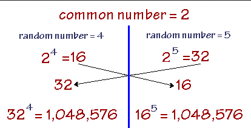
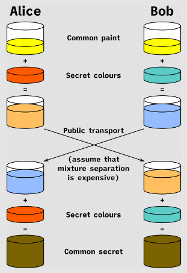

**Main Source :**

- **[Diffie–Hellman key exchange - Wikipedia](https://en.wikipedia.org/wiki/Diffie%E2%80%93Hellman_key_exchange)**

**Diffie-Hellman [Key Exchange](/computer-security/encryption#key-exchange)** is a cryptographic protocol to securely exchange a secret key over a public communication. It was one of the earliest example of [public-key cryptography](/computer-security/encryption#public--private-key) or [asymmetric cryptography](/computer-security/encryption#symmetric--asymmetric-encryption).

### Explanation

The Diffie-Hellman key exchange is based on mathematical concepts including the [modular exponentiation](/computer-security/math-concepts#modular-exponentiation) and the difficulty of the discrete logarithm problem. The protocol relies on mathematical operations performed in a finite field.

1. **Public Key Agreement** : Each party, often denoted as **Alice** and **Bob**, agree on two number : $p$, which is a prime number and $g$, which is the base value.
2. **Key Generation** : Both parties choose their own private key (an integer), let's say Alice's private key is $a$ and Bob's private key is $b$.
3. **Public Key Calculation** : Alice's public key (denoted as $A$) is obtained by $A = g^{a} \text{ mod } p$, and for Bob (denoted as $B$) is similar : $B = g^{b} \text{ mod } p$. After the calculation, they will share the public key to each other.
4. **Compute Secret Key** : The shared secret key, denoted as $s$ is computed as follows: For Alice, $s = B^a \text{ mod } p$. Similarly, for Bob, $s = A^b \text{ mod } p$.

That's it, they will have the same secret key. The secret key is not shared in public, they will derive the secret key on their own. Although they chose a different number (their own private key), they will still arrive at the same secret key.

The most important math properties of why this works is described as the following formula :

$(g^a \text{ mod } p)^b \text{ mod } p = (g^b \text{ mod } p)^a \text{ mod } p$  
or  
$A^b \text{ mod } p = B^a \text{ mod } p$

This equation demonstrates that if Party A raises the result of $g^a \text{ mod } p$ to the power of $b$ and takes the modulus $p$, it will yield the same result as Party B raising the result of $g^b \text{ mod } p$ to the power of $a$ and taking the modulus $p$. This property allows both parties to compute the same shared secret key without directly exchanging their private keys.

  
Source : https://www.pcmag.com/encyclopedia/term/diffie-hellman

Here is an analogy of Diffie-Hellman key exchange in terms color combination.

  
Source : https://en.wikipedia.org/wiki/Diffie%E2%80%93Hellman_key_exchange#/media/File:Diffie-Hellman_Key_Exchange.svg

#### Security

If an attacker were to [brute force](/computer-security/other-attack-and-exploit#brute-forcing) the secret key, the attacker would need to compute the secret key formula, which is $(g^a \text{ mod } p)^b \text{ mod } p$ or $(g^b \text{ mod } p)^a \text{ mod } p$. Note that only $a$ and $b$ are kept secret, all the other values such as $p$, $g$, $g^a \text{ mod } p$, and $g^b \text{ mod } p$ are sent in clear.

The hacker would need to solve for $g^{ab} \text{ mod } p = g^{ba} \text{ mod } p$, which is equal to the secret key formula. As $a$, $b$, $p$ grow larger, the complexity grows exponentially, making it computationally infeasible for large values. Therefore, it is crucial to select larger values to ensure the security of the Diffie-Hellman key exchange.
