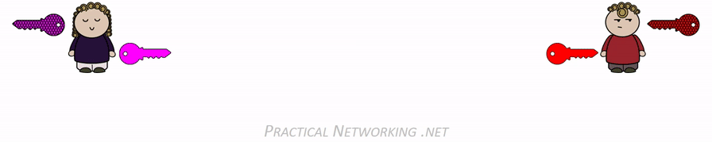
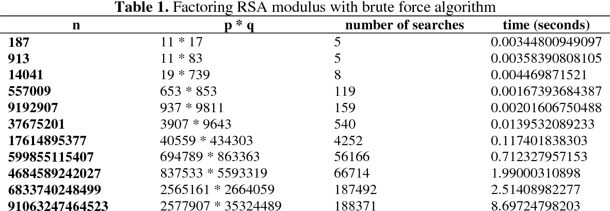

**Main Source :**

- **[RSA (cryptosystem) - Wikipedia](<https://en.wikipedia.org/wiki/RSA_(cryptosystem)>)**
- **[Carmichael function - Wikipedia](https://en.wikipedia.org/wiki/Carmichael_function)**
- **[What's the difference between RSA and Diffie-Hellman? [duplicate] - cryptography stackexchange](https://crypto.stackexchange.com/questions/42180/whats-the-difference-between-rsa-and-diffie-hellman)**

**Rivest–Shamir–Adleman (RSA)** is a widely used [asymmetric encryption](/computer-security/encryption#symmetric--asymmetric-encryption) algorithm. It was based on similar mathematical properties with the [Diffie-Hellman key exchange](/computer-security/diffie-hellman), that is large prime numbers and [modular arithmetic](/computer-security/math-concepts#modular-arithmetic).

RSA uses public and private key, the [public key](/computer-security/encryption#public--private-key), which is shared publicly is used to encrypt, and the [private key](/computer-security/encryption#public--private-key), which is kept secret, is used to decrypt. The key are related mathematically, however, it is computationally infeasible to derive the private key from the public key.

### Explanation

The RSA is an actual asymmetric encryption algorithm (e.g., used for exchanging data), it is not used solely for exchanging key like the [Diffie-Hellman key exchange](/computer-security/diffie-hellman).

It consists of four steps :

1. **Key Generation** :

   - Randomly select two large prime numbers which has large different, $p$ and $q$. These prime numbers should be kept secret.
   - Compute $n = pq$, where $n$ is the modulus used for both the public and private keys. $n$ is also publicly available as part of the public key.
   - Calculate $\lambda(n)$, where $\lambda$ is **Carmichael's totient function**, and it is the smallest positive integer $m$ such that $a^{m}\equiv 1{\pmod {n}}$, where $n$ is a positive integer, for all integers $a$ [coprime](/computer-security/math-concepts#relative-prime) to $n$.

     Since $n = pq$, $\lambda(n) = \text{lcm}(\lambda(p), \lambda(q))$, and since $p$ and $q$ are prime, $\lambda(p) = \phi(p) = p − 1$, and likewise $\lambda(q) = q − 1$. Hence, $\lambda(n) = \text{lcm}(p − 1, q − 1)$, where $\phi$ is the [Euler's totient function](/computer-security/math-concepts#eulers-totient-function).

     The LCM itself can be calculated using [Euclidean algorithm](/computer-security/math-concepts#greatest-common-divisor-gcd) through the [LCM formula](/computer-security/math-concepts#least-common-multiply-lcm), also $\lambda(n)$ is kept secret.

   - Choose a public exponent, $e$, such that $2 < e < \lambda(n)$ and $\text{gcd}(e, \lambda(n)) = 1$; that is, $e$ is [coprime](/computer-security/math-concepts#relative-prime) to $\lambda(n)$. $e$ is also publicly available as part of the public key.
   - Compute $d$ as $d \equiv e^{-1} (\pmod \lambda(n))$ to obtain $d$. $d$ is modular multiplicative inverse of $e$ modulo $\lambda(n)$. $d$ can be obtained by solving $de \equiv 1 (\pmod \lambda(n))$ using the [extended Euclidean algorithm](/computer-security/math-concepts#extended-euclidean-algorithm), using the properties of [Bézout's identity](/computer-security/math-concepts#bézouts-identity). This $d$ is kept secret as the private key exponent.

   In conclusion, modulus $n$ and exponent $e$ is the public key. While exponent $d$ is obtained from $p$, $q$, and $\lambda(n)$, these must be kept secret.

   :::note
   In the original RSA paper, the [Euler's totient function](/computer-security/math-concepts#eulers-totient-function), $\phi(n) = (p - 1) \times (q - 1)$ is used instead of $\lambda(n)$.
   :::

2. **Key Distribution** :

   - The public key is shared with anyone who wants to send an encrypted message to the owner of the private key.
   - The private key must be kept secret by the owner and should not be shared.

   Sender must know recipient's public key to encrypt message, and the recipient must use its own private key to decrypt the message. Similar when the scenario is reversed, if the recipient want to send message to the sender instead, then the recipient needs sender's public key and sender will use their private key to decrypt the message.

3. **Encryption** :

   - The sender must convert the plaintext message into a numerical representation, the plaintext will also be added with random padding, becoming $m$.
   - The sender retrieves the recipient's public key $e$ and the modulus $n$.
   - The ciphertext is computed as $c \equiv m^e \text{ mod } n$.

4. **Decryption** :

   - The recipient uses their private key $d$ to decrypt the encrypted message.
   - The numerical representation of plaintext $m$ is calculated by $c^d \equiv (\text{m}^e)^d \equiv m \text{ mod } n$.
   - The original message $M$ is recovered by reversing the random padding scheme in the beginning of encryption scheme.

     
    Source : https://www.practicalnetworking.net/series/cryptography/using-asymmetric-keys/

### Security

RSA is used to encrypt message that is transmitted over insecure network. Attacker would intercept that encrypted message and decrypt it. In order to decrypt it, the attacker would need the recipient's private key.

To obtain the recipient's private key, the modulus $n$, which is available in public needs to be prime factorized. Modulus $n$ is obtained by the product of two prime number $p$ and $q$, we would need to find these numbers. After that, the $p$ and $q$ will be used to calculate the Carmichael totient's function to obtain the private key $d$, which is used to decrypt the message.

The difficulty of breaking RSA comes when factoring large composite numbers into their prime factors. Modulus $n$ is obtained by the product of two prime number (product of two prime number is always a composite number), however, factoring large numbers is computationally challenging. As long as the key sizes used in RSA are sufficiently large, it is considered secure against brute force attacks.

:::tip
See [factorization](/computer-security/math-concepts#factorization) as reference about factoring number.
:::

The level of RSA security can be chosen by how many bits used for prime numbers $p$ and $q$ :

- **1024-bit RSA** : The modulus $n$ is 1024 bits, each prime factor $p$ and $q$ would be roughly 512 bits.
- **2048-bit RSA** : $n$ is 2048 bits, $p$ and $q$ is 1024 bits.
- **3072-bit RSA** : $n$ is 3072 bits, $p$ and $q$ is 1536 bits.
- **4096-bit RSA** : $n$ is 4096 bits, $p$ and $q$ is 2048 bits.

By having 2048 bits for $p$, it means $p$ can vary from $0$ to $2^{2048} - 1$, which is approximately equal to $1.1 \times 10^{77}$. Consider the table below, the time grows exponentially. For reference, $2577907 \times 35324489 = 91063247464523$ is approximately 47 bits.

  
Source : https://www.semanticscholar.org/paper/Using-Random-Search-and-Brute-Force-Algorithm-in-Budiman-Rachmawati/c54d03d38e7b1e34efb712fb6ec6f23e8673d559
