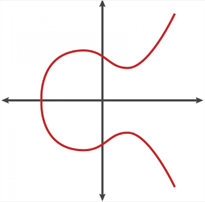
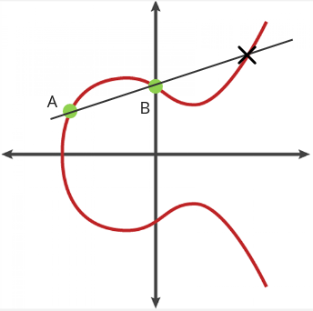
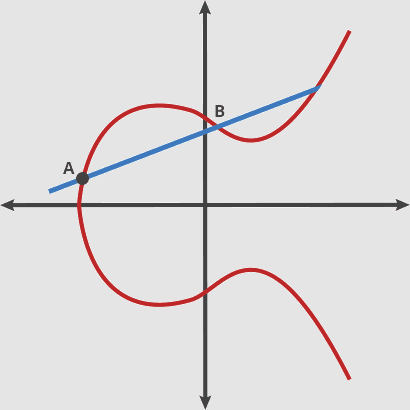
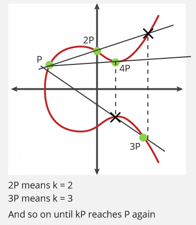
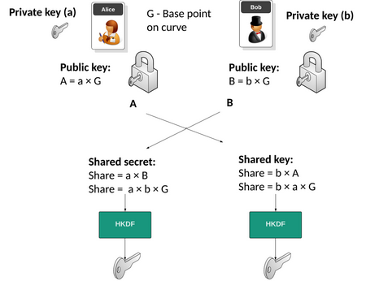

**Main Source:**

- **[Elliptic-curve cryptography — Wikipedia](https://en.wikipedia.org/wiki/Elliptic-curve_cryptography)**
- **[A (Relatively Easy To Understand) Primer on Elliptic Curve Cryptography — Cloudflare Blog](https://blog.cloudflare.com/a-relatively-easy-to-understand-primer-on-elliptic-curve-cryptography/)**
- **[Elliptic Curve Cryptography Overview — Wikipedia](https://youtu.be/dCvB-mhkT0w?si=hT-fXRxmjb3TmHfu)**
- **[Elliptic Curves — Computerphile](https://youtu.be/NF1pwjL9-DE?si=XfPlzAbOj1Qe7EGq)**
- **[ECDH — A security site](https://asecuritysite.com/ecdh)**

**Elliptic Curve Cryptography** is a form of [public key cryptography](/computer-security/encryption#public--private-key) that is based on the properties of elliptic curve when they are defined over finite fields.

### Elliptic Curve

An elliptic curve is a mathematical curve defined by $y^2 = x^3 + ax + b$.

  
Source: https://www.globalsign.com/en/blog/elliptic-curve-cryptography

$a$ and $b$ are the constants that defines the curve, and $x$ and $y$ are the coordinates of points on the curve. The equation represents the set of points $(x, y)$ that satisfy the equation.

The unique properties of elliptic curve is that they are symmetric around the x-axis. When you draw a line from two point, the line will always intersect another point somewhere.

  
Source: https://www.globalsign.com/en/blog/elliptic-curve-cryptography (with modification)

The operation that involves taking two point and obtaining the intersection point is called the "dot" operation. We can keep repeating this operation, the intersection point will be reflected over the x-axis, and we will draw another line from the first point to the new reflected point.

  
Source: https://blog.cloudflare.com/a-relatively-easy-to-understand-primer-on-elliptic-curve-cryptography/

After doing a lot of dot operation, it is said to be hard to arrive again at the initial point.

#### ECDLP

The **Elliptic Curve Discrete Logarithm Problem (ECDLP)** is the problem of finding the scalar value $k$ in the equation $kP = Q$. In this equation, $P$ is a known point on the elliptic curve, $Q$ is another point on the curve, and $k$ is the scalar value that needs to be determined.

To relate this with the graphical illustration, we need to find how many times we need to do the dot operation in order to arrive at the same initial point. There is also a limit of how many dot operation we can do, it is denoted as $n$. The $n$ should be a prime number, prime number is said to have unique properties that makes the problem becomes harder to solve.

So, when we have $n = 1000$, this mean there are 1000 possible addition or 1000 possible dot operation. Out of all 1000 operation, we will need to find the one number $k$ inside the range of $n$ that makes the intersection point same as the initial point.

As of now, there are no efficient algorithms that can find the value of $k$, while the brute force algorithm is computationally infeasible for large $n$. For example, if $n$ is a 256-bit prime, there are approximately $2^{256}$ possible values of $k$ to check.

Relating the ECDLP problem to cryptography, the $n$ is the key size of the encryption, the value of $k$ is the private key that is kept secret and hard to be found, and the public key is all the multiple of initial point, it is the P, 2P, 3P, 4P or all the intersection in the graphical illustration.

### Elliptic Curve Diffie-Hellman

The [Diffie-Hellman key exchange](/computer-security/diffie-hellman) is a traditional [key exchange](/computer-security/encryption#key-exchange) method. **Elliptic Curve Diffie-Hellman (ECDH)** is a key exchange algorithm based on the Diffie-Hellman (DH) protocol that utilizes elliptic curve cryptography (ECC).

#### Explanation

Just like the traditional Diffie-Hellman, two parties are going to share the same secret key.

1. **Key Generation**:

   - Each party, let's say Alice and Bob, generates their own elliptic curve key pair, which consist of a private key and a corresponding public key.
   - The private key is denoted as $a$ for Alice and $b$ for Bob, and it's a randomly generated scalar value, which is an integer.
   - The public key is a specific point on the curve, it is obtained by scalar multiplication of private key and a chosen base point $G$ on the elliptic curve.
   - For Alice, it will be $A = aG$, for Bob, it will be $B = bG$.

2. **Key Exchange**:

   - Alice sends her public key $A$ to Bob, and Bob sends his public key $B$ to Alice.

3. **Shared Secret Key Computation**:

   - Alice computes the shared secret key $S = aB = a(bG) = (ab)G$.
   - Bob computes the shared secret key $S = bA = b(aG) = (ab)G$.

     
    Source: https://asecuritysite.com/ecdh

#### Security

The security of ECDH relates to the ECDLP problem. Even if the attacker intercepts the base point $G$ and the public key $A$ or $B$, which is equal to $aG$ or $bG$, it will be hard to find the value of $a$ or $b$. Finding $a$ or $b$ is the same as finding the value of integer $k$.
