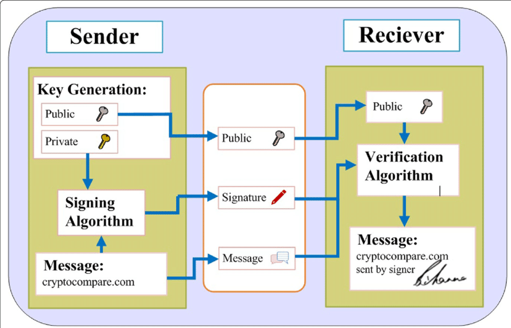

**Main Source:**

- **[Digital Signature Algorithm — Wikipedia](https://en.wikipedia.org/wiki/Digital_Signature_Algorithm)**

**Digital Signature Algorithm (DSA)** is a [public key cryptography](/computer-security/encryption#public--private-key) or [asymmetric cryptography](/computer-security/encryption#symmetric--asymmetric-encryption) algorithm used for digital signatures. Digital signature is like a real physical signature, it is used to ensure integrity and origin of digital data.

DSA is based on the mathematical concept of [modular exponentiation](/computer-security/math-concepts#modular-exponentiation) and the difficulty of solving the discrete logarithm problem. DSA and [Diffie-Hellman key exchange](/computer-security/diffie-hellman) both rely on the computational difficulty of the discrete logarithm problem.

### Explanation

The discrete logarithm problem is finding the exponent number in the equation $g^x \equiv y \space (\text{mod } p)$, where $g$ is base value, $y$ is the result of $g^x \text{ mod } p$, and $p$ is a prime number. The $x$ is the private key which is kept secret, the remaining, $g$, $y$, and $p$ are the public keys.

Here is a more detailed explanation of DSA:

1. **Key Generation**:

   - Choose parameters:

     - Choose a [hash function](/computer-security/hash-function) $H$ with output length of $|H|$ bits (e.g., [SHA-1](/computer-security/sha#sha-1) or [SHA-2](/computer-security/sha#sha-2)).
     - Choose key length $L$, it should be multiple of 64 between 512 bits and 1024 bits inclusive (or even larger).
     - Choose modulus length $N$, should be lower than key length and hash function's output. For example, $L$ and $N$ can be (1024, 160), (2048, 224).
     - Choose $N$-bit prime $q$ and $L$-bit prime $p$, such that $p - 1$ is a multiple of $q$
     - Choose a random integer $h$ from $\{2..p - 2\}$.
     - Compute generator $g$: $g:= h^{(p - 1) / q} \text{ mod } p$.
     - The $p$, $q$, and $g$ can be shared publicly.

   - Compute keys:
     - Choose random integer $x$ as private key from $\{1..q - 1\}$
     - Compute public key $y$: $y:= g^x \text{ mod } p$

2. **Key Distribution**:

   - The (signer) of the digital data should public the public key $y$, whereas the $x$ is kept secret.

3. **Signing**:

   - Choose a random integer $k$ from $\{1..q - 1\}$.
   - Compute $r:= (g^k \text{ mod } p) \text{ mod } q$.
   - Compute $s:= (k^{-1} (H(m)) + xr) \text { mod } q$, where $H(m)$ is the output of hash function when inputting message $m$.
   - The resulting signature is the pair $(r, s)$, which will be attached to the document.

4. **Signature Verification**: Given a pair of signature $(r, s)$, to determine if it's valid for message $m$:

   - Verify that $0 < r < q$ and $0 < s < q$.
   - Compute $w:= s^{−1} \text{ mod } q$.
   - Compute $u_1:= H (m) \cdot w \text{ mod } q$.
   - Compute $u_2:= r \cdot w \text{ mod } q$.
   - Compute $v:= ( g^{u_1}y^{u_2} \text{ mod } p ) \text{ mod } q$.

   If $v$ is equal to $r$, then the signature is valid.

In conclusion, the public key $y$ is used to verify the signature, while the private key $x$ (which is hard to find) is used to sign the digital data.

When an attacker tries to break DSA, their objective is to impersonate the original owner. They will try to find the private key so they can modify the content of digitally signed messages without invalidating the signature. This can lead to the manipulation or corruption of data, potentially causing harm or deception.

If we say the document is $a$, the hashed document is $b$, and the hashed document encrypted with private key is $c$, then, the attacker must find the original private key owned by the actual signer, so that the decryption of digital signature or converting back from $c$ to $b$ will match the hashing of document from $a$ to $b$. The verification process doesn't check if document is modified or not, the point is, the resulting hash value from the document must match with the decrypted digital signatures attached in the document.

  
Source: https://medium.com/@21_000_000/digital-signature-algorithm-60c8318cf9b6
