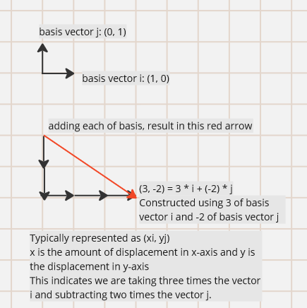
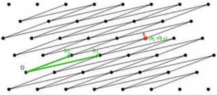
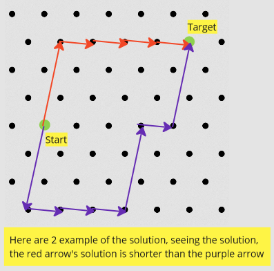

**Main Source :**

- **[What is Lattice-Based Cryptography & Why You Should Care by Wickr - Medium](https://medium.com/cryptoblog/what-is-lattice-based-cryptography-why-should-you-care-dbf9957ab717)**
- **[How Quantum Computers Break The Internet... Starting Now - Veritasium](https://youtu.be/-UrdExQW0cs?si=J_BSoCsNY3a4g45s)**

**Lattice-Based Cryptography** is a cryptography based on mathematical concept called **lattice**.

### Lattice

In math, lattice is an infinitely many points that extends infinitely in all directions. Each point in the lattice, called lattice point, is associated with a set of coordinates that specify its position in space.

  
Source : https://en.wikipedia.org/wiki/Lattice_(group)

A lattice can be represented as vector, vector can be thought as an arrow that points to some direction and has a magnitude or the length of the vector.

A vector can be made by a bunch of other vectors, the smallest vector you can use to build another vector is called the **basis vector**. To construct a vector, you would add together the basis vector several times (or multiply).

The basis vector serves as the building block for making vector, which will determine the lattice's structure. Operation in lattice is closed, which means if you add or subtract a point with another lattice point, it will always result in another point which exists in the lattice itself.

Basis vector can even be more complex, for example, the basis vector $i$ may point to the x-axis as well as the y-axis. In other word, it is not necessary to only point to one direction, it can point diagonally.

  
Source : https://medium.com/cryptoblog/what-is-lattice-based-cryptography-why-should-you-care-dbf9957ab717

### Cryptography Applications

Unlike many other cryptographic schemes that rely on the difficulty of factoring large numbers or solving the discrete logarithm problem, lattice-based cryptography is believed to be resistant to attacks by quantum computers.

:::tip
Quantum computer is a computer that takes advantage of quantum mechanism phenomena, it is able to do computation faster than classical computer, which mean it can break cryptography algorithm faster by brute forcing faster.
:::

The security of lattice-based cryptography is based on the hardness of certain problems related to lattices, such as the **Closest Vector Problem (CVP)**.

#### CVP

The CVP problem states that we are given some lattice and two vectors, we are told to construct a vector that starts from some point to the target lattice point. The problem is hard because the vector we are looking for is the shortest vector.

The problem become harder as we extend the lattice's dimension. It may not only have x and y coordinate, it may have 10000 coordinates. Going to some direction in a dimension may not be the best choice, it may result in further distance in another dimension.

The given vector may be peculiar, or the given lattice structure is more complex (e.g., we can't form a straight path, we may need to go diagonally). The more complex the constraint, the more combination would exist, which mean will be harder to solve.

There is no known algorithm that can solve CVP in efficient time for arbitrary lattices. There are some algorithms that approximate the closest vector, but still, it may not be the closest.

#### Usage

Both sender and recipient will have a pair of public and private key. The private key will be a "good" basis vector that defines the lattice structure. The public key is the lattice structure, which will be used by the recipient.

To securely share the lattice structure, the private key (the "good" basis vector) is not used. Instead, a set of "bad" vectors is used to define the lattice structure.

When sending a message, it is encoded as a lattice point. The recipient, equipped with the private key (the "good" vector), can easily locate and retrieve that specific lattice point. However, an attacker, knowing only the lattice structure but lacking the private key, would face difficulties in reaching the desired lattice point.
