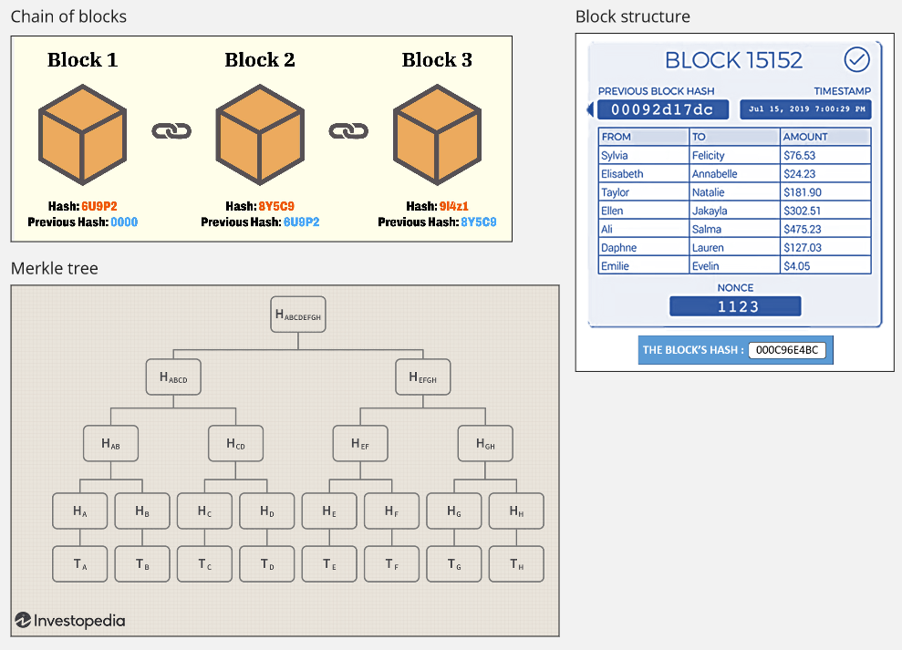
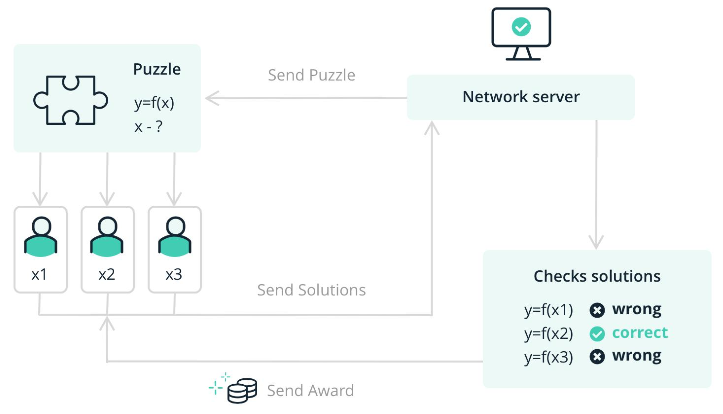

**Main Source :**

- **[Structure of a Block in Blockchain - Shiksha Online](https://www.shiksha.com/online-courses/articles/structure-of-a-block-in-blockchain/)**
- **[UNIT-2.2: Hash Puzzle by SSLP - Medium](https://medium.com/@slpbphdvit/unit-2-2-hash-puzzle-9eeb9d25196e)**
- **[How does a blockchain work - Simply Explained](https://youtu.be/SSo_EIwHSd4?si=PHEwccOano4XOC2G)**

**Blockchain** is a technology of decentralizing transactions record using the concept of cryptography.

Decentralize is a concept where central authority is not needed for recording and handling activities. For example, individuals that wants to transfer money to another person typically require a central authority, like a bank, to facilitate or validate the transaction. Decentralization reduces transaction costs and make it less susceptible to manipulation or restrictions by the third parties.

### Explanation

A single record of transaction is called a **block**, each block has a reference to other block, these blocks are chained together to create a chain of block. The chaining mechanism in blockchain is similar to [linked list](/data-structures-and-algorithms/linked-list) data structure.

In linked list, each element is considered as a node, each node has memory reference to the next node. However, blockchain is more advanced than that, blocks are chained together using [cryptographic hash functions](/computer-security/hash-function).

#### Block Structure

A block consists of header and body. Header contains important information about the block, and the body, contains the transaction data.

Header :

- **Hash of Previous Block** : The hash value of the previous block in the blockchain, creating the chain.
- **Timestamp** : The time when the block was created or mined.
- **Version** : This field indicates the version of the blockchain protocol being used.
- **Merkle Root** : Merkle root is a hash value that represents a summary of all the transactions in the block. Merkle's tree, also known as hash tree, is a data structure used to verify the integrity and consistency large sets of data. A Merkle tree is constructed by recursively hashing pairs of data until a single root hash, known as the **Merkle root**, is obtained. This mean the hashes of data will be hashed again to create the parent, up to the root node.

When a block is hashed, the entire block is converted into specific format that can be processed by hash function. The resulting hash serve as a unique identifier for a block in the chain.

The chaining mechanism in blockchain ensure the immutability of the data stored in a blockchain. If any data in a block is modified, it will result in a change in the block's hash value (due to [avalanche effect](/computer-security/hash-function#hash-function-properties)). As a result, the subsequent blocks in the chain will have invalid references to the altered block, indicating that the blockchain has been tampered with. Another thing to note is blockchain is a decentralized platform, the ledger is distributed among multiple participants who maintain their own copies of the blockchain. This distributed nature ensures that any changes made to a particular block or transaction would need to be replicated across the entire network to maintain consensus and consistency.

Body :

- **Transactions** : The block body contains a list of transactions that are being added to the blockchain.

  
Source : [Chain of blocks](https://money.com/what-is-blockchain/), [Block structure](https://www.shiksha.com/online-courses/articles/structure-of-a-block-in-blockchain/), [Merkle tree](https://www.investopedia.com/terms/m/merkle-tree.asp)

#### Mining

Blockchain mining is the process of adding new blocks to a blockchain by solving complex mathematical puzzles or cryptographic problems. Some blockchain implementation requires you a proof when you add blockchain.

##### Consensus

Consensus is the mechanism that involves asking participants whether blockchain can be modified or not. These participants are individuals or organizations that are actively involved in the operation and maintenance of the blockchain network. It is the process of all participants to verify if a transaction is valid or not, to ensure the validity of transactions and the integrity of the ledger.

One of the popular consensus mechanism is the **Proof of Work (PoW)**. This mechanism require network participants (known as miners) to solve complex mathematical puzzles. In a PoW system, the puzzle typically involves finding something called **nonce** that, when combined with the other block data, produces a hash value that meets certain criteria. The **nonce** is a random value that also exist in the header of a block.

Miners attempt to find the solution to the puzzle through a trial-and-error process. They repeatedly modify the nonce value, calculate the hash of the block, and check if it meets the required criteria. Since the output of a cryptographic hash function is essentially unpredictable, miners must make many attempts until they find a suitable nonce that satisfies the puzzle's difficulty criteria. The difficulty depends on the blockchain system, the system may make it to be easy to increase the block creation rate or hard to decrease it.

For example, the puzzle may require miners to find a nonce value that, when combined with the block data, produces a hash value that starts with three zeros (000) when hashed using a cryptographic hash function like [SHA-256](/computer-security/sha#sha-2). So we will need to find hash such that: `Hash = SHA-256(Block Data + Nonce) = 000...`. After a miner found a solution, the other participants will verify the solution by doing the same calculation with the given nonce solution. If it's valid, the nonce will be used for creating new block, the miner that found the solution will also be rewarded with something like cryptographic currency or tokens.

This also applies when you modify certain block, when you modify the block, you will also change the hash of the block. Let's say you are changing certain block, the previous block that refer to it will need to be changed as well. When you want to change that other block, you will need to complete the PoW again to satisfy the block's difficulty criteria.

  
Source : https://www.ledger.com/academy/blockchain/what-is-proof-of-work
