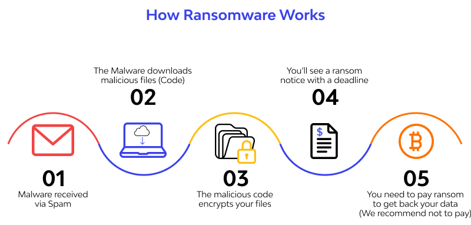
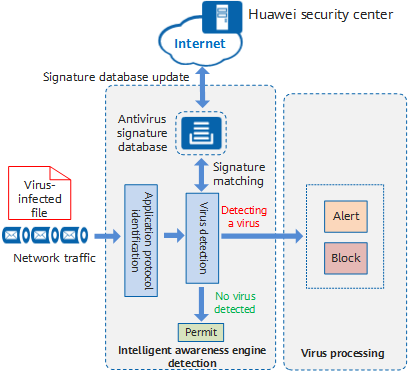

**Main Source:**

- **[What Is Malware and How to Protect Against Malware Attacks? — Avast](https://www.avast.com/c-malware)**
- **Many Google search**

**Antivirus & Antimalware** are software that are designed to protect computers and other devices from malicious software, commonly known as **malware**. Malware is any software that is created to compromise the security of a computer system, steal sensitive information, or cause damage to the device or its data.

### How Malware Works

Malware can do various thing to cause problems, for example, they may execute instruction without authority. The instruction can be deleting user's data, leaking information, doing a useless computation to slow down computers, etc.

Malware exploit vulnerabilities of a computer system. It can exploit weaknesses in software security, outdated patches, or misconfigurations to bypass defenses and gain elevated privileges.

  
Source: https://www.wallarm.com/what/explained-ransomware-attack

### Type of Malware

Malware is a broad term for malicious software, here are some types of malware:

- **Viruses**: Viruses is analogous to biological viruses, when they are executed, they will infect other programs by injecting malicious code.
- **Worms**: Worms is a self-replicating malware that starts from an infected computer and replicates to other device in a network. Worms can consume network bandwidth and degrade system performance.
- **Trojans**: Trojans are software that imitate other software to trick users into downloading and executing them, often by hiding in seemingly harmless files or applications.
- **Ransomware**: Ransomware is a type of malware that encrypts files on a victim's computer or network, making them inaccessible. The attackers then demand a ransom payment in exchange for the decryption key.
- **Adware**: Adware is a form of malware that displays unwanted advertisements. It may come bundled with legitimate software or be installed unintentionally by the user. While it is not very dangerous compared to other, it can be annoying to users.
- **Spyware**: Spyware is designed to covertly gather information about a user's activities, such as browsing habits, keystrokes, or sensitive data.
- **Rootkits**: Rootkits are stealthy malware that provides unauthorized access to a computer or network.
- **Keyloggers**: Keyloggers record keystrokes made by a user on a compromised system. They can capture sensitive information such as passwords, credit card details, or other confidential data.

### How Antivirus & Antimalware Works

Antivirus and antimalware help protecting computer systems, many techniques are used for this.

- **Database of Virus**: Antivirus software often have a huge database of known malware, they will scan through user's file and check if those file contains a common pattern or characteristics.
- **Analysis**: Antivirus can analyze software by having a heuristic analysis. Heuristic is an approach to solve problem that involves using rules or strategy that may evolve over time. For example, if a program often access user's information and send it over network, it may be considered as malicious.

An antivirus software regularly updates its signature database and program components to stay up-to-date with the latest threats. It is a very crucial to keep up with recently known vulnerabilities as fast as possible.

  
Source: https://info.support.huawei.com/info-finder/encyclopedia/en/Antivirus.html
