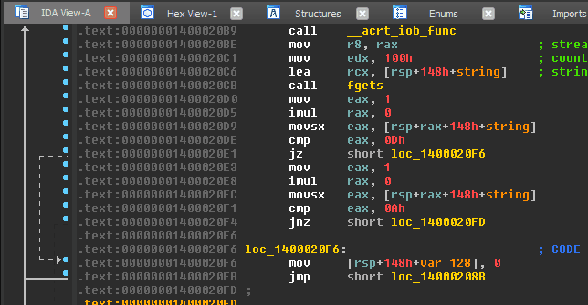

**Main Source :**

- **[Reverse engineering - Wikipedia](https://en.wikipedia.org/wiki/Reverse_engineering)**
- **Other Google search**

**Reverse Engineering** is the process of analyzing software or computer system to understand their inner workings, design, or functionality. It is a broad term that encompasses various techniques and approaches.

### Reverse Engineering Technique

#### Trial & Error

Trial and error involves systematically experimenting with different inputs, configurations, or parameters of a software or system to understand its behavior. Reverse engineers observe the outcomes of these experiments, after many experiments, they will come up in conclusion of how it works.

For example, we may have a program that connect to server, suppose we want to know how the server works. We can try each setting and input to see how will the server respond, including the invalid request. Seeing the response, we will get the idea of how it works a little by little.

#### Decompilation

**Decompilation** is a technique to translate compiled binary code back into a higher-level programming language. When we program in higher-level language, the source code will be converted down into machine language (e.g., assembly language), which will be executed by computers. These codes are hard to understand by human, by decompiling it back to higher-level language, we can understand it easier.

Decompiling can recreate (or at least approximate) the original source code from executable code to higher-level language. This will help reverse engineering process a lot, because we are able to see the readable code. However, decompilation tools are not perfect. The resulting decompiled code may not be an exact replica of the original source code. Decompilers can face challenge when reconstructing the code due to compilers optimizations that results in loss of information during the compilation process, and other factors.

#### Disassembly

**Disassembly** is a technique to convert machine code or binary instructions back into assembly language. It doesn't convert back to higher-level language, but it converts it into readable machine code.

Disassembly provides more detail about the low-level instruction, it doesn't need to approximate high-level abstraction. It can reveal specific instructions executed by the processor, including memory accesses, register operations, and control flow.

  
Source : https://blog.ret2.io/2017/11/16/dangers-of-the-decompiler/
