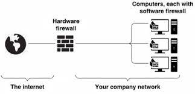

**Main Source :**

- **[Network eavesdropping - Wikipedia](https://en.wikipedia.org/wiki/Network_eavesdropping)**
- **[Man-in-the-middle attack - Wikipedia](https://en.wikipedia.org/wiki/Man-in-the-middle_attack)**
- **[Wikipedia Denial-of-service attack](https://en.wikipedia.org/wiki/Denial-of-service_attack)**
- **[Spoofing attack](https://en.wikipedia.org/wiki/Spoofing_attack)**
- **[DDoS Attack Explained](https://youtu.be/ilhGh9CEIwM?si=tVeGgpOmlVOtxNSx)**
- **[What is a Firewall?](https://youtu.be/kDEX1HXybrU?si=gobmfAT1Kcq8dFGO)**
- **Several other Google searches**

Network Security page

### Eavesdropping

**Eavesdropping** is an unauthorized activity that intercept or monitor network communication between devices. It involves capturing and inspecting network traffic without the knowledge or consent of the parties involved in the communication.

Eavesdropping can be very dangerous in an insecure network, hacker could take your personal information that you intend to send to the server.

There are many ways to eavesdrop, it is possible that local communication devices (e.g., Wi-Fi or network cables) is modified so that it can send incoming and outgoing network packet to the hacker's device.

  
Source : https://securitypilgrim.com/what-is-an-eavesdropping-attack-5-tips-to-prevent-it/

#### Packet Sniffing

**Packet sniffing** is the practice of collecting and gathering network traffic by capturing the incoming or outgoing packets in the network. Malicious actor could analyze the packets and extract the contents of data packets flowing across a network.

  
Source : https://upload.wikimedia.org/wikipedia/commons/c/cf/Wireshark_3.6_screenshot.png

#### Man in The Middle Attack

**Man in The Middle Attack (MitM attack)** is the practice of an attacker that positions themselves between two parties engaged in communication. The attacker might intercepts and modify the communication between the two parties without their knowledge.

Let's say there are two parties, A and B. A wants to connect to B, the attacker will inserts themselves in the communication between them. This can be achieved by various means, such as hacking into a router, or executing attacks on the underlying protocols. When the attacker successfully places themselves, the attacker will try to impersonate party B, to make party A thinks they are communicating with party B. By successfully impersonating Party B, the attacker can intercept, read, modify, steal data, or inject malicious content into the communication.

  
Source : https://www.imperva.com/learn/application-security/man-in-the-middle-attack-mitm/

### DDoS Attack

**Distributed Denial of Service (DDoS)** attack is a type of cyberattack in which many computers or devices, often infected with malware, are used to flood a website or network with traffic. This makes the server overwhelmed and cause it to become unavailable to legitimate users. A network of computers that does a DDoS attack is called **botnet**.

An attack where the requests typically originate from a single source is just **Denial of Service (DoS)**. On the other hand, a DoS attack is an attack which run on multiple system connecting to server is called **Distributed Dos (DDoS)**, this causes the server to floods and be overwhelmed.

Another type is **Yo-Yo DDoS** attack which typically targets server that has limited capacity for processing incoming traffic. In a back-and-forth manner, the attacker first attack the server and wait for it to stop the operation. After the server continue the normal operation, the hacker will attack again causing the server to constantly switch between normal operation and overload.

There are several ways to anticipate a DDoS attack :

- **Increase Network Bandwidth** : If possible, increasing the available bandwidth will helps absorb the impact of a DDoS attack by allowing the network to handle a larger volume of traffic.

- **[Load Balancing & Content Delivery Network (CDN)](/computer-networking/server#server-optimization)** : If the DDoS attackers are around the world, using CDN might help. Or we can also distribute the incoming network request using load balancing technique. This technique distribute network request from client evenly across all the server, this will ensure there will be no server that becomes overwhelmed or underwhelmed.

- **Traffic Filtering** : Filtering traffic means we are blocking specific client from making request to the server. There are several technique including blacklisting IP addresses, detect and block suspicious traffic patterns, and by using access control lists (ACLs).

  
Source : https://www.onelogin.com/learn/ddos-attack

### Spoofing

**Spoofing** is the act of impersonating information or identities to manipulate others to gain advantage. It can be presenting false data that looks legitimate, with the intention of gaining unauthorized access or tricking individuals.

#### IP Spoofing

**IP spoofing** is when an attacker modify the source [IP address](/computer-networking/ip-address) in network packets to make it appear as if they are originating from a different IP address. The attacker might impersonate themselves as an innocent user by modifying the IP in network packets so that it looks like it was sent by legitimate user.

#### MAC Spoofing

**MAC spoofing**, on the other hand, impersonate [MAC address](/computer-networking/mac-address) instead. MAC address is a unique identifier assigned to network interface cards. An attacker can deceive network switches or routers into associating their device with the MAC address of a trusted device.

#### DNS Spoofing

When we enter an address of a website, it will be sent to [DNS server](/computer-networking/dns), the server will give us the IP address of the website for us to load in our browser. **DNS spoofing** is the technique where an attacker manipulates the DNS server, so it returns malicious websites instead of a legitimate websites.

  
Source : https://socradar.io/what-is-spoofing-attack-and-how-to-prevent-it/

### Firewall

**Firewall** is a network security device that acts as a barrier between a trusted internal network and an untrusted external network, such as the Internet. Its primary purpose is to control incoming and outgoing network traffic.

  
Source : https://en.wikipedia.org/wiki/Firewall_(computing)

Firewall examines the packets of data passing through them and make decisions about whether to allow or block the traffic based on the defined criteria. Common criteria include source and destination IP addresses, ports, protocols, and packet contents. By analyzing this information, firewalls can determine whether a packet should be allowed to pass through or if it poses a potential security risk and should be blocked.

  
Source : https://youtu.be/kDEX1HXybrU?si=iRlxiRyRBPYrG90I&t=137

A firewall can be implemented in both hardware and software forms. A hardware firewall protects the entire network, typically in a standalone form or built-in to the [router](/computer-networking). A software firewall, also known as host-based firewall, is implemented on individual computers or servers. For example, Windows operating system has a built-in firewall called Microsoft Defender Firewall.

  
Source : https://shop3213.sosoutremer.org/category?name=hardware%20vs%20software%20firewall

### Network Encryption

See [network encryption](/computer-networking/network-encryption)
