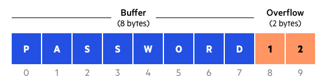
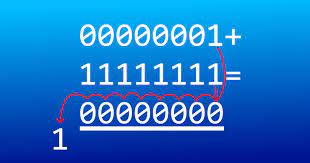
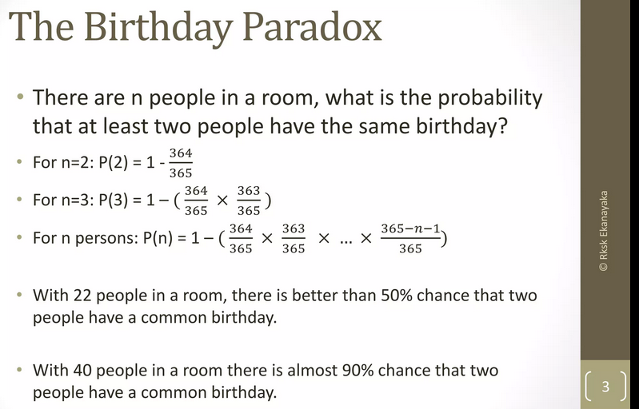
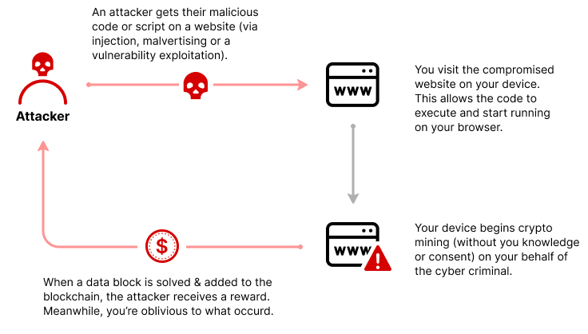

**Main Source :**

- **Various Google searches and chatbots**

### Brute Forcing

Systematically trying out possible combination without strategy to find a correct solution. See [brute force](/computer-and-programming-fundamentals/computer-and-programming-terminology#brute-force) for example.

### Rainbow Table Attack

A rainbow table attack is a precomputed table-based method used to crack [hashed passwords](/computer-security/hash-function) or other cryptographic keys. Before actually attacking a system, the attacker compute the hash of plaintext passwords and store the plaintext along with the hash codes in some table called **rainbow table**.

In the actual attack, when the attacker has the hashed value of a password but don't know what the plaintext password is, the attacker can perform a reverse lookup in the rainbow table. They compare the hashed value with the values stored in the table to find a match. If a match is found, the corresponding plaintext value is retrieved, giving the attacker the original password or key.

### Memory Leak

**Memory leak** is a type of software bugs that occurs when the program fails to release memory that it no longer needs or fails to return memory to the operating system after it has finished using it.

When a program uses memory, it will be allocated by the OS. Memory leaks occur when you don't deallocate the memory after using it, leading to a gradual accumulation of unused memory over time. The program's memory usage increases, potentially leading to performance degradation and eventually causing the program to crash or become unresponsive.

### Buffer Overflow

**Buffer overflow** is software vulnerability when a program writes data beyond the boundaries of a buffer, or a fixed-size memory storage area. For example, a program require you to write a fixed 5-length character. Under the hood, the program only allocates memory with the size of 5 character. When you enter a longer character, the program doesn't have any more memory to store, causing it to write into adjacent memory locations. Reserved memory might be overwritten, making the program experience **undefined behaviors (UB)**.

  
Source : https://www.imperva.com/learn/application-security/buffer-overflow/

### Integer Overflow

**Integer overflow** is another software bug that occurs when you do an arithmetic operation that results in a value that exceeds the maximum representable value for a given integer type.

For example, the maximum number you can represent using 8-bit [binary representation](/computer-and-programming-fundamentals/binary-representation) is `11111111`, which represent the number 255.

When you add 255 with the number 1, you will obviously end up with 256, however, computer can't represent this, because it has limited bits. When adding `11111111` with `00000001`, you will end up back to `00000000`, because the most significant bit is discarded, and the result wraps around to `00000000`. This is known as "wrapping" or "overflow" behavior, where the value resets back to the minimum representable value.

  
Source : https://www.sdsolutionsllc.com/forcedentry-and-integer-overflows/

### Birthday Attack

**Birthday attack** is a cryptographic attack that exploits the mathematical probability of collisions in [hash functions](/computer-security/hash-function). It is named after the "birthday paradox," which states that in a group of a relatively small number of people, the probability of two individuals having the same birthday is higher than one might intuitively expect.

Even a strong hash function has the potential to generate identical outputs for distinct inputs. Birthday attack takes advantage of this collision probability to find collisions more efficiently than by brute force. Instead of trying to find a collision between two specific inputs, which would require a large number of computations, a birthday attack aims to find any two inputs that produce the same hash value.

The attack works by hashing a large number of randomly generated inputs and storing their resulting hash values. As more inputs are hashed, the probability of finding a collision increases.

  
Source : https://www.slideshare.net/RkskEkanayaka/birthday-paradox-explained

### Social Engineering

**Social engineering** is the technique of manipulating individuals or groups to deceive them into performing unintended actions. It is a technique used by malicious actors to exploit human psychology and trust in order to gain unauthorized access to systems, sensitive data, or to carry out fraudulent activities.

As an example, consider a situation where a friend asks to exchange social media accounts. They might provide you with an incorrect password for their account, leading to a scenario where the account you share with them could be exploited.

#### Phishing

**Phishing** is the technique where an attacker tries to impersonate well-known organization or individuals with the goal to trick individuals into clicking on malicious links, downloading malicious attachments, or providing their confidential information directly to the attacker.

The attacker may replicate an email from bank and ask you for your banking information. On a fake website, you may be prompted to enter sensitive credentials. In a mobile app context, an attacker may create an app that closely resembles a legitimate one, aiming to trick users into believing it is the legitimate application.

#### Typosquatting

**Typosquatting** is the technique that take advantage of human's error when typing for something. It includes variations such as misspelled words, additional characters, or different top-level domains (TLDs).

For example, attacker can reserve the domain `googlr.com` incase people mispelled the domain `google.com`. In another scenario, the attacker could add specific characters, such as a hyphen `-`, to a website address, creating a domain like `paypal-support.com`. This alteration might mislead users into believing that it is the authentic website associated with PayPal's customer support.

The domain name is the important thing to check while you are surfing the internet. Domain names comes after the protocol (e.g., `https://`) and after the subdomain (e.g., `www.`), also before the top-level domain (e.g., `.com`).

:::tip
More about [URL syntax](/frontend-web-development/web-url#url-syntax)
:::

### Cryptojacking

**Cryptojacking** is the practice of using someone's computer or computing resources to mine cryptocurrencies. Cryptojacking can happen silently in the background, idenfity it by checking if the application you are using consume unreasonable amount of resources.

  
Source : https://www.imperva.com/learn/application-security/cryptojacking/

### Tampering

**Tampering** is the act of intentionally modifying something in an unauthorized or improper manner, which might happen when an attacker have access to a system by exploiting system's vulnerabilities. This can includes modifying data, documents, or physical objects with the intent to deceive, manipulate, or gain an unfair advantage.

### Backdoor

**Backdoor** is a hidden or secret method of bypassing regular authentication or security measures in a computer system, software, or network. Software bugs or vulnerabilities can be a contributing factor to the existence of backdoors.

Because they are hidden, they are more difficult to detect than typical method. Backdoors can be intentionally created by developers, system administrators, or individuals with access to a system. These individuals may design and implement hidden access points or bypass mechanisms to gain unauthorized access to a system or network.
