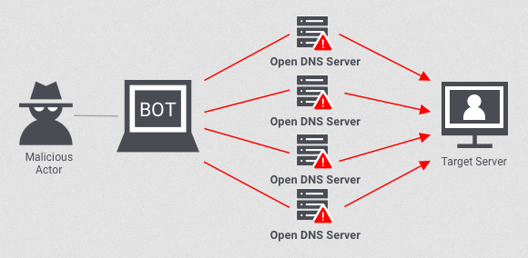

This is the same notes as :

- **[Computer Networking > DDoS](/computer-networking/ddos-attack)**

**Main Source :**

- **[Wikipedia Denial-of-service attack](https://en.wikipedia.org/wiki/Denial-of-service_attack)**
- **[DDoS Attack Explained](https://youtu.be/ilhGh9CEIwM?si=tVeGgpOmlVOtxNSx)**

### DDoS Attack

**Distributed Denial of Service (DDoS)** attack is a type of cyber attack in which a large number of computers or devices, often infected with malware, are used to flood a website or network with traffic, overwhelming it and causing it to become unavailable to legitimate users. This is called **botnet**, which is network of computers that does a DDoS attack.

An attack where the requests typically originate from a single source is called just **Denial of Service (DoS)**. While a DDoS attack is an attack which run on multiple system connecting to server is called **Distributed Dos**, this causes the server to floods and be overwhelmed.

Another type is **Yo-Yo DDoS** attack which typically targets server which has limited capacity for processing incoming traffic. This works by back-and-forth attack, the attacker first attack the server and wait for it to stop the operation, after the server continue the normal operation hacker will attack again causing the server to constantly switch between normal operation and overload.

There are several ways to anticipate a DDoS attack :

- **Increase Network Bandwidth** : If possible, increasing the available bandwidth will helps absorb the impact of a DDoS attack by allowing the network to handle a larger volume of traffic.

- **[Load Balancing & Content Delivery Network (CDN)](/computer-networking/server#server-optimization)** : If the DDoS attackers are around the world, using CDN might helps. Or we can also distribute the incoming network request using load balancing technique. This technique distribute network request from client evenly across all the server, this will ensure there will be no server that becomes overwhelmed or underwhelmed.

- **Traffic Filtering** : Filtering traffic means we are blocking specific client from making request to the server. There are several technique including blacklisting IP addresses, detect and block suspicious traffic patterns, and by using access control lists (ACLs).

  
Source : https://www.onelogin.com/learn/ddos-attack
