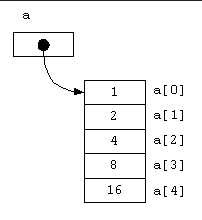

**Main Source :**

- **[Array (data structure) - Wikipedia](<https://en.wikipedia.org/wiki/Array_(data_structure)>)**
- **[Dynamic array - Wikipedia](https://en.wikipedia.org/wiki/Dynamic_array)**

**Array** is a data structure that stores a **fixed-size** of element of the **same type**. In memory, array is located within a contiguous block of memory locations. It is a fundamental and elementary data structure that serves as a building block for constructing more complex data structures.

  
Source : https://beginnersbook.com/2018/10/data-structure-array/

Each element in the array has its own position, it is called **index**. Index in most programming languages starts from 0 (called 0-indexed array) and is incremented by 1 for each subsequent element.

To access an element in the array, we will need to know its position or index. For instance, in some programming language, accessing an element in the array is done by calling the array name with a square bracket and include the index inside it, such as `array[3]` (access element in the index 3 from the array).

The [time complexity](/data-structures-and-algorithms/analysis-of-algorithms#time--space-complexity) or the time it takes to access an element in the array will be constant $O(1)$. This is because, no matter which array or which index we are accessing, the amount of time it takes will always be the same.

Accessing an element by its index involves a simple calculation to determine the memory location of the element. Since the index directly corresponds to the memory location, accessing any element in the array can be done in constant time, regardless of the array's size.

Array require us to store the same type of element, this is because the memory location calculation depends on the type of element. For example, if you have an array of integers, where each element takes up 4 bytes of memory, and you want to access the element at index 3, the memory address of that element can be calculated as follows:

`memory_address = base_address + (data_type_size * index)`  
`memory_address = base_address + (4 * 3)`

Therefore, it is important for array to have store the same type of element.

#### Array in Memory

We see that memory address of an element is obtained by adding the base address with certain offset (i.e., `data_type_size * index`) of the element.

The declaration of array involves assigning a [pointer](/computer-and-programming-fundamentals/memory#pointer--reference) to an identifier that points to some base address. For example, in C language, with the assignment `int a[5] = {0, 1, 2, 3, 4};`, we are essentially assigning a pointer to `arr` identifier. This pointer holds the memory address of the first element of the array, which is called the **base address**.

Subsequent access of this array is done using [pointer arithmetic](/computer-and-programming-fundamentals/memory#pointer-arithmetic) under the hood.

  
Source : https://www2.hawaii.edu/~walbritt/ics212/materials/array-diagrams.htm

#### Array Operation

There are some operation we can do in an array :

- **Mutating elements** : To mutate or change an element in an array, we can do it easily and we just need its index and the new value. For example, changing element at index 4 to 9 can be done by : `arr[4] = 9`. Under the hood, this process involves directly accessing the element's memory location and change the value directly in-place.
- **Removing elements** : Removing an element from a normal array involves shifting the elements after the removed element to fill the gap. If you want to remove an element at index 2, you would need to shift all elements from index 3 to the end of the array one position to the left. This ensures that there are no gaps in the array. In the worst case scenario, the shifting operation may require $O(n)$ time.

### Dynamic Array

A **dynamic array**, also known to as an **array list**, is an array that has the ability to resize and expand automatically as required during program execution. It expands the functionality of a static array to a variable-sized array.

Dynamic array starts with an initial size, it will automatically resize itself as the number of element present exceeds some threshold. The resizing operation involve allocating a new and larger block of memory in a new memory location. The new capacity is determined by some **growths factor** (e.g., we may adjust the size of the array to 1.5x of its current size). Each element in the old array will be copied to the new memory location, after moving all the element, the old array will be deallocated.

### Multidimensional Array

An array contains a collection of elements with the same type, an array can also contain another array, which is called **multidimensional array**. An array is called one-dimensional if it only contains a linear sequence of elements, without additional array inside it. A two-dimensional array is where an array has another array inside it, making the array has matrix-like structure.

For instance, here are comparison between the dimension of an array :

```
[1, 2, 3, 4, 5] : one-dimensional array, contain only linear sequence of element
[[1, 2], [3, 4], [5, 6]] : two-dimensional array, each element in the array contains another array

The same two-dimensional array can be organized like :

[
    [1, 2],
    [3, 4],
    [5, 6]
]

Has 3 rows and 2 columns
```

Accessing a multidimensional array is similar to one-dimensional array. We will need to provide multiple index to access a single element. Consider the `[[1, 2], [3, 4], [5, 6]]` array, we want to access number 4. Before accessing the number 4, we will need to access the second array first, which can be accessed using index 1. After accessing the array inside, we can access number 4 directly by index 1. Therefore, accessing 4 would be: `arr[1][1]`.

### String as an Array
