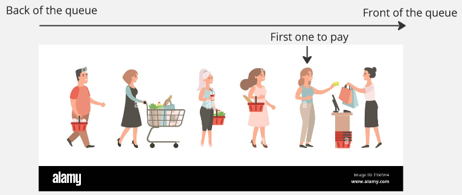
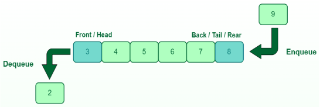
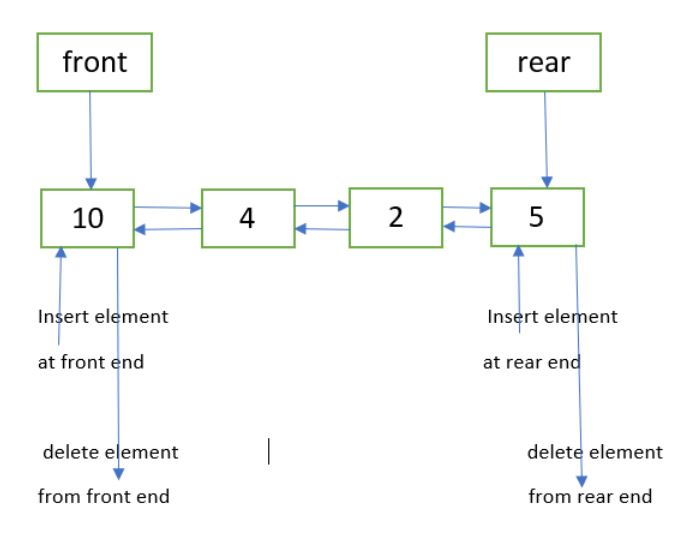
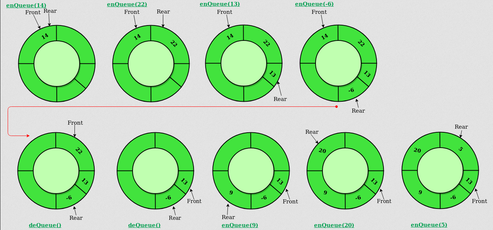
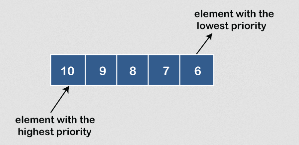

**Main Source :**

- **Queue** is a data structure where the elements behave like a literal queue. Queue follows the **First-In-First-Out (FIFO)** principle, which mean the **first element to be removed is the first one added**. In contrast, [stack data structure](/data-structures-and-algorithms/stack) supports the **Last-In-First-Out (LIFO)** principle, which mean the **first element to be removed is the last element added**.

Just like a literal queue, the elements are organized in a sequence, and the oldest element is always at the front, while the newest element is at the rear.

  
Source : https://www.alamy.com/people-waiting-in-long-queue-shopping-people-in-supermarket-daily-grocery-purchase-image243232560.html (with modification)

### Queue Operation

Following the FIFO principles, we can remove element in the front (also called head) and add element in the rear (also called back or tail) of the queue.

There are two main operation in queue data structure :

- **Enqueue** : Adds an element to the rear of the queue.
- **Dequeue** : Removes the element from the front of the queue.

  
Source : https://www.geeksforgeeks.org/queue-data-structure/

A queue data structure can be implemented efficiently using [doubly linked list](/data-structures-and-algorithms/linked-list#doubly-linked-list), this is because doubly linked list behavior aligns with queue operation. Doubly linked list has a head and a tail, enqueuing an element, or adding element to the rear of the queue is just inserting element in the tail. Dequeuing an element, or removing an element from the front of the queue is just a linked list deletion in the head. Inserting or deleting element in the head or tail of a linked list can be done in constant time.

Using doubly linked list, we can even create **double ended queue**, which is a queue data structure that supports enqueue and dequeue in the front or the rear of the queue.

  
Source : https://www.geeksforgeeks.org/implementation-deque-using-doubly-linked-list/

### Circular Queue

**Circular Queue**, also known as a **circular buffer**, is a variation of the queue data structure where the element are stored circularly, the last element is connected to the first element, forming a loop. Similar to traditional queue, it follows the FIFO principle, we can only enqueue in the rear and dequeue in the front.

  
Source : https://www.geeksforgeeks.org/introduction-to-circular-queue/

The circular nature of circular queue enables continuous enqueue and dequeue operations. When we ran out of space in the queue (when rear pointer touch front pointer), the enqueue operation will overwrite anything in the front of the queue. This is useful for scenario where we need to store data in a queue-like structure, but we don't want it to take up to many spaces, so that we will overwrite the oldest data.

### Priority Queue

**Priority Queue** is a data structure that stores a collection of elements, each associated with a priority value (e.g., larger number have larger priority). Unlike a regular queue, where elements are processed in a first-in-first-out (FIFO) manner, a priority queue retrieves elements based on their priority.

  
Source : https://www.javatpoint.com/ds-priority-queue

:::note
Priority queue is conceptually different with [heap](/data-structures-and-algorithms/heap), a priority queue is just a concept where each element has some priority. Heap is often used to implement a priority queue, it is a specific implementation of priority queue using [binary tree](/data-structures-and-algorithms/tree#binary-tree).
:::
