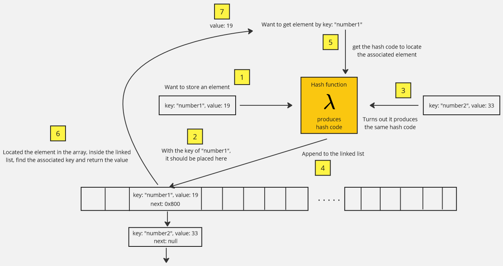

**Main Source:**

- **[Hash table — Wikipedia](https://en.wikipedia.org/wiki/Hash_table)**

**Hash Table**, also known as **hash map**, is a data structure where we access element based on a unique identifier called **key**. To add an element, we must provide a key and a **value**, which contains the actual value of the element. To retrieve back an element, we will need to access it with the associated key, which is the same key used while adding the element.

### Implementation

Hash table is a very efficient data structure, it is similar to [array](/data-structures-and-algorithms/array), it provides an efficient retrieval of an element in constant O(1) time. While array uses index to retrieve specific element, it can change anytime when we modify the array. Hash table uses a unique identifier and this identifier will always map to the same value.

Under the hood, hash table is implemented using an array. Array with a pre-determined size will be allocated in the memory. Every value associated with a key will be stored in that array. The key act as a determinant that will determine in which position in the array should we store the value. This is why the key should be unique, to ensure the hash table doesn't store different value in the same position in the array.

However, we don't use key directly to decide the position of value in the array, we will use something called **hash function**.

#### Hash Function

**[Hash function](/computer-security/hash-function)** is a mathematical function that takes input and output a **hash code**, which is an integer value that can be used as the index of the element in the array. Depending on the hash function logic, the key used as the input doesn't have to be number. The hash function's implementation handles the conversion to a numerical hash code.

Hash function used doesn't have to be an advanced cryptographic function, the point is, it must be able to produce a good distribution of hash codes, minimizing the chance of different key producing same hash code. When different key produced same hash code, therefore having same index in the array, this is called **collision**.

### Collision

There are many techniques to mitigate collision in hash table, one of the technique is **chaining**. Chaining is a technique where in the array inside the hash table, a [linked list](/data-structures-and-algorithms/linked-list) is used. Linked list provide a way to chain together collided element, so that when an element collide, it will be appended to the list.

Another technique to mitigate collision, which is a trivial one is just increasing the array size. Hash function generates hash code which will be used to represent index in the array, the hash function typically consider the size of array, this is to ensure the hash function doesn't produce out of bound index. By increasing the array size, we can lower the chance for collision.

### Example

One of a simple hash function for hash table is the **division hash function**. The formula is:  
$\text{hash code} = \text{key } \% \text{ array size}$  
The hash code for some key will be obtained by calculating the remainder (% modulo) of dividing the key by the array size.

For example, when we have `key = 10` and the `array size = 1000`, the hash code will be $10 \space \% \space 1000 = 3$, which mean the value associated with the key will be stored in the index 3 of the array.

Lastly, we may also put the key inside the array, so that we can identify which key does a value belong to.
