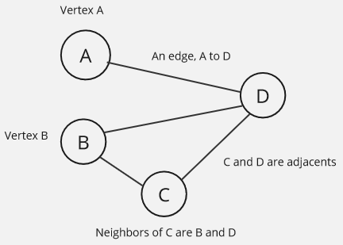
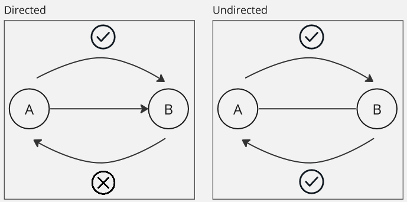
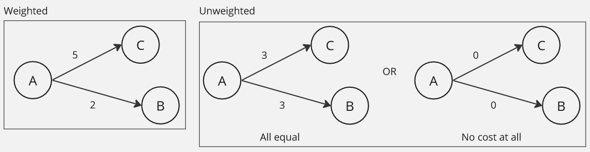
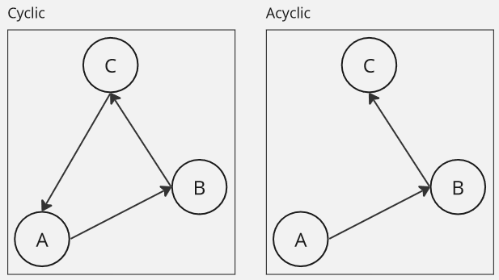
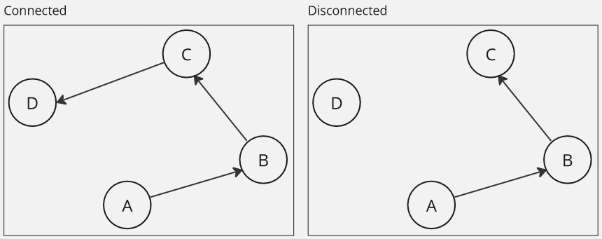
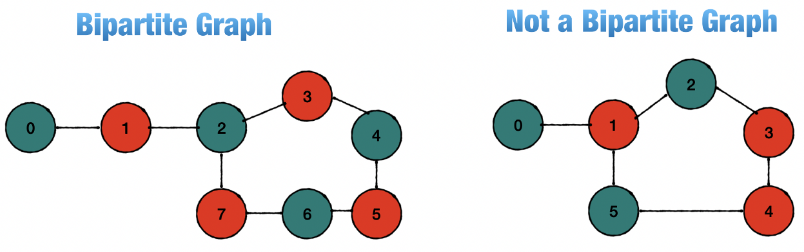
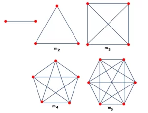
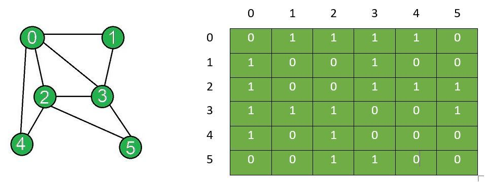
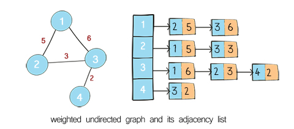
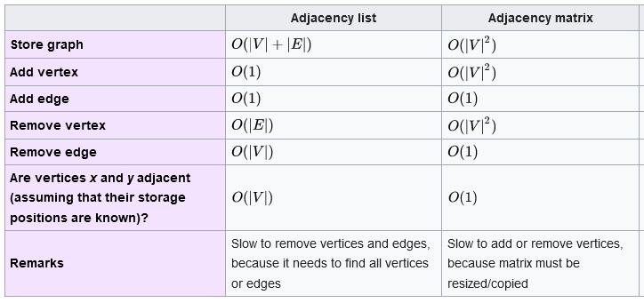

**Main Source :**

- **[Graph (abstract data type) - Wikipedia](<https://en.wikipedia.org/wiki/Graph_(abstract_data_type)>)**

**Graph** is a data structure that represents a collection of interconnected elements.

### Terminology

- **Vertex / Vertices** : Also called **node**, it is a fundamental element in graph, it is a single object or entity which a graph has. Each vertex can connect to each other.
- **Edges** : The connections or relationships between vertices in a graph is called **edge**. They represent the associations or interactions between the entities represented by the vertices.
- **Adjacent** : Two nodes are considered adjacent to each other, when there is an edge connecting them directly.
- **Neighbors** : All the nodes that are directly connected to a given node by an edge.

- **Degree** : The number of edges incident to a vertex.
- **Path** : A sequence of vertices connected by edges, where each vertex in the path is adjacent to the next vertex. The length of a path is the number of edges it contains.
- **Cycle/Loop** : A closed path in a graph that starts and ends at the same vertex. It consists of at least three vertices and at least three edges.
- **Circuit** : A circuit is a closed path in a graph that may or may not repeat vertices or edges. It starts and ends at the same vertex, but it may traverse some edges multiple times.
- **Euler Path/Circuit** : An Euler path is a path in a graph that visits every edge exactly once. An Euler circuit is a closed path that visits every edge exactly once and starts and ends at the same vertex. In other words, an Euler circuit is an Euler path that covers all the vertices of the graph.

### Types of Graph

Graph can be classified based on various characteristics :

#### Directed

A graph where its edges have a specific direction, indicating a one-way relationship between nodes. The edges can be traversed only in the direction specified by the edge.

In a directed graph, the degree is divided into the indegree (number of incoming edges) and the outdegree (number of outgoing edges) of the vertex.

#### Undirected

The opposite of directed, its edges have no specific direction and represent a two-way relationship between nodes. The edges can be traversed in both directions.

In an undirected graph, the degree is simply the count of edges connected to the vertex.

#### Weighted

Each edge in the graph is assigned a weight or a cost, representing the strength, distance, or any other quantitative value associated with the relationship between nodes.

#### Unweighted

On the other hand, unweighted graph's edges have equal importance and do not carry any additional information or weight.

#### Cyclic

A cyclic graph contains cycles or loops, meaning that it is possible to traverse a path in the graph that starts from a node and returns to the same node without repeating any edges.

#### Acyclic

An acyclic graph has no cycles or loops. It is not possible to traverse a path in the graph that starts from a node and returns to the same node without repeating any edges.

#### Connected

A connected graph is one in which there is a path between every pair of nodes. In other words, there are no isolated nodes or disconnected components in the graph.

#### Disconnected

A disconnected graph is a type of graph where there are at least two vertices that are not connected by any path within the graph.

#### Bipartite

A bipartite graph is a graph whose nodes can be divided into two disjoint sets such that no two nodes within the same set are connected by an edge. In other words, the graph can be colored using only two colors without any adjacent nodes having the same color.

  
Source : https://rohithv63.medium.com/graph-algorithm-bipartite-graph-dfs-f7f6a4afed4c

#### Complete

A complete graph is one in which there is an edge between every pair of distinct nodes. In other words, all nodes in the graph are connected to each other.

  
Source : https://www.tutorialscan.com/datastructure/complete-graph/

Depending on the problem, a graph may have multiple characteristics together. For example, a [tree](/data-structures-and-algorithms/tree) is a special type of graph where it is undirected and acyclic. We can traverse from top to bottom or vice versa and it has no cycle in it. A graph is a more generalized tree, it is more flexible, and it can have arbitrary connections and structures.

### Graph Representation

To represent graph, we will need a way to represent their edge and the vertices which stores values.

#### Adjacency Matrix

An adjacency matrix is a two-dimensional matrix where rows and columns represent the nodes of the graph. The value at position `(i, j)` in the matrix indicates whether there is an edge between nodes `i` and `j` (typically indicated by 1 if they are connected and 0 if they are not connected). This representation is useful for dense graphs (graphs with many edges) and allows for efficient lookup of edge existence (multidimensional array indexing). However, it requires $O(V^2)$ space, where $V$ is the number of vertices.

  
Source : https://www.geeksforgeeks.org/add-and-remove-edge-in-adjacency-matrix-representation-of-a-graph/

#### Adjacency List

An adjacency list represents a graph as an array of lists or arrays. Each element of the array corresponds to a node, and the list at each index contains the neighbors or adjacent nodes of that node. This representation is efficient for sparse graphs (graphs with fewer edges) as it requires space proportional to the number of edges. It allows for efficient traversal of neighbors for each node.

  
Source : https://www.lavivienpost.com/implement-weighted-graph-as-adjacency-list/

For example, we have an array of nodes `[[2, 3], [1, 3], [1, 2, 4], [3]]`, where node `i` correspond to index `i - 1` in the array. The node `1` should correspond to index `0`, which has `2` and `3`.

Here is the comparison of the time complexity of adjacency matrix and list, where $E$ and $V$ is the number of edges and the number of vertices, respectively.

  
Source : https://en.wikipedia.org/wiki/Graph_(abstract_data_type)
