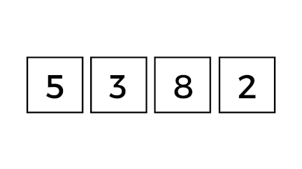
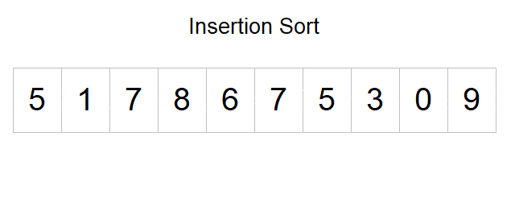

**Main Source :**

- **[Sorting algorithm - Wikipedia](https://en.wikipedia.org/wiki/Sorting_algorithm)**

**Sorting algorithms** are algorithm that arranges a collection of elements based on specific order, such as ascending (increasing order) or descending (decreasing order). Sorting algorithms time and space complexity can vary from $O(n)$, $O(n \log n)$, $O(n^2)$, or higher.

### Bubble Sort

Bubble sort is a very simple and intuitive sorting algorithm, it sorts elements by comparing each of them and swap them if they are in the wrong order.

Here is the pseudocode for bubble sort :

```
procedure BubbleSort(A: list)
    n := length(A)

    for i from 0 to n-2 do
        for j from 0 to n-i-2 do
            if A[j] > A[j+1] then
                swap A[j] and A[j+1]
            end if
        end for
    end for
end procedure
```

We will have outer and inner loop, inside the inner loop, we will compare each adjacent element. Bubble sort results in best of $O(n)$ time, average in $O(n^2)$, and worst in $O(n^2)$, with the space complexity being $O(1)$. The worst-case scenario occurs when we compare and swaps for every pair of elements in the input list.

  
Source : https://www.doabledanny.com/bubble-sort-in-javascript

### Selection Sort

Selection sort divides the input list into two parts: the sorted portion at the beginning and the unsorted portion at the end. The algorithm repeatedly find and select the smallest (or largest) element from the unsorted portion and swaps it with the element at the beginning of the unsorted portion. This process continues until the entire list is sorted.

```
procedure SelectionSort(A: list)
    n := length(A)

    for i from 0 to n-2 do
        minIndex := i

        for j from i+1 to n-1 do
            if A[j] < A[minIndex] then
                minIndex := j
            end if
        end for

        swap A[i] and A[minIndex]
    end for
end procedure
```

In the pseudocode, we will find the index of the minimum (or maximum) element. After going to the entire list, we will swap the element at index `i` (outer loop) with the minimum element. This will be repeated for each element in the list. The algorithm always performs in $O(n^2)$ time complexity for the best, average, and worst-case scenario, and uses constant $O(1)$ memory, this is because, we will always need to swap each element in the list. While it isn't the fastest, it has the advantage of doing fewer swaps compared to bubble sort.

  
Source : https://matcha.fyi/selection-sort-javascript/

### Insertion Sort

Insertion sort builds the sorted portion of the list incrementally. It iterates through the input list, considering one element at a time and inserting it into its correct position within the already sorted portion of the list. The algorithm repeats this process until the entire list is sorted.

```
procedure InsertionSort(A: list)
    n := length(A)

    for i from 1 to n-1 do
        key := A[i]
        j := i - 1

        while j >= 0 and A[j] > key do
            A[j + 1] := A[j]
            j := j - 1
        end while

        A[j + 1] := key
    end for
end procedure
```

It will iterate starting from index 1 to the last index of the list. We will also have extra index `j`, which is set as an index before `i`. If we encounter an element at index `j` which is greater than element at current index `i` (called the key), we will swap them, and then swap it again continuously backward until we achieved the correct order. After that, we will continue iterating the outer for loop.

Insertion sort results in best of $O(n)$ time, average and worst in $O(n^2)$ time, with the space complexity being $O(1)$. The worst-case scenario occurs when the input list is in reverse order. In this case, the algorithm has to perform the maximum number of comparisons and shifts for each element in order to insert it into its correct position within the sorted portion of the list.

  
Source : Mark Bowman Chapter_15.01
