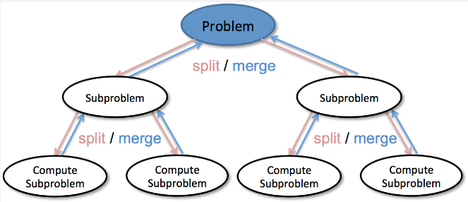
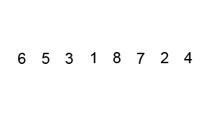

**Main Source:**

- **[Divide-and-conquer algorithm — Wikipedia](https://en.wikipedia.org/wiki/Divide-and-conquer_algorithm)**

**Divide and Conquer** is a problem-solving strategy that uses [recursion](/data-structures-and-algorithms/recursion) and involves breaking down a complex problem into smaller, more manageable subproblems, solving them independently, and then combining the solutions to solve the original problem.

Divide and conquer involves three steps:

1. **Divide / Split**: The problem is divided into smaller, more easily solvable subproblems. This can be achieved by breaking the input into smaller chunks or dividing it into multiple parts.
2. **Conquer**: Each subproblem is solved independently. This can be applying the same divide and conquer strategy recursively to further break down the subproblems until they become simple enough to be solved directly.
3. **Combine / Merge**: The solutions to the subproblems are combined or merged to obtain the solution to the original problem. This step involves aggregating the results from the conquered subproblems and transforming them into a solution for the overall problem.

  
Source: https://data-notes.co/divide-and-conquer-algorithms-b135681d08fc

### Merge Sort

Merge sort is a [sorting algorithm](/data-structures-and-algorithms/sorting) that follows divide and conquer strategy to sort a collection of elements.

The idea is, sorting a large array must involve a lot of comparison, which result in a harder problem. Merge sort divides the array into smaller subarrays, sorting them individually, and then merging the sorted subarrays, which effectively reduces the number of comparisons needed.

Here is the pseudocode:

```
MergeSort(arr):
    if length of arr <= 1:
        return arr

    mid = length of arr // 2
    left = arr[0:mid]
    right = arr[mid:end]

    left = MergeSort(left)
    right = MergeSort(right)

    return Merge(left, right)

Merge(left, right):
    result = empty array

    while left is not empty and right is not empty:
        if left[0] <= right[0]:
            append left[0] to result
            remove left[0] from left
        else:
            append right[0] to result
            remove right[0] from right

    append remaining elements of left to result
    append remaining elements of right to result

    return result
```

The algorithm starts by dividing the input array into two equal-sized subarrays (or approximately equal-sized if the array size is odd). This process continues until the array contains only one element or empty. Once the subarrays are small enough, the algorithm starts sorting them by comparing each other and placing them in correct order in the temporary array (result array), this process also merge the two subarray.

  
Source: https://en.wikipedia.org/wiki/Merge_sort (with speed modification)

Merge sort results in best, average, and worst-case of $O(n \log n)$ time complexity. This is because the algorithm divides the array into halves recursively ($\log n$ term), and the merging step takes linear time ($n$ term) proportional to the size of the subarrays being merged.

The memory required for merge sort is $O(n)$, this is because it requires additional space to store the temporary subarrays during the merging process.

### Quick Sort

Quick sort is another sorting algorithm that follows the divide and conquer strategy. Quick sort selects an element (called **pivot**), and then it partitions or reorders the array based on that element. The reordering involves dividing the array into two subarrays, one containing elements smaller than or equal to the pivot, and the other containing elements greater than the pivot.

```
QuickSort(arr, low, high):
    if low < high:
        pivotIndex = Partition(arr, low, high)
        QuickSort(arr, low, pivotIndex - 1)
        QuickSort(arr, pivotIndex + 1, high)

Partition(arr, low, high):
    pivot = arr[high]
    i = low - 1

    for j = low to high - 1:
        if arr[j] <= pivot:
            i = i + 1
            Swap(arr, i, j)

    Swap(arr, i+1, high)
    return i + 1

Swap(arr, i, j):
    temp = arr[i]
    arr[i] = arr[j]
    arr[j] = temp
```

The `low` and `high` represent the range of the array. The `Partition` function takes the range of the array and returns the pivot index that represents the final position of the pivot element after partitioning. `Partition` function selects a pivot element (in this case the last element) and rearranges the subarray such that elements smaller than or equal to the pivot are on the left, and elements greater than the pivot are on the right. After `pivotIndex` is obtained, the algorithm recursively applies `QuickSort` function on the subarrays to the left and right of the pivot until the entire array is sorted (when `low` < `high`).

  
Source: https://en.m.wikipedia.org/wiki/File:Quicksort-example.gif (with speed modification)

Quick sort achieves the same in the best and average scenario with merge sort, which is $O(n \log n)$. The worst-case scenario results in $O(n^2)$ time complexity, when the pivot is consistently chosen poorly (e.g., already sorted array or sorted in reverse order). Quick sort has an advantage in terms of space complexity, requiring only $O(\log n)$ memory, as the recursive calls are made on smaller subarrays.
