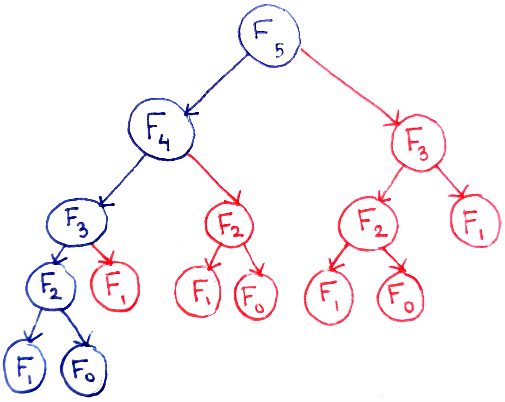
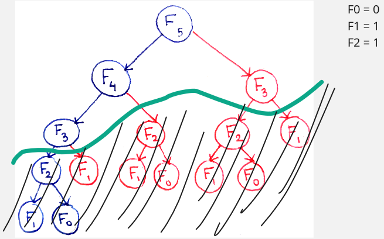
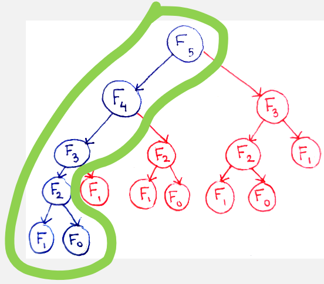
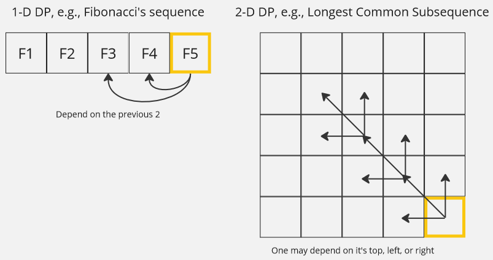

**Main Source:**

- **[Dynamic programming — Wikipedia](https://en.wikipedia.org/wiki/Dynamic_programming)**

**Dynamic Programming (DP)** is a problem-solving technique in computer science and mathematics that solves complex problems by breaking them down into simpler subproblems. The overall problem depends on the smaller piece subproblem, we would solve the simpler one first and use the solution to solve the overall problem.

### Dynamic Programming vs Divide and Conquer

Both are very similar in terms of the approach. However, both are unique approach and may not be applicable to all problems interchangeably.

The difference is, [divide and conquer](/data-structures-and-algorithms/divide-and-conquer) approach divides the problem into non-overlapping subproblems that are solved independently. In other word, each subproblem doesn't depend on each other, we can't apply the solution of a subproblem into another subproblem.

On the other hand, dynamic programming may contain overlapping subproblem that depends on each other. The idea is, if the problem exhibits overlapping subproblems, instead of solving each of the subproblem, we just need to solve it once and store the solution for another subproblem. This characteristics of dynamic programming makes it efficient than just brute forcing.

### Top-Down

Dynamic programming can be done in two approach, **top-down** and **bottom-up**.

In the top-down approach, we will start with the original problem and breaks it down into smaller subproblems. We will then solve these subproblems [recursively](/data-structures-and-algorithms/recursion).

#### Fibonacci

A common example of dynamic programming is calculating the Fibonacci sequence. Fibonacci's sequence, is a series of numbers in which each number is the sum of the two preceding ones. It starts with 0 and 1, and each subsequent number is the sum of the two numbers that precede it.

The Fibonacci sequence typically starts with 0 and 1, and the subsequent numbers are generated by summing the two previous numbers. The sequence continues indefinitely, and it follows this pattern:

0, 1, 1, 2, 3, 5, 8, 13, 21, 34, 55, 89, ...

Mathematically, it can be defined as:

$F(0) = 0$,  
$F(1) = 1$,  
$F(n) = F(n-1) + F(n-2) \text{ for n } \ge 2$.

#### Naive Fibonacci's Sequence Solution

Here is the pseudocode to compute the Fibonacci's sequence:

```
function fibonacci(n):
    if n <= 1:
        return 1
    else:
        return fibonacci(n - 1) + fibonacci(n - 2)
```

The Fibonacci sequence exhibits overlapping subproblems because each number in the sequence is derived from adding the two preceding numbers. Each of the two preceding numbers are also derived from the two preceding numbers again up to 1 and 0.

Here is an image to visualize the dependency, we can see that calculating F5 involve the dependency of F2 up to 3 times.

  
Source: https://avikdas.com/2019/04/15/a-graphical-introduction-to-dynamic-programming.html

#### Memoization

The pseudocode above is a naive solution that recursively computes the sequence multiple times. For example, when `n = 5`, we will calculate F(4) and F(3). Calculating F(4) involve calculating F(3) again. We are doing a lot of repeated work and it can be very inefficient for large `n`.

The pseudocode above results in $O(2^n)$ time complexity, this is because, for each `n` we will always calculate the two preceding Fibonacci numbers, `n - 1` and `n - 2`. Each of those calls, in turn, calls the function for their preceding Fibonacci numbers, and so on. As a result, the number of function calls grows exponentially with the input value `n`. Specifically, for each Fibonacci number, two additional function calls are made, resulting in a branching factor of 2. Therefore, the total number of function calls follows a recursive pattern where the number of calls doubles with each increase in `n`.

Memoization is a technique used in dynamic programming, specifically in the top-down approach to improve the algorithm efficiency. Memoization optimize the execution by storing (or **[caching](/computer-and-programming-fundamentals/caching)**) the result of function calls for specific input values and reusing them when the same inputs occur again.

We know that when we input `n = 2`, we will always obtain 1. If we store the result of F(2), we can eliminate some repeated work, therefore improving the overall efficiency.

  
Source: https://avikdas.com/2019/04/15/a-graphical-introduction-to-dynamic-programming.html (with modification)

The memoization technique stores all the result of every Fibonacci's sequence in some data structure that can be random accessed efficiently like [array](/data-structures-and-algorithms/array) or [hash map](/data-structures-and-algorithms/hash-table).

Here is the improved version of the previous pseudocode:

```
memo = array of size n
function fibonacci(n):
    if memo[n] is defined:
        return memo[n]

    if n <= 1:
        return 1
    else:
        result = fibonacci(n - 1) + fibonacci(n - 2)
        memo[n] = result

    return memo[n]
```

We will first check if the `n` or the current Fibonacci's sequence is present in the `memo` array. If yes, it means we have already computed it before and we can just use that result. If not, we will compute the sequence normally (also don't forget to store the result).

Here is the visualization, we only need to compute each Fibonacci sequence once. This results in $O(n)$ time complexity, where $n$ is the Fibonacci sequence we want to calculate.

  
Source: Source: https://avikdas.com/2019/04/15/a-graphical-introduction-to-dynamic-programming.html (with modification)

### Bottom-Up

In top-down approach, we start with the original problem, breaking it down into smaller problem until we can solve it directly. In the case of Fibonacci's sequence, we will need to break it down until `n` is at least 1. Top-down approach also uses recursion, therefore requiring additional memory for the call stack (space complexity for Fibonacci's sequence with the top-down solution is $O(n)$).

**Bottom-up** approach, on the other hand, solves the problem starting from the smallest subproblems and gradually builds up the solutions to larger subproblems until the original problem is solved. While at the end we still solve the smaller subproblems first, in bottom-up approach, we immediately start from the bottom iteratively, eliminating the need of recursion.

In some case, bottom-up approach has no difference in terms of space complexity, because we still need some place to store the previously computed result. However, there is scenario where solving it bottom-up can improve the solution, which is in the case of Fibonacci's sequence.

Here is the pseudocode for calculating Fibonacci's sequence in bottom-up approach:

```
function fibonacci(n):
    if n <= 1:
        return n

    fib = array of size (n + 1)

    fib[0] = 0
    fib[1] = 1

    for i from 2 to n:
        fib[i] = fib[i - 1] + fib[i - 2]

    return fib[n]
```

Similar to top-down approach, we used an array to store the previous solution. The difference is, instead of using recursion, we do it iteratively.

#### Improved Bottom-Up

This code can be further improved so we don't need additional space to store the previous solution:

```
function fibonacci(n):
    if n <= 1:
        return n

    fib1 = 0
    fib2 = 1

    for i from 2 to n:
        nextFib = fib1 + fib2
        fib1 = fib2
        fib2 = nextFib

    return fib2
```

Using the bottom-up approach, it's worth noting that we don't need to store the whole sequence result. Whenever we calculate the sequence, we always use the last two result which are `fib[i - 1]` and `fib[i - 2]`, therefore, we can eliminate the need of array and instead store it in some variable. This result an improvement of space complexity from $O(n)$ to a constant $O(1)$.

#### Tabulation

The Fibonacci's sequence problem is simple enough that we can use a simple one-dimensional array to store the previous result. We can even use two variable to store the previous result in the improved bottom-up approach. In conclusion, we can say that the problem is one-dimensionally dependent (also called **1-D dynamic programming**).

In a more complex problem, the problem may depend multidimensionally (**2-D dynamic programming** or higher). Instead of creating a one-dimensional array, we may need to create multidimensional array such as table or matrix. Each cell in the table represents the solution to a specific subproblem.

**Tabulation** is a technique used in dynamic programming to solve problems by iteratively filling up a table or a matrix of precomputed values.


