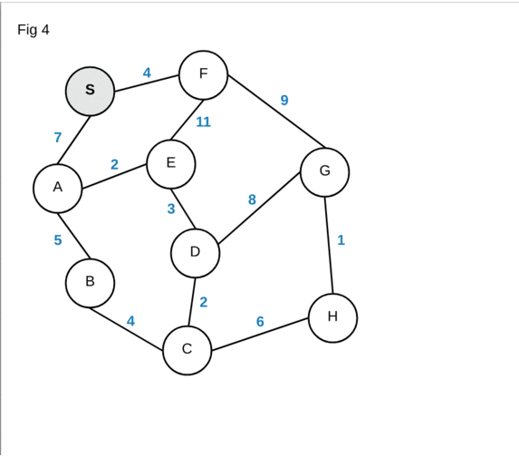

**Main Source :**

- **[Shortest path problem - Wikipedia](https://en.wikipedia.org/wiki/Shortest_path_problem)**
- **[Dijkstra's algorithm - Wikipedia](https://en.wikipedia.org/wiki/Dijkstra%27s_algorithm)**

**Shortest Path** is the path between two vertices or nodes in a graph which has minimum total weight or cost among other possible path. A weight refers to a numerical value associated with a edge in a graph. It represents the effort required to traverse that path.

Shortest path is a common problem in graph theory and optimization. It is a common problem even in real life, where it is used to navigate or finding optimal route between locations.


Here is an illustration, in the image above, we are supposed to start from node A and traverse to node F. There are total of three ways to get to node F, which are:

- A → C → F : (10 + 7 = 17)
- A → B → D → F : (2 + 3 + 5 = 10)
- A → B → E → F : (2 + 4 + 1 = 7)

While the first path visits the minimal nodes, it results in the highest cost. The problem become harder when we have a lot of paths, and each of the cost vary within the path. For example, one path may have larger cost at the start, but it may have a lower cost latter, leading to lower total cost overall.

### Dijkstra's Algorithm

**Dijkstra's Algorithm** is a popular algorithm to find the shortest path between two vertices in a [weighted graph](/data-structures-and-algorithms/graph#weighted). Dijkstra's algorithm works by exploring the graph from the source to the target, the cost of each traversal between nodes is kept track.

Dijkstra's algorithm explores the path systematically. When there are many possible paths, the algorithm prioritize the path with the currently minimum cost. It continues along this path before moving on to others. At the end, the algorithm will explore all the possible paths.

The systematic behavior of Dijkstra's algorithm is similar to [BFS traversal](/data-structures-and-algorithms/traversal#breadth-first-search-bfs), it uses a [queue data structure](/data-structures-and-algorithms/queue), specifically the [priority queue](/data-structures-and-algorithms/queue#priority-queue), which is often implemented using [min-heap](/data-structures-and-algorithms/heap) to keep track of the path with the currently minimum cost. It is also considered as [greedy algorithm](/data-structures-and-algorithms/greedy), because it traverses the optimal path first.

Here is the pseudocode :

```
function Dijkstra(graph, source):
    visited = set()
    distance = []
    previous = []
    heap = minHeap()

    for each vertex v in graph:
        distance[v] = infinity
        previous[v] = undefined

    distance[source] = 0
    heap.add(source, 0)

    while heap is not empty:
        currentVertex = heap.poll()
        if currentVertex is visited:
            continue

        visited.add(currentVertex)

        for each neighbor of currentVertex:
            if neighbor is visited:
                continue

            cost = distance[currentVertex] + weight(currentVertex, neighbor)

            if cost < distance[neighbor]:
                distance[neighbor] = cost
                previous[neighbor] = currentVertex
                heap.update(neighbor, cost)

    return distance, previous
```

  
Source : https://blog.aos.sh/2018/02/24/understanding-dijkstras-algorithm/

1. The `distance` is an array to store the shortest distance from the source vertex to each vertex. The `previous` is another array used to store the previous vertex that leads to the currently known shortest path from the source vertex to each vertex.
2. We initially make all the distance from the source to each vertex in the graph to infinity, indicating they are yet to be determined. Except for the source vertex, we will make it 0, because that is where we are going to start.
3. We add the source to the min-heap and start the loop by polling it (remove and return the minimum element). Whatever vertex is returned, if that vertex has been visited before (present in visited set), then we will skip it, else we will continue the loop and add it to the visited set.
4. We will iterate through every neighbor of that vertex. Next, we will add the vertex to the heap for next visit, but we will only add the one that hasn't been visited before.
5. We will also calculate the cost by adding the previous tracked distance with the new cost from the `currentVertex` to the target `neighbor`. Also update the `distance` and `previous` array with the `currentVertex` and `cost` and update the neighbor's key with the new cost in the min-heap.
6. When the heap is empty, indicating there are no more paths to traverse, we will return the `distance` and `previous` array. The minimum cost is the minimum element in the `distance` array and the `previous` contains the path that correspond to it.

Using binary heap, we will obtain $(V + E) \log V$ time complexity, where $V$ is the number of vertices and $E$ is the number of edges.

- Initializing the distance and previous arrays is $O(V)$.
- The main part of the algorithm is the while loop, which runs until the priority queue becomes empty. Adding vertex to the heap takes $O(\log V)$ time, if we add a total of $V$ number of vertices, then it will be $O(V \log V)$
- Within the while loop, we iterate over the neighbors of the current vertex. In the worst case, each edge is considered once, resulting in a total of $O(E)$ iterations.
- Performing heap update takes $O(\log V)$. Since the total number of vertex-neighbor pairs in the graph is $E$, the time complexity of these operations is $O(E \log V)$.

We can also optimize this using **Fibonacci heap** instead of binary heap to obtain $O(E + V \log V)$ time complexity.
