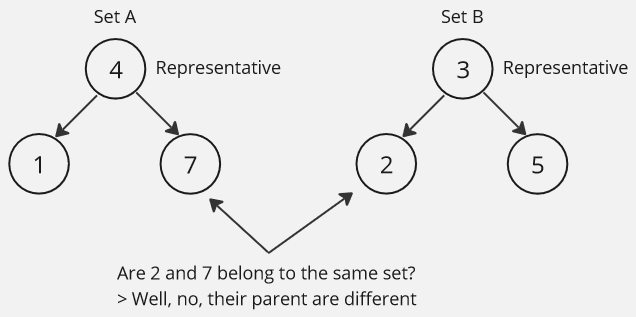
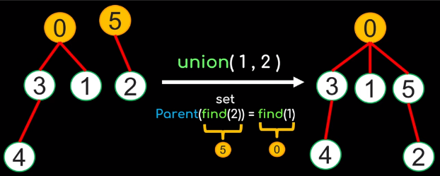

import find_operation from "./find.mp4";

**Main Source :**

- **[Disjoint-set data structure - Wikipedia](https://en.wikipedia.org/wiki/Disjoint-set_data_structure)**
- **[Union Find in 5 minutes — Data Structures & Algorithms - Potato Coders](https://youtu.be/ayW5B2W9hfo?si=pf1XvhDNEkhI2Nm8)**

**Union Find**, also called **disjoint-set**, is a data structure that help solving connectivity problem. It maintains a collection of disjoint sets, which is a collection of [sets](/data-structures-and-algorithms/set) where no two sets have any elements in common. In other word, it stores a collection of elements, where each collection doesn't contain an element that other collection has.

### Operation

Apart from being data structure, it also provides a way to determine whether two elements belong to the same set and allows us to merge two sets containing some elements into a single set.

Union find organizes its sets in a [tree-like structure](/data-structures-and-algorithms/tree), where each node represents an element, the root is called the **representative element**, which serves as the identifier or representative for the entire set. This identifier will help us to determine whether two elements belong to the same set easily. The idea is, if two elements belong to the same set, their root node must be the same.



Terminology :

- **Parent** : The root node, which is the representative element of the set.
- **Size** : The number of elements or nodes in the set represented by a particular node.
- **Rank** : The height of a node or the longest path from the node to a leaf.

The size and rank is used to which one should be the representative, as the representative should be the one which has the most information.

#### Find

Given a node, `Find` is a function that should return the representative. The `Find` function is [recursive](/data-structures-and-algorithms/recursion), it will find the parent of some node, the parent of that node again, up to the root node.

```
function Find(x):
    if x.parent != x:
        x.parent = Find(x.parent)
        return x.parent
    else:
        return x
```

In union find initialization, each element's representative is itself. When we merge element together, one of the element will become the representative, but the representative itself will still have its own representative as itself, only the other element's representative will change. The characteristics of representative's parent being itself serve as the base case for the Find recursive function.

<video width="695" height="392" controls>
  <source src={find_operation} />
</video>

#### Union

The `Union` function takes two element and merge them together.

```
function Union(x, y):
    rootOfX = Find(x)
    rootOfY = Find(y)

    if rootOfX == rootOfY:
        return

    if rootOfX.rank < rootOfY.rank:
        rootOfX.parent = rootOfY

    rootOfY.parent = rootOfX
    if rootOfX.rank == rootOfY.rank:
        rootOfX.rank = rootOfX.rank + 1
```

We will first find the root of x and y. If their root or representative are the same, it means they belong to the same set and no further operation is needed.

If they are in different set, we will need to decide how should we attach the tree. Should we attach x to the y or the y to the x? The decision should be attaching the smaller tree to the larger tree. How large a tree is can be determined using **size** or **rank**.

If they have equal rank, one root is chosen arbitrarily, and its rank is increased by one. We don't increase rank if we attach x to y or y to x, because by attaching it, the tree depth won't be increased (remember the definition of rank and the rules of attached tree should be smaller).

  
Source : https://youtu.be/ayW5B2W9hfo?si=76W-GO9H-hEy-Xk1&t=205
