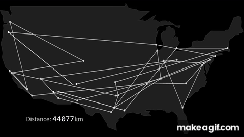
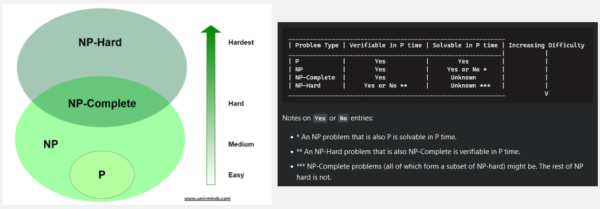

**Main Source :**

- **[P, NP, CoNP, NP hard and NP complete | Complexity Classes - Geeks for Geeks](https://www.geeksforgeeks.org/types-of-complexity-classes-p-np-conp-np-hard-and-np-complete/)**
- **[What are the differences between NP, NP-Complete and NP-Hard? - stackoverflow](https://stackoverflow.com/questions/1857244/what-are-the-differences-between-np-np-complete-and-np-hard)**

**Complexity Theory** is the study of the behavior of computational problems, particularly in the difficulty and efficiency of solving problems, in the terms of time and space complexity.

Some concepts are :

- [Time Complexity](/data-structures-and-algorithms/analysis-of-algorithms#time--space-complexity) : The amount of time required by an algorithm to solve a problem as a function of the input size.
- [Space Complexity](/data-structures-and-algorithms/analysis-of-algorithms#time--space-complexity) : The amount of memory or storage space required by an algorithm to solve a problem as a function of the input size.
- [Big-O Notation](/data-structures-and-algorithms/analysis-of-algorithms#big-o-notation) : Mathematical notation used to describe the upper bound or worst-case behavior of an algorithm as the input size increases.
- Complexity Class
- Reduction
- P vs NP Problem

### Complexity Class

Complexity class is a classification of a set of problem with common level of computational complexity. To analyze the behavior and the complexity of algorithms, a mathematical model of a general computing machine called **Turing machine** is used.

Terminology :

- **Deterministic Turing machine** : The Turing machine follows a set of rules to process input and produce output, the behavior will depend on current state and the current input. In other word, the Turing machine behave in predictable manner.
- **Nondeterministic Turing machine** : Turing machine which can have multiple choices for the next transition, it can have multiple possible outcomes for a given state and symbol.
- **Decision problems** : Problem that requires yes-or-no answer. For example, whether number 7 is prime or not.
- **Polynomial time** : Mathematical expression that involves one or more variables raised to non-negative integer powers, multiplied by coefficients. For example, $n^1$ or simply $n$, $n^2$, $n^3$, $3n^2 + 3$. When we say a problem can be run in polynomial time, it means the running time of the algorithm for the problem grows no faster than a polynomial function of the input size.
- **Reduction** : 

#### Time Complexity

##### P

- P : Polynomial Time
- P is the complexity class that consists of decision problems that can be solved by a **deterministic Turing machine in polynomial time**.
- P problems are also easy to find.
- Example of P algorithms includes [sorting algorithm](/data-structures-and-algorithms/sorting).

##### NP

- NP : Nondeterministic Polynomial Time
- NP is a complexity class that consists of decision problems for which a "yes" instance can be verified in polynomial time.
- A problem is in NP if there exists a **nondeterministic Turing machine** that can verify a proposed solution to a "yes" instance in polynomial time.

In other words, if there is a potential solution to an NP problem, it can be efficiently checked for correctness.

Subset Sum Problem

> Given a set of integers and a target value, determine if there exists a subset of the integers that sums up to the target value.

For example, let's say we have the set of integers {2, 4, 7, 9} and the target value is 13. The problem is to find out if there is a subset of these numbers that adds up to 13. In this case, the subset {4, 9} sums up to 13, so the answer would be "yes."

To verify a potential solution, we can simply sum up the numbers in the subset and check if the sum equals the target value. This verification process can be done in polynomial time. However, finding the subset itself is the challenging part, as the set of integers increase, it becomes more difficult.

##### Co-NP

- Co-NP : Complement of NP
- It consists of decision problems for which the "no" instances can be verified in polynomial time.

It is not known whether NP and Co-NP are the same or different classes. If NP = Co-NP, it would imply that every problem for which a "yes" instance can be verified in polynomial time also has a polynomial-time verification for "no" instances.

An example of a problem in Co-NP is the problem of determining if a given number is not prime.

##### NP-Complete

- NP-Complete : Nondeterministic Polynomial-Time Complete
- An NP-Complete problem is one that is believed to be among the most difficult problems in NP.
- If a polynomial-time algorithm exists for any NP-Complete problem, it implies that a polynomial-time algorithm exists for all problems in NP.
- NP-Complete problems are considered to be of equal difficulty, meaning that solving one NP-Complete problem would effectively solve them all.
- This property is known as "completeness" because the complexity of all problems in NP is "complete" with respect to the complexity of NP-Complete problems.

An example of an NP-Complete problem is the Boolean satisfiability problem (SAT).

##### NP-Hard

- NP-Hard : Nondeterministic Polynomial-Time Hard
- NP-Hard is a class of decision problems that are at least as hard as the hardest problems in NP.
- Unlike NP-Complete problems, NP-Hard problems do not necessarily need to be in NP themselves.
- NP-Hard problems are believed to be computationally intractable (can be solved in theory but not in practice) and do not necessarily have a polynomial-time algorithm for their solution.
- Solving an NP-Hard problem does not imply solving all problems in NP, but it indicates that the problem is at least as difficult as the hardest problems in NP.

Example of an NP problem is the **traveling salesman problem**. The problem is to find the shortest possible route that visits a set of cities once and returns to the starting city.

  
Source : https://makeagif.com/gif/traveling-salesman-problem-visualization-GZeMvl

The complexity classes diagram and table :

  
Source : [diagram](https://unicminds.com/complexity-classes-p-np-of-problems-in-computer-science-coding/), [table](https://stackoverflow.com/questions/1857244/what-are-the-differences-between-np-np-complete-and-np-hard#answer-19510170)

#### Space Complexity

- **L** :
- **NL** :
- **PSPACE** :
- **NPSPACE** :
- **EXPSPACE** :
- **NEXPSPACE** :

### P vs NP Problem

Source : https://upload.wikimedia.org/wikipedia/commons/a/a0/P_np_np-complete_np-hard.svg
