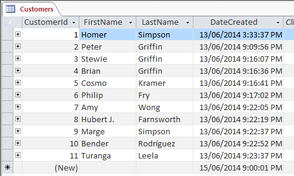
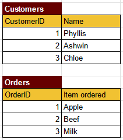
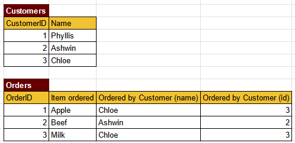
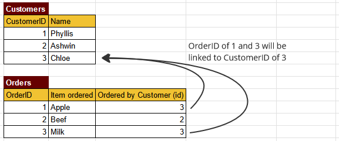
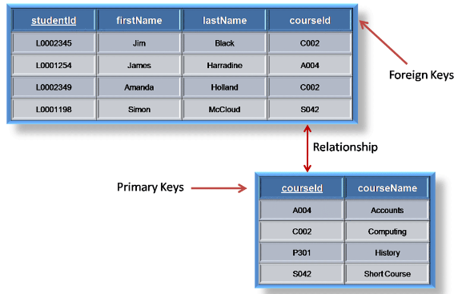
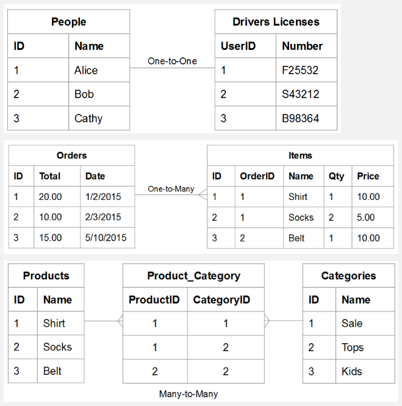
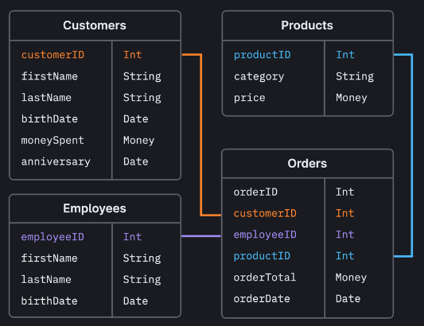
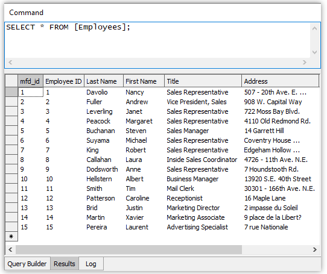
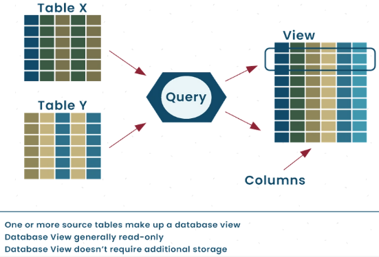

**Main Source :**

- **[Relational database - Wikipedia](https://en.wikipedia.org/wiki/Relational_database)**
- **[Relational model - Wikipedia](https://en.wikipedia.org/wiki/Relational_model)**
- **[Understand and Evaluate Table Relationships - Adobe](https://experienceleague.adobe.com/docs/commerce-business-intelligence/mbi/analyze/warehouse-manager/table-relationships.html)**

Relational data organizes data according to the principles of the relational model in a relational database management system (RDBMS).

### Tables, Column, Row

In a relational database, data is organized into **tables**. A table is a collection of related data, it contains **column** (or attributes) and **row** (or tuple, record).

A column has a particular **data type** (or domain) associated with it. The column represents what kind of data or the specific attribute of the data, such as a person's name, age, or address, in the case of a person table. The columns are given names or label to be identified.

A row entry represent individual instances of data within the table. Each row contains the actual data values for each attribute. For example, in a table representing employees, each row would represent a specific employee, and the columns would contain attributes such as employee ID, name, age, and so on.

  
_A customer table containing column CustomerId, FirstName, LastName, and DateCreated._  
Source : https://database.guide/what-is-a-table/

:::info
Table is also called **relations**, which consist of rows or formally a set of **tuples**.
:::

### Data Types

There are many types of data that can be assigned to specific column, some common data types are :

- **Integer** : Used to store whole numbers without decimal places, such as 1, 10, -5, etc.
- **Floating-point** : Used to store numbers with decimal places, such as 3.14, 10.5, -0.75, etc. The precision and scale of decimal numbers can often be specified.
- **Character/String** : Used to store alphanumeric text, such as names, addresses, or descriptions. The length of the string may be limited or unlimited, typically known as VARCHAR or TEXT data types, respectively.
- **Date/Time** : Used to store dates, times, or both. This includes data types like DATE, TIME, DATETIME, TIMESTAMP, etc., which can represent specific points in time or intervals.
- **Boolean** : Used to store true/false or binary values, representing logical conditions. Some RDBMS doesn't offer boolean data types, we may use Integer (1) to represent true value and Integer (2) to represent false value.
- **Binary** : Used to store binary data, such as images, files, or serialized objects.
- **Enumerated Types** : Some systems offer the ability to define custom data types with a limited set of predefined values.

### Primary & Foreign Key

To be able to distinguish between record in a table, each record is associated with a unique identifier called **primary key**. A primary key can be a simple integer type, or other kind of data types. The point is, we must ensure its uniqueness. A name is probably not a good choice of primary key, because sometimes people can have the same name.

In a relational database, data is organized into table. A database may contain multiple table, each representing a specific entity within the database. Multiple table can be connected to together, this mean we are establishing a relationship between particular data across multiple tables.

The most common way to connect tables is by using primary key and **foreign key** relationships. A primary key in one table serves as a unique identifier for each record, and a foreign key in another table references that primary key to establish a relationship between the two tables.

#### Example

For example, let's consider two tables : `Customers` and `Orders`.

- The `Customers` table maintains a collection of customer, it has a primary key column called `CustomerID` and another column containing the customer's name.
- The `Orders` table contains order data, it has primary key column called `OrderID` and another column `Item ordered`, which specify particular item that was ordered.

An order is obviously ordered by a customer, it make sense to also store which customer placed the order. Let's modify the table.

Now the order table has an information about which customer ordered the item. However, we need to include more information into the `Orders` table, and those information are from the `Customers` table. This lead to **data redudancy** in the `Orders` table.

Instead of storing customer information directly in the `Orders` table, we can use a foreign key column in the `Orders` table to refer to some customer in the `Customers` table. This way, we will know which customer is associated with specific order without needing to duplicate the customer data in the `Orders` table. So, let's modify the table again.

We removed the column `Ordered by Customer (name)` and only preserve the `Ordered by Customer (id)` column. This table is much more efficient than the previous table. When we process the table and we wanna know who ordered an item, we will look at the foreign key column. The foreign key will guide us to the primary key of the `Customers` table.

Furthermore, as the row and column of a table increase, the use of foreign key becomes even more useful to reduce duplicate data. Also, maintaining multiple table with the same data can increase the chance of **data inconsistency**, in which multiple instance of same data in a database or system do not match or are contradictory. If we modify data on the `Customers` table, we must also modify the `Orders` table as well. However, this introduce overhead when we modify data, imagine having to modify 10 table just to modify a single entry of a table.

  
_Another example of table with foreign key_  
Source : https://www.thecrazyprogrammer.com/2019/04/difference-between-primary-key-and-foreign-key.html

#### Relationship

Through the use of primary and foreign keys, there are different types of relationship that may be achieved :

- **One-to-One (1:1)** : Each record in one table is associated with exactly one record in another table, and vice versa.

  A person can have only one driver’s license number, and a driver’s license number belongs to only person.

- **One-to-Many (1:N)** : Each record in one table can be associated with multiple records in another table, while each record in the other table is associated with only one record in the first table.

  An order can contain many items, but an item belongs to a single order. In this case, the orders table is the one side and the items table is the many side.

- **Many-to-Many (N:M)** : Multiple records in one table can be associated with multiple records in another table. This type of relationship is typically implemented using an intermediary table that holds the associations between the two tables.

  A product can belong to many categories, and a category can contain many products.

  
Source : https://experienceleague.adobe.com/docs/commerce-business-intelligence/mbi/analyze/warehouse-manager/table-relationships.html

### Schema

A database schema is a logical blueprint or structure that defines the organization, relationships of the database in an RDBMS. It specifies the tables, columns, data types, and relationships between tables.

  
Source : https://planetscale.com/blog/schema-design-101-relational-databases

For example, if we were to make a `Customers` table, it should consist of column `customerID` with `Int` data types, `firstName` with `String` data types, and so on. The `customerID` should be the foreign key of the `Orders` table, creating a one-to-one relationship.

### Query

**Query** is a request or command made to retrieve or manipulate data stored in a database. It is a structured statement or set of instructions written in a [database query language](/database-system/query-language), used to communicate with an RDBMS.

While querying, we can retrieve data based on specific criteria. For example, a query can be used to retrieve all customers who have made a purchase in the last month.

  
Source : https://manifold.net/doc/mfd9/queries.htm

In the image above, we are trying to retrieve data from the `Employees` table. The command used is `SELECT * FROM [Employees]`. In short, the `SELECT` statement indicates we are going to retrieve data, the `*` is a shorthand that represent all the available row in the table, and the `FROM [Employees]` means we are retrieving the data from the `Employees` table. Combining them all together, using that command is the equivalent of saying "Retrieve all the row from Employees table". The database engine will then return the requested data, which includes all the rows and columns present in the `Employees` table.

#### View

**View** is a virtual table that is derived from querying one or more existing tables or other views. It does not store any data itself but instead provides a way to present data from underlying tables in a customized or simplified manner. A view can be seen as a saved query that can be used like a table in subsequent queries, but it does not contain its own data. Database view can be thought as the summary of a series of table in a database, providing a way for us to see the overall data.

  
Source : https://aristeksystems.com/blog/database-views-what-you-need-to-know/

#### Operation

We can perform various operation on our query, some examples are :

- **Projection** : Specifies the columns to be included in the query result.
- **Selection** : Specifies the conditions or criteria to filter the rows to be included in the query result.
- **Sorting** : Specifies the order in which the query results should be arranged. It can be ascending (smallest to largest) or descending (largest to smallest) based on one or more columns.
- **Aggregation** : Performs calculations on a set of values, such as calculating the sum, average, count, minimum, or maximum values from a column or group of rows.
- **Union** : Combines the results of two or more queries into a single result set, removing duplicate rows.
- **Intersection** : Retrieves only the common rows between two or more queries, keeping only the rows that appear in all result sets.

:::info
More about [operation](/database-system/query-language#operation).
:::
