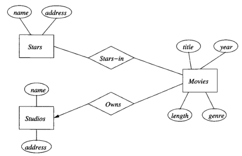
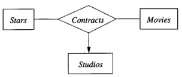
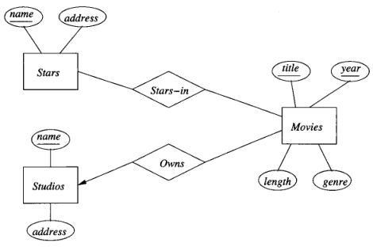
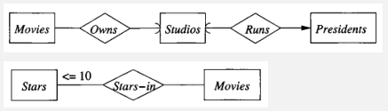
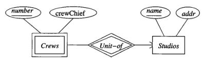
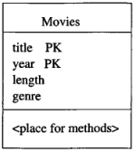
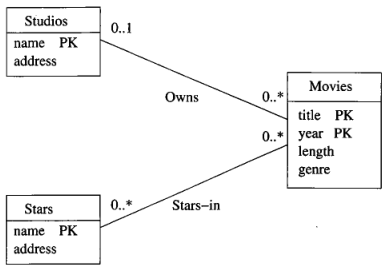
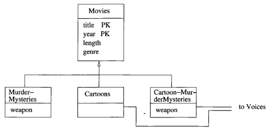

**Main Source :**

- **Chapter 4 - Database Systems - The Complete Book (2nd Edition)**
- **[Database model - Wikipedia](https://en.wikipedia.org/wiki/Database_model)**

**Database Model** is a conceptual representation of how data is organized and structured in a database system. It describes the logical structure, relationships between data elements, and the rules for manipulating and accessing the data. Database models serve as a blueprint for designing and implementing a database system.

There are many types of database models, each with its own approach to organizing and representing data.

### Representation

#### E/R Model

**Entity-Relationship (E/R) Model** is a representation of database structure in a diagram called **ER diagram**. ER consists of three elements :

- **Entity sets** : Entity is a distinct and identifiable object, concept, or thing in the real world or in the domain being modeled. An entity sets is a collection of similar entities. In a student dataset, a student is an entity, some set of students is an entity sets.
- **Attributes** : Attributes are the properties or characteristics that is associated within an entity set. Student entity set might include name, major, or date of birth.
- **Relationships** : Relationships describe the associations between two or more entity sets. They represent how entities from different sets are related to each other.

  Relationships can have **cardinality constraints** that indicate the number of instances of one entity set that are associated with instances of another entity set. Cardinality constraints include one-to-one (1:1), one-to-many (1:N), and many-to-many (N:M) relationships.

##### ER Diagram

  
Source : Book page 128

In the diagram :

- Entity sets are represented by rectangles.
- Attributes are represented by ovals.
- Relationships are represented by diamonds.

The relationship in E/R diagram can also be categorized into to, **stars-in** and **owns** relationship. Stars-in represent a many-to-many relationship, one entity sets can have multiple entities from the other sets and vice versa. While owns represent a one-to-one relationship, one entity sets can only have one entity from the other sets.

For example in a movie database, movie have stars-in relationship with stars. This is because multiple stars can play in multiple movie and multiple movie can have multiple stars. On the other hand, movie have owns relationship with studio, because a movie can only be owned by a single studio.

For more complex relationship, there can be **multiway relationship**, which consist of three or more entity sets are connected through a single relationship.

  
Source : Book page 131

In the movie database again, movies can have multiple stars and stars can have multiple movie. A contract specifies a star involvement in a particular movie and is associated with a specific studio.

###### Constraints

We can enforce constraints on a database, they are specific rules or conditions that must be satisfied by the data in the database.

  
Source : Book page 149

In the diagram, we indicate an attribute as the unique identifier of an entity set by underlining it. In this case, a studio is uniquely identified by its [primary key](/database-system/relational-data/primary--foreign-key), which is the name.

  
Source : Book page 150, 151

Other constraints include **referential integrity**, which is indicated by arrow head. It enforces that values in foreign key attributes match the values in the corresponding primary key attributes of the related entity.

The other constraint is called **degree constraint**, which limits the number of relationship between entity sets. Setting a constraint of stars to be less than 10 with a movie means that the movie can only have less than 10 relationship with stars.

###### Weak Entity Sets

A weak entity set is an entity set that does not have sufficient attributes to form a primary key uniquely on its own. Instead, it relies on a related strong entity set to provide part of its primary key.

  
Source : Book page 153

Such entity set is indicated by double rectangle box. A crew can't be identified by its number only, but it requires dependency on the name of studio it belongs to.

#### UML

**Unified Modeling Language (UML)** is a standardized visual modeling language used to model, design, and document software systems and other systems with a graphical notation, in an [object-oriented](/computer-and-programming-fundamentals/object-oriented-programming) style. While UML is typically used for software systems, it can also be used to model database.

UML diagram is represented in three parts of box. The top part is the name of the class, or the entity set in the case of similarity with E/R model. The middle part consists of the attributes and its data types. The bottom part is the methods of the class.

  
_PK stands for primary key_  
Source : Book page 172

##### Association

  
Source : Book page 173

Classes can have relationship between them, it is indicated with a straight line and also provided with the relationship type and its constraints. The "0..1" means zero or one relationship, the "0..\*" means zero or more, "1..1" means exactly one.

##### Subclasses

A subclass is a class that inherits properties, attributes, and operations from another class, known as its superclass or parent class. Subclass is indicated by another rectangle with an arrow pointing to its parent class.

  
Source : Book page 177

#### ODL

**Object Definition Language (ODL)** is a language used for defining object-oriented database schemas.

```
class Movie {
    attribute string title;
    attribute integer year;
    attribute integer length;
    attribute enum Genres
        {drama, comedy, sciFi, teen} genre;
    relationship Set<Star> stars
                inverse Star::starredln;
    relationship Studio ownedBy
                inverse Studio::owns;
};

class Star {
    attribute string name;
    attribute Struct Addr
        {string street, string city} address;
    relationship Set<Movie> starredln
                inverse Movie:: stairs;
};

class Studio {
    attribute string name;
    attribute Star::Addr address;
    relationship Set<Movie> owns
                inverse Movie::ownedBy;
};
```

- An entity set is defined as a class.
- The class contains attribute name and its data types. It is possible for the attribute to be a more complex type such as list, array, or dictionary.
- An attribute can be an enum that can take values from some set (e.g., `Genres`) or a struct (e.g., `Addr`)
- Relationship is modeled in a set along with the specified types (e.g., `starredIn`, `owns`). The `inverse` keyword is used to specify the inverse relationship on the other end of the association.

```
class Cartoon extends Movie {
    relationship Set<Star> voices;
};
```

In the case of subclass, we would add the `extends` keyword along with the parent class. The subclass will inherit the parents attributes.

A key is declared as follows :

`class Movie (key (title, year))`

This mean title and year is the primary key of `Movie`.

:::info
The two code example above is taken from the book chapter 4.9.
:::

### Data Model

#### Hierarchical

#### Network

#### Relational

#### Object

object defintiion lang
orm

#### Document

#### XML

page 483-515
