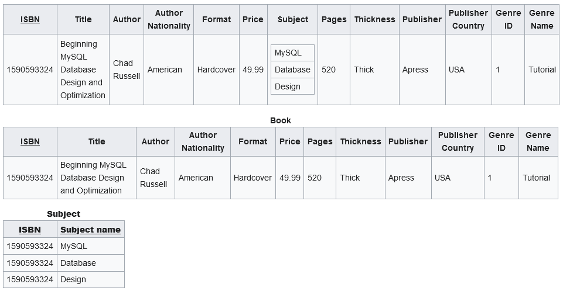
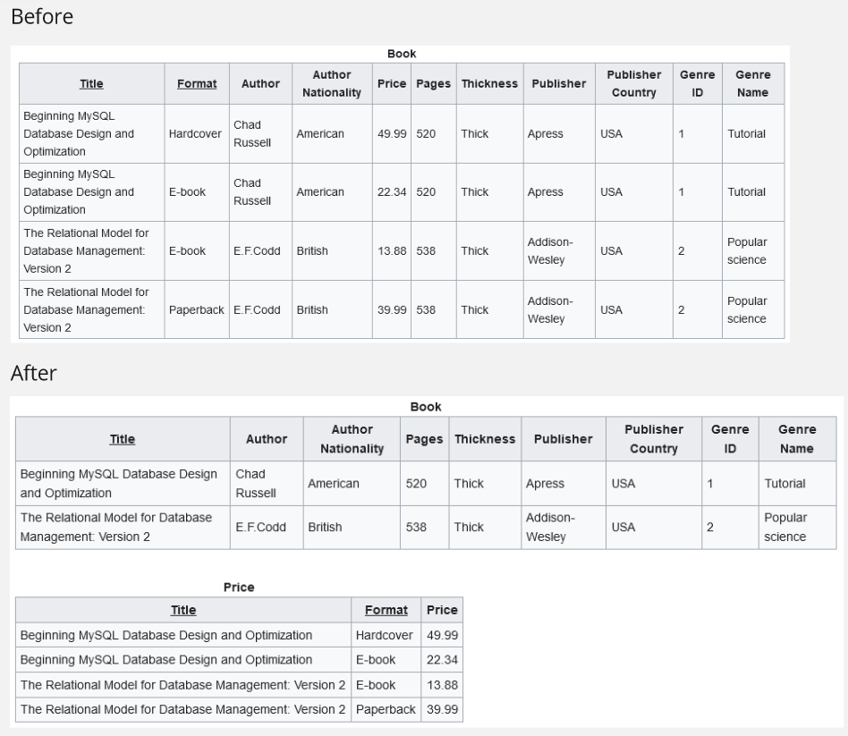
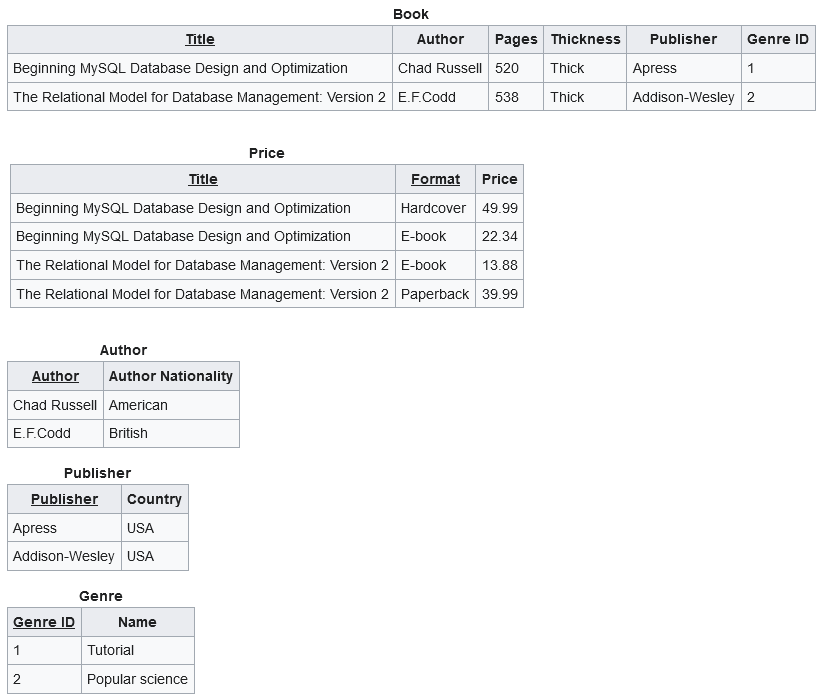
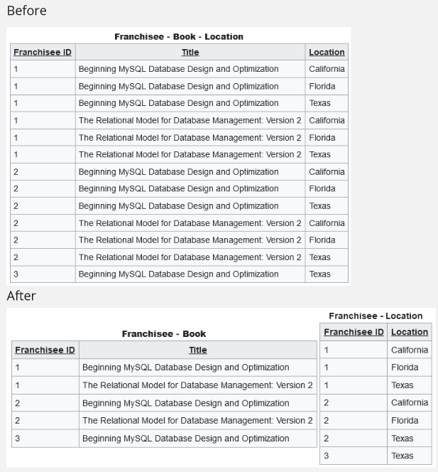
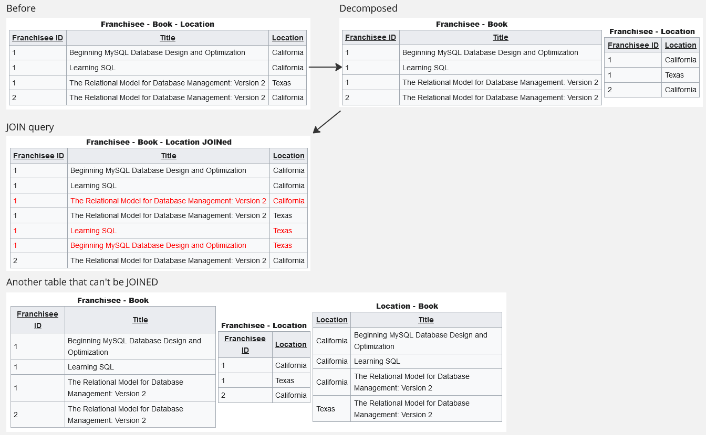

**Main Source :**

- **[Database normalization - Wikipedia](https://en.wikipedia.org/wiki/Database_normalization)**
- **[Denormalization - Wikipedia](https://en.wikipedia.org/wiki/Denormalization)**
- **[Functional dependency - Wikipedia](https://en.wikipedia.org/wiki/Functional_dependency)**

In database, Normalization is the process of organizing data in a relational database to eliminate redundancy and improve data integrity and efficiency. Database normalization is done in several levels, called **normal forms**, each building upon the previous one.

### Functional Dependency

**Functional Dependency** is a concept that describes the relationship between column or sets of attributes within a table. It specifies how the values of one or more attributes determine the values of other attributes. Functional dependency is an important concept for normalization.

One attribute, known as the **determinant**, uniquely determines the value of another attribute, known as the **dependent**. This means that for a given value of the determinant, there can be only one corresponding value for the dependent attribute.

Functional dependencies are denoted using arrow notation (→). For example, if A and B are attributes in a table, A → B represents a functional dependency where the value of attribute A uniquely determines the value of attribute B. So, if we need a value of B, we can find it by knowing the value of A.

:::note
In actual application, functional dependency is the one that you find on primary key and foreign key relationship.
:::

There are different types of functional dependencies :

- **Full functional dependency** : A functional dependency A → B is considered full if no proper subset of A determines B. In other words, removing any attribute from A would result in the dependency no longer holding.
- **Partial functional dependency** : A functional dependency A → B is considered partial if there is a proper subset of A that also determines B. In this case, removing any attribute from A would still preserve the dependency.
- **Transitive dependency** : A transitive dependency occurs when there is a functional dependency A → B and B → C, which implies a transitively dependent relationship between A and C. In other words, A indirectly determines C through B.

#### Heath's Theorem

Given a relation or table $R$ with attributes $X, Y,$ and $Z$, where $X → Y$ is a functional dependency, and $Z$ is defined as the set difference between $U$, which is some set of $R$ and $XY$, then $R = \prod_{XY}(R) \bowtie \prod_{XZ}(R)$.

Where $\prod$ is a symbol for [projection](/database-system/query-language#projection), and $\bowtie$ is a symbol for natural joins.

:::info
Natural join : a join that combines two relations based on matching values in their common attributes, without duplicate columns for the common attributes.
:::

In simpler term, the expression says that a relation can be decomposed into two smaller relations to eliminate redundancy while still maintaining the original functional dependency, which is used to reconstruct the decomposed relation.

The expression describes the decomposition, it is achieved by projecting the attributes $X$ and $Y$ from $R$ and joining this projection with the projection of attributes $X$ and $Z$ from $R$.

### 1NF

In **First Normal Form (1NF)**, a table must **satisfy atomicity**.

- **Atomic Values** : Each column in a table should contain only atomic values, meaning that each value is indivisible. There should be no repeating groups or arrays of values within a single column.

:::info
Example here are taken from the Wikipedia page.
:::

  
Source : https://en.wikipedia.org/wiki/Database_normalization#Satisfying_1NF

A book record containing an array in the subject column can be separated into two tables. The first table holds the book data without the subject column, and the second table contains the removed subject data, with a foreign key of ISBN that refers to the primary key in the book table.

### 2NF

In **Second Normal Form (2NF)**, the table must **meet 1NF** and **has no partial dependency**.

  
Source : https://en.wikipedia.org/wiki/Database_normalization#Satisfying_2NF

In the book data above, the [composite key](/database-system/relational-data#other-keys) is title and format. Partial dependency is when one of the column depend on one of the composite key, but not all. For example, the `Price` column depends on format, but not title.

To conform 2NF, all non-key attributes (attributes that are not part of the primary key) must be fully functionally dependent on the entire primary key.

The solution is separating the book and price table, so the other column on book table depends only on title, and the price in the price table also depend on title.

### 3NF

In **Third Normal Form (3NF)**, the table must **meet 2NF** and **has no transitive dependency**.

A transitive dependency occurs when a non-key attribute in a table depends on another non-key attribute, rather than directly on the primary key. In other words, there is an indirect relationship between non-key attributes through other non-key attributes.

For example, in the 2NF book table, the `Author Nationality` is dependent on `Author`, which is dependent on `Title`. To eliminate transitive dependency, we would separate all the column that violates it.

  
Source : https://en.wikipedia.org/wiki/Database_normalization#Satisfying_3NF

### 4NF

In **Fourth Normal Form (4NF)**, the table must **meet 3NF** and **has no non-trivial multivalued dependencies**.

A multivalued dependency occurs when there is a relationship between two sets of attributes such that for every instance of a particular value of one set of attributes, there can be multiple instances of the other set of attributes. For example, consider attributes A, B, and C, where A determines B and B determines C. In this case, we can have multiple instances of C for each instance of B, indicating a multivalued dependency between B and C.

A non-trivial multivalued dependency is one that is not trivially implied by the existing dependencies in the schema.

To eliminate multivalued dependencies, we would need to decompose the columns into separate tables.

  
Source : https://en.wikipedia.org/wiki/Database_normalization#Satisfying_4NF

In this table, `Title` depend on `Franchisee ID`, and `Location` depend on title. In the normalized form, now `Location` can depend on `Franchisee ID` directly.

### 5NF

In **Fifth Normal Form (5NF)**, the table must **meet 4NF** and **has no join dependencies**. Join dependency occurs when a table can be logically reconstructed by joining two or more smaller tables together based on their common attributes.

So, to meet 5NF, a table must not be able to be reconstructed from join query. To examine if a table meet 5NF or not, we would try decomposing it into several tables and see if joining them together reconstructed the original table.

Typically, a 4NF table already meets 5NF.

  
Source : https://en.wikipedia.org/wiki/Database_normalization#Satisfying_5NF

We will first decompose the first table into two separate tables. We won't be able to fully reconstructed the table if we join them. We will then decompose the table again into three separate tables. At this point, the three table can't be joined anymore, therefore the original table meet 5NF.

### Denormalization

Normalization reduce data redundancy by eliminating duplicate data by separating them into multiple table and use a foreign key to link between them. While normalization can be good to reduce redundancy, query can be overhead. This is because we will need to perform join operation to retrieve the data separated into several tables.

**Denormalization** is the opposite of normalization, we will instead introduce duplicate data or combine related data into single table to reduce joins operation. We can also create a summary table to store pre-aggregated data to reduce the need for complex calculations during query execution.

:::tip
Denormalization is different with unnormalized form. Unnormalized form means that the table is not normalized yet.
:::
