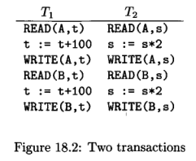
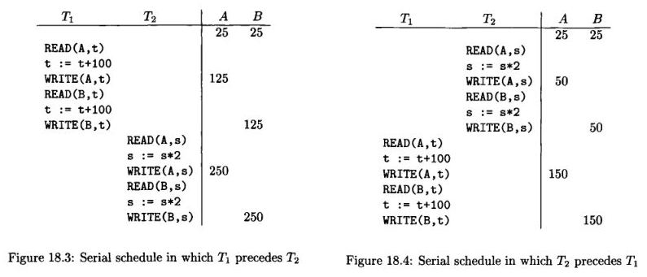
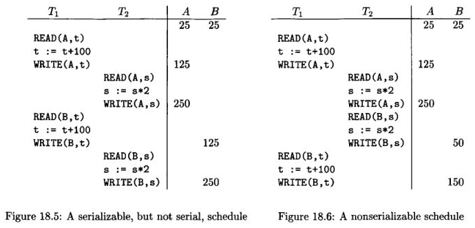
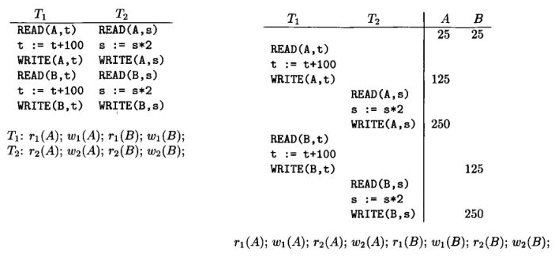
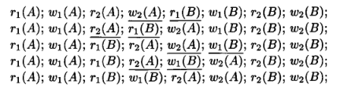
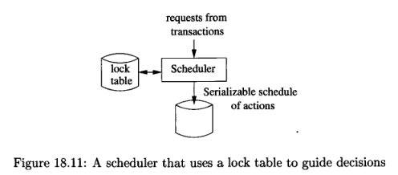
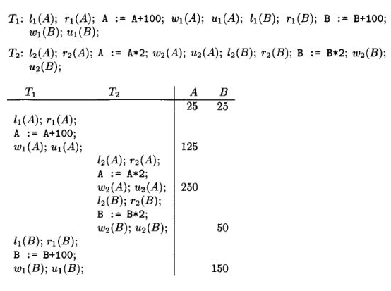
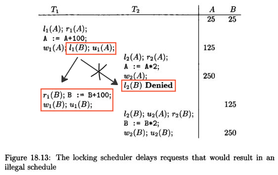

**Main Source :**

- **Chapter 18 - Database Systems - The Complete Book (2nd Edition)**
- **[Concurrency control - Wikipedia](https://en.wikipedia.org/wiki/Concurrency_control)**

Database operations are grouped into a transaction unit. The execution of each transaction unit is scheduled by the **scheduler** of DBMS. This is to ensure database operations executed in controller manner, avoiding concurrency issues such as [data races](/computer-and-programming-fundamentals/concurrency#race-condition). The overall process of handling concurrency is called **concurrency control**.

The three property of concurrency control (whether in local database or [distributed database](/cloud-computing-and-distributed-systems/distributed-database)) :

- **Serializability** : Serializability is a property of a schedule in concurrent transactions that guarantees the execution to produces the same outcome as if they had executed in other sequential order, without any overlap. In other word, a database system with serializability means that even if we execute multiple transaction simultaneously, we can guarantee that the end result of executing those transactions is equivalent to some serial execution of the transactions (i.e., as if they had executed one after another in a specific order).
- **Linearizability** : Also known as strict serializability, is a strong consistency condition, where execution of operations appears as if they occurred atomically and in a specific global order, even though they may be executed concurrently across different processes or devices. We could describe it in an example.

  In a system with three servers (S1, S2, and S3), S1 accepts write operations while S2 and S3 accept read operations. This division of roles helps balance the system load. Suppose a client initially reads a value from S2 because it is geographically close. Later, the client wants to update the value and writes it to S1. S1 is responsible for propagating the update to S2 and S3. However, there is a possibility that the update has reached S3 but not S2, and the client reads the value from S2 again before the update reaches it. In this scenario, S2 is unaware of the update while S3 knows about it.

  To ensure the linearizability property, the distributed system must ensure that the client's read operation on S2 appears to take effect atomically at a single point in time, regardless of the server's location. It should observe a consistent and globally agreed-upon state of the system, even across servers in the distributed system.

- **Recoverability** : Recoverability in concurrency control does not mean the ability to recover, but rather the property to not read invalid or inconsistent data written by aborted transactions. Changes made by aborted or uncommitted transactions shouldn't be valid.

  
Source : Book page 884

Two example of transactions, `T1` and `T2`. `READ(A, t)` means read value `A` and store in local variable `t`, which is then increment by 100. The resulting `t` is written back to value `A`.

### Serial & Serializable Schedules

**Schedule** is a sequence of actions performed by one or more transactions in a database.

- **Serial** : Schedule can be serial, meaning transactions execute one at a time, without any interleaving. In the example below, T1 completes first before T2 do anything. T2 can also be started first, and T2 after. The point is, no mixing between transaction is allowed.

    
   Source : Book page 885, 886

- **Serializable** : In serializable schedule, actions from different transactions can be interleaved. A schedule is said to be serializable, if there exists a serial schedule, and interleaving between them produce the same result. The figure 18.5 is an example of serializable schedule, while figure 18.6 is not, because the result differ from the serial schedule above.

    
   Source : Book page 886, 887

### Transaction Notation

Transaction is denoted as follows :

  
Source : Book page 889 and previous images

$r_i(X)$ means that a value $X$ is being read by transaction $i$. In the case of $w$, it means the transaction is writing data. When doing transaction, the scheduler is not bothered by what the transaction actually doing.

### Conflict Serializability

**Conflict** is a situation where changing the order of two or more transactions leads to data inconsistencies or incorrect results. **Conflict serializability** focuses on making schedule that has serializability property.

Conflict will _not_ occur when :

- $r_i(X);r_j(Y)$ : Two different transaction reading the same or different value.
- $r_i(X);w_j(Y)$ or $w_i(X);r_j(Y)$ : As long as the two transactions access different data (i.e., $X \ne Y$), then conflict won't occur.
- $w_i(X);w_j(Y)$ : Similar to before, as long as they are distinct data.

Conflict may occur when :

- Two actions of the same transactions, e.g., $r_i(X); w_i(Y)$. Changing their order would lead to different results.
- Two writes of the same database element by different transactions, $w_i(X);w_j(X)$.
- Read and write of the same database element by different transactions, $r_i(X);w_j(X)$.

The general scenario of conflict is when two or more transaction access same data, and at least one of them is writing. If we swap schedule and conflict doesn't occur, this is called **non-conflicting swap**.

Two schedules are considered **conflict-equivalent** if one schedule can be transformed into the other by performing a sequence of non-conflicting swaps of adjacent actions. A schedule is considered **conflict-serializable** if it is conflict-equivalent to a serial schedule. In other word, if we can rearrange the order of operations in the schedule without changing the final result, then the schedule is conflict-serializable.

  
Source : Book page 892

The above is example of a schedule that is conflict-serializable. A sequence of swap is performed indicated by the underline.

### Common Problem

Some common problem that occurs in concurrent transactions :

- **[Deadlock](/operating-system/process-synchronization#deadlock)** : Deadlock is a situation where two or more transactions are waiting indefinitely for resources that are held by other transactions.
- **Dirty Reads** : Dirty read occurs when one transaction reads data that has been modified by another transaction that has not yet been committed. In other words, a transaction reads uncommitted data that may be rolled back later, leading to a potential data inconsistency.
- **Dirty Writes** : Occur when a write operation that hasn't been committed is overwriten by another write operation.
- **Non-repeatable Reads** : Non-repeatable reads occur when a transaction reads the same data multiple times during its execution, but the values of the data change between each read. This inconsistency can happen when another transaction modifies the data that the first transaction is reading.
- **Phantom Reads** : Phantom reads occur when a transaction reads a set of rows that satisfy a certain condition, but when it repeats the same read, additional rows are found that meet the condition. This can occur when another transaction inserts or deletes rows that match the condition.

### Methods

Concurrency control mechanism are categorized into three :

1. **Optimistic** : Optimistic concurrency control assumes that conflicts between transactions are rare. In this approach, transactions are allowed to execute concurrently without blocking each other. When a transaction is ready to commit, it checks if any conflicts have occurred with other concurrently executing transactions. If conflicts are detected, the transaction is rolled back and can be retried with a new copy of the data. This approach can be efficient if conflict happened less.
2. **Pessimistic** : Pessimistic concurrency control assumes that conflicts between transactions are likely to occur. In this approach, transactions must wait for each other until possibility of violation disappear (e.g., it's fine to let multiple transactions read the same data). This approach can lead to performance overhead during blocking.
3. **Semi-optimistic** : Semi-optimistic concurrency control combines both optimistic and pessimistic approaches. It allows transactions to execute concurrently, similar to optimistic mode. However, at certain points in the transaction, it may check for conflicts and switch to a pessimistic mode if conflicts are detected.

#### Serializability Checking

The schedule of transactions execution can be represented by a graph called the **precedence graph**. The method to check serializability involve checking the graph if a conflict is present. A conflict occurs when the order of two actions of different transactions cannot be swapped without affecting the final result of the schedule.

  
Source : https://www.geeksforgeeks.org/equivalent-serial-schedule-of-conflict-serializable-schedule-in-dbms/

In the precedence graph, each transaction is represented by a node, and there is a directed edge from one transaction to another if the former transaction must precede the latter transaction in the schedule. The edges in the graph represent the dependencies between transactions based on their read and write operations.

:::tip
Checking serializability through precedence graph is a pessimistic approach.
:::

#### Locks

Lock is a mechanism to prevent multiple transaction accessing the same database element. A lock can be _acquired_ by a transaction, meaning that particular transaction has the access to the data and the others can't interfere it until the lock is _released_.

:::tip
See also [mutex](/operating-system/multithreading#locks--mutex).
:::

The scheduler keep track a lock table, which contains the mapping that associates database elements with locking information specific to each element. Based on the lock table information, a transaction request will be delayed if another transaction is currently holding the lock.

  
Source : Book page 898

Notation for lock is :

- $l_i(X)$ : Transaction $i$ requests a lock on database element $X$.
- $u_i(X)$ : Transaction $i$ releases or unlock its lock on database element $X$.

Below is an example of lock notation for transactions.

  
Source : Book page 899

Transaction 1 acquire lock and read the value database element $A$. It increases the value of it by 100 and write the result. After that, it releases the lock and transaction 2 continue. It's a valid schedule of transaction, but not serializable.

##### Two-Phase Locking

**Two-phase locking (2PL)** is a pessimistic locking mechanism that enforces a specific order of actions within a transaction that guarantees serializability.

It divides a schedule into two distinct phases : the **lock acquisition phase** and the **lock release phase**. In the lock acquisition phase, a transaction acquires _all_ the necessary locks it needs to read or modify database elements before proceeding with its operations. In other word, all lock actions precede all unlock actions.

Once the transaction enters the lock release phase, it releases the locks it acquired during the lock acquisition phase, allowing other transactions to acquire them. Any transaction requesting the lock before it is released will be denied and delayed further.

  
Source : Book page 901 (with modification)

In this example, the transaction 1 acquire the lock for database element B before even unlocking A. This way, even if the schedule of transaction 2 precede it in instantaneous time, it won't be able to acquire B.

#### Timestamp Ordering (TO)

This method assigns a unique timestamp to each transaction when it begins execution. The timestamps are used to order the transactions and determine their relative precedence. The system validates that transactions are executed in timestamp order, which means that a transaction with a higher timestamp is executed after a transaction with a lower timestamp.

There are two approaches to generating timestamps in this method :

- One approach is to use the system clock as the timestamp, as long as the scheduler does not operate so fast that it could assign the same timestamp to two transactions.
- Another approach is to maintain a counter that is incremented by 1 each time a transaction starts, and the new value becomes the timestamp.

Each database element is associated with two timestamps and a **commit bit**. The two timestamps are **read time (RT)** and **write time (WT)**, which are the highest timestamp of a transaction that has read and write the element, respectively. The commit bit is used to track whether the most recent write has already committed or not.

The commit bit gives an information to prevent a situation where one transaction reads data written by another transaction that subsequently aborts (dirty read).

Timestamp ordering can be considered optimistic because it assumes that conflicts between transactions are rare. Transactions are allowed to execute concurrently based on their timestamps, without acquiring locks. If conflicts occur, we can allow the transaction with the earlier timestamp to proceed, while the transaction with the later timestamp may be rolled back and restarted or delayed.
