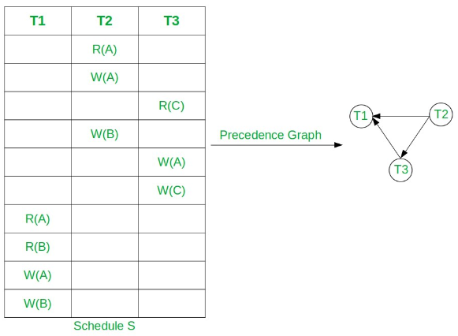

**Main Source :**

- **Chapter 18 - Database Systems - The Complete Book (2nd Edition)**
- **[Concurrency control - Wikipedia](https://en.wikipedia.org/wiki/Concurrency_control)**

883-950 concurrency control
953-983 transaction

Database operations are grouped into a transaction unit. The execution of each transaction unit is scheduled by the **scheduler** of DBMS. This is to ensure database operations executed in controller manner, avoiding concurrency issues such as [data races](/computer-and-programming-fundamentals/concurrency-and-parallelism#race-condition). The overall process of handling concurrency is called **concurrency control**.

The two property of concurrency control :

- **Serializability** : Serializability is a property of a schedule in concurrent transactions that guarantees the execution to produces the same outcome as if they had executed in other sequential order, without any overlap.
- **Recoverability** : Recoverability in concurrency control does not mean the ability to recover, but rather the property to not read invalid or inconsistent data written by aborted transactions. Changes made by aborted or uncommitted transactions shouldn't be valid.

  
Source : Book page 884

Two example of transactions, `T1` and `T2`. `READ(A, t)` means read value `A` and store in local variable `t`, which is then increment by 100. The resulting `t` is written back to value `A`.

### Serial & Serializable Schedules

**Schedule** is a sequence of actions performed by one or more transactions in a database.

- **Serial** : Schedule can be serial, meaning transactions execute one at a time, without any interleaving. In the example below, T1 completes first before T2 do anything. T2 can also be started first, and T2 after. The point is, no mixing between transaction is allowed.

    
   Source : Book page 885, 886

- **Serializable** : In serializable schedule, actions from different transactions can be interleaved. A schedule is said to be serializable, if there exists a serial schedule, and interleaving between them produce the same result. The figure 18.5 is an example of serializable schedule, while figure 18.6 is not, because the result differ from the serial schedule above.

    
   Source : Book page 886, 887

### Transaction Notation

Transaction is denoted as follows :

  
Source : Book page 889 and previous images

$r_i(X)$ means that a value $X$ is being read by transaction $i$. In the case of $w$, it means the transaction is writing data. When doing transaction, the scheduler is not bothered by what the transaction actually doing.

### Conflict Serializability

**Conflict** is a situation where changing the order of two or more transactions leads to data inconsistencies or incorrect results. **Conflict serializability** is a concept that extends serializable. It ensures that a schedule is serializable and avoid conflict. Conflict serializability is a desirable property as it guarantees the correctness and consistency of the database state.

Conflict will _not_ occur when :

- $r_i(X);r_j(Y)$ : Two different transaction reading the same or different value.
- $r_i(X);w_j(Y)$ or $w_i(X);r_j(Y)$ : As long as the two transactions access different data (i.e., $X \ne Y$), then conflict won't occur.
- $w_i(X);w_j(Y)$ : Similar to before, as long as they are distinct data.

Conflict may occur when :

- Two actions of the same transactions, e.g., $r_i(X); w_i(Y)$. Changing their order would lead to different results.
- Two writes of the same database element by different transactions, $w_i(X);w_j(X)$.
- Read and write of the same database element by different transactions, $r_i(X);w_j(X)$.

The general scenario of conflict is when two or more transaction access same data, and at least one of them is writing. If we swap schedule and conflict doesn't occur, this is called **non-conflicting swap**.

Two schedules are considered **conflict-equivalent** if one schedule can be transformed into the other by performing a sequence of non-conflicting swaps of adjacent actions. A schedule is considered **conflict-serializable** if it is conflict-equivalent to a serial schedule. In other word, if we can rearrange the order of operations in the schedule without changing the final result, then the schedule is conflict-serializable.

  
Source : Book page 892

The above is example of a schedule that is conflict-serializable. A sequence of swap is performed indicated by the underline.

### Methods

Concurrency control mechanism are categorized into three :

1. **Optimistic** : Optimistic concurrency control assumes that conflicts between transactions are rare. In this approach, transactions are allowed to execute concurrently without blocking each other. When a transaction is ready to commit, it checks if any conflicts have occurred with other concurrently executing transactions. If conflicts are detected, the transaction is rolled back and can be retried with a new copy of the data. This approach can be efficient if conflict happened less.
2. **Pessimistic** : Pessimistic concurrency control assumes that conflicts between transactions are likely to occur. In this approach, transactions must wait for each other until possibility of violation disappear (e.g., it's fine to let multiple transactions read the same data). This approach can lead to performance overhead during blocking.
3. **Semi-optimistic** : Semi-optimistic concurrency control combines both optimistic and pessimistic approaches. It allows transactions to execute concurrently, similar to optimistic mode. However, at certain points in the transaction, it may check for conflicts and switch to a pessimistic mode if conflicts are detected.

#### Serializability Checking

The schedule of transactions execution can be represented by a graph called the **precedence graph**. The method to check serializability involve checking the graph if a conflict is present. A conflict occurs when the order of two actions of different transactions cannot be swapped without affecting the final result of the schedule.

  
Source : https://www.geeksforgeeks.org/equivalent-serial-schedule-of-conflict-serializable-schedule-in-dbms/

In the precedence graph, each transaction is represented by a node, and there is a directed edge from one transaction to another if the former transaction must precede the latter transaction in the schedule. The edges in the graph represent the dependencies between transactions based on their read and write operations.

#### Locks

When a database transaction is going on, that transaction will lock the data it is accessing. The other transaction will not be able to access the locked data, until the one that locks it releases it. This may be implemented using [mutex](/operating-system/multithreading#locks--mutex).

#### Timestamp Ordering

This method assigns a unique timestamp to each transaction when it begins execution. The timestamps are used to order the transactions and determine their relative precedence. The system ensures that transactions are executed in timestamp order, which means that a transaction with a higher timestamp is executed after a transaction with a lower timestamp. By using timestamps, conflicts between transactions can be resolved by allowing the transaction with the earlier timestamp to proceed, while the transaction with the later timestamp may be rolled back and restarted.

### Common Problem

Some common problem that occurs in concurrent transactions :

- **[Deadlock](/operating-system/process-synchronization#deadlock)** : Deadlock is a situation where two or more transactions are waiting indefinitely for resources that are held by other transactions.
- **Dirty Reads** : Dirty read occurs when one transaction reads data that has been modified by another transaction that has not yet been committed. In other words, a transaction reads uncommitted data that may be rolled back later, leading to data inconsistency.
- **Non-repeatable Reads** : Non-repeatable reads occur when a transaction reads the same data multiple times during its execution, but the values of the data change between each read. This inconsistency can happen when another transaction modifies the data that the first transaction is reading.
- **Phantom Reads** : Phantom reads occur when a transaction reads a set of rows that satisfy a certain condition, but when it repeats the same read, additional rows are found that meet the condition. This can occur when another transaction inserts or deletes rows that match the condition.
