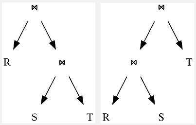

**Main Source :**

- **[Query optimization - Wikipedia](https://en.wikipedia.org/wiki/Query_optimization)**
- **[Database index - Wikipedia](https://en.wikipedia.org/wiki/Database_index)**
- **[How much do B-trees reduce disk accesses? - stackoverflow](https://stackoverflow.com/questions/34471493/how-much-do-b-trees-reduce-disk-accesses)**

341-367

Query language, typically being a declarative language, allows it to make its own optimization. It is up to the database engine how will it perform the database operation. Query language doesn't rely on specific instruction from the programmer, this makes the compiler able to produce a highly optimized query in a controlled way.

### Index

In database, index is a data structure that helps to improve performance in database queries, at the cost of extra space to store the data structure and additional maintenance. The idea of index is, rather than searching the whole table for particular value, we will instead create a special column that will narrow down the search space and help us locate the relevant data more quickly.

An index is a copy of a column, it is associated with a key and pointer. A key is a value that identify a data, it's going to be a value that will be searched for. Each key will be associated with a pointer, which is the reference or address that points to the physical location of the corresponding data within the table.

#### Naive Example

Let's say we have a table of employee, it consists of name, ID, and department. For the example, we are going to find the department associated with a particular employee name.

  
Data from : https://www.linkedin.com/pulse/database-index-selvamani-govindaraj

Suppose we are going to find the department for employee Derek. The naive approach is to check each row of `Employee_Name` column one by one from top to bottom. We will have to go through the table until we find someone with the name of Derek. In this case, we have to go through 4 row before we found Derek.

In a small table, the impact on query performance may not be significant. However, as the table size increases and the query becomes more frequent, it can have a noticeable effect on overall performance.

Now obviously we can improve the performance by sorting the table, so we can perform [binary search](/data-structures-and-algorithms/search#binary-search). However, it will be harder in a scenario where we have to search based on multiple values, not just the name.

Binary search still requires accessing specific disk blocks/pages where the data resides. In a big sorted table, the data may not be stored contiguously, meaning that multiple disk blocks/pages may need to be read to complete the binary search. This can result in multiple I/O operations, especially if the desired data is distributed across different disk blocks.

Another downside of flat sorted table is the performance of insertion and deletion, as we need to maintain the sorted order of the table. If we insert a new record, we may need to shift all the subsequent records to make room for the new entry. This process can be time-consuming and resource-intensive.

#### B-Tree Index Example

There are many ways to implement database indexes. One way is to maintain a column of key and pointer, arranged in a tree structure. The column will be sorted based on the key. This tree structure is called [B-tree](/data-structures-and-algorithms/tree#b-tree).

  
Source : https://www.linkedin.com/pulse/database-index-selvamani-govindaraj (with modification)

The tree will consist of many nodes, each node has different column of key and pointer. As said earlier, the key will be the terms that is being searched, such as name. Each column entry is associated with a pointer that refers to the child nodes, eventually referring to the leaf nodes.

Let's say we are searching for name "Derek".

1. Start from the root node.
2. Compare the search key with the keys stored in the root node.
3. If the search key is found in the root node, the search is complete, and the corresponding data can be retrieved.
4. Because **De**rek is higher than **Da**vid but lower than **G**reg, we will follow the pointer associated with David.
5. This comparison will keep being repeated until we find the data or arrived at the leaf nodes.
6. We followed the pointer which led us to the disk location of 2459.
7. Upon searching the node, we found Derek and its department.

In this case, we found Derek by doing 5 search, checking all the key on the root node and 2 key on the middle leaf nodes. So why is this index structure better than binary search?

One advantage is the **balanced structure** which results in **reduced I/O operation**. The binary search can only narrow down the search by half. In other word, it only divides the search space by 2. If we have 1 million data, we would need 20 comparison in average ($\log_{2} (1,000,000) \approx 19.93$). By 20 comparison, this mean we need to do the disk operation 20 times.

On the other hand, b-tree is more flexible in terms of the node maintained in each level. In contrast, a binary search can be represented in a tree like below.

  
Source : https://en.wikipedia.org/wiki/Binary_search_tree

A b-tree node does not have to be 2, the number of node can be within a certain range. A node in a b-tree is sized to match the disk page size. Each node can contain many keys which all held in a single page. This is possible because an index entry consist only a key and a pointer, whereas binary search performed on sorted table requires all rows and column.

The compact representation of index entries in b-tree indexing enables a significant amount of data (the index keys) to fit within a single page. We can check a large amount of key in just a single I/O operations that retrieves the specific page.

Also, we don't need to reorganize the node and all the disk pages every time insertion or deletion happens, this is because [b-tree by itself is a self-balancing tree](/data-structures-and-algorithms/tree#rules--balancing).

#### Index Architecture & Methods

Indexes can be organized differently :

- **Clustered** : A clustered index stores their index in the same order as how data rows are stored on disk. Clustered index can determine the physical order of the data rows in a table. Each table can have only one clustered index.
- **Non-clustered** : A non-clustered index contains copy of the indexed column(s) along with a pointer to the corresponding data row. Non-clustered index does not determine the physical order of the table rows. Instead, it provides a quick lookup mechanism to locate specific rows based on the indexed columns. There can be more than one non-clustered index on a table.

:::info
The b-tree example before is an example of non-clustered index.
:::

  
Source : https://josipmisko.com/posts/clustered-vs-non-clustered-index

Clustered index can significantly improve the performance of queries that involve range-based searches or sorting operations on the clustered index key. However, we need to maintain the sorted order of the data, possibly rearranging the data every insertion or deletion operation.

Non-clustered index can be efficient for query of data based on the indexed column(s) that involve filtering, sorting, or joining. However, it requires additional disk I/O operations to access the actual data rows after locating them through the index.

#### Types of Indexes

- **Bitmap Index** : A bitmap index stores data in a bit array (bitmap) and answer query by performing [bitwise operations](/computer-and-programming-fundamentals/bitwise-operation). Each bit in the bitmap represents the yes or no of a particular value in the indexed column. Bitmap indexes are efficient for low cardinality columns (columns with a few distinct values) and can provide fast lookup and efficient boolean operations.
- **Dense Index** : Dense index contains an entry for every record in the indexed data structure. In other words, there is an index entry (containing key and pointer) for each data record in the table.
- **Sparse Index** : Sparse index contains an entry for some subset of record in the indexed data structure. It skips some records in the data structure, resulting in a smaller index size.
- **Inverted Index** : Inverted index maps a value to the records that contain them. Inverted indexes are commonly used in search engines which uses keyword as the value and the document or website as their records.
- **Primary Index** : Primary index is an index created on the primary key of a table. It determines the location of the table's rows based on the primary key values. Each table can have only one primary index.
- **Secondary Index** : Secondary index is an index created on a column(s) other than the primary key of a table. It contains a pointer to the data block. Unlike primary indexes, a table can have multiple secondary indexes.
- **Hash Index** : Hash index uses a [hash function](/computer-security/hash-function) to map the indexed values to specific locations in the index structure. Hash indexes provide fast equality searches, but they are not well-suited for range queries or partial matches.

  
Source : [Bitmap index](https://www.semanticscholar.org/paper/A-Data-Mining-Approach-for-selecting-Bitmap-Join-Bellatreche-Missaoui/be31419bb65817e457433f4061af2771e9891ac2), [Dense index](http://mlwiki.org/index.php/Dense_Index), [Sparse index](https://prepinsta.com/dbms/indexing-and-its-types/), [Inverted index](https://spotintelligence.com/2023/10/30/inverted-indexing/), [Primary and secondary index](https://byjus.com/gate/indexing-in-dbms-notes/), [Hash index](https://www.sqlpipe.com/blog/b-tree-vs-hash-index-and-when-to-use-them)

### Query Optimization

#### Query Plan

It is possible for single query to have multiple valid execution plans, with different performance. For example, consider the following query :

```sql
SELECT *
FROM table1
JOIN table2 ON table1.id = table2.id
WHERE table1.column = 'value'
```

There are three ways to join both table :

- **Nested Loop Join** : The optimizer scans each row from `table1` and looks up matching rows in `table2`. This plan is suitable when one table is significantly smaller, or when the join condition is selective, meaning it filters out a relatively small portion.
- **Hash Join** : The optimizer builds [hash tables](/data-structures-and-algorithms/hash-table) for both `table1` and `table2`. The hash table serves as a quick lookup for matching rows between two tables. Hash join can be more efficient when both tables are large and the join condition is not selective.
- **Merge Join** : Merge join efficiently merge the sorted data to perform the join. It scans the sorted tables simultaneously, comparing the values of the join columns. Merge join can be efficient when the data is already sorted and the join condition is not selective.

#### Join Ordering

**Join Ordering** is the process of determining the order in which tables are joined in a database query. The goal of join ordering is to find the most efficient sequence of join operations that minimizes the overall cost of executing the query.

The query plan is represented as tree.

  
Source : https://en.wikipedia.org/wiki/Query_optimization

Join order is determined using [dynamic programming](/data-structures-and-algorithms/dynamic-programming) algorithm pioneered by IBM's System R database. This algorithm works in two stages :

1. **Enumeration** : The optimizer generates all possible join order for the given tables.
2. **Cost-Based Selection** : The algorithm estimates the cost of each generated join order and choose the best way.

#### Cost Estimation

A cost of query plan is estimated by several factors such as disk I/O operations, CPU time, connectivity (in the case of distributed systems), and selectivity and cardinality.

- **Selectivity** : refers to the proportion of rows in a table that satisfy a particular condition or predicate. Selectivity information helps the optimizer to plan and optimize query execution by estimating the number of rows that will be returned by a given query or predicate.

  For example, if a predicate has a high selectivity, meaning it filters out a large portion of the rows, it might be advantageous to push the predicate closer to the data source to reduce the amount of data that needs to be processed.

- **Cardinality** : Cardinality is the number of distinct values or rows in a table or a column. Cardinality is important for estimating the number of rows that will be returned by a query or the number of distinct values that will be involved in a join.

The information and metrics collected about the data and structure of a database is stored in a database statistics. These can be table, column, index statistics, which stores data types, size, cardinality, or any other metadata. Statistical summaries such as frequency and distribution of values can also be stored in a histogram.

### Caching

DBMS can introduce [caching](/backend-development/caching) mechanism to improve database queries.

- **Buffer caching** : Buffer pool is a region of memory that is allocated by the buffer manager as the place to transfer disk blocks. It is basically the "transit" area between the disk storage and the CPU. When query happens, the DBMS may check the buffer pool if the required data is available already.
- **Query caching** : When a query is executed, the DBMS checks if the same query with the same parameters has been executed before and if the result is already present in the query cache. If the result is found in the cache, it can be directly returned without the need for re-executing the query and accessing the disk, resulting in performance improvement.

### Partition

Database partitioning is a technique to logically divide a large database into smaller, more manageable partitions. Partitioning is particularly useful when dealing with large datasets or when performance bottlenecks occur due to the size and complexity of the database.

Partitioning also improves scalability and availability, it ensures that a failure of one partition does not affect the availability of the other partitions. Those partitions can be distributed across multiple servers.

For example, a global company with customers in multiple regions could partition its customer data by region. This would allow the company to store the customer data for each region on a server in that region, which would improve data locality and reduce latency.

Type of database partitioning :

1. **Range Partitioning** : Data is divided based on a specific range of values from a chosen attribute. For example, a date attribute could be partitioned into monthly or yearly ranges. Each partition contains data that falls within that specific range.
2. **List Partitioning** : Divides data based on specific values or a list of values from a chosen attribute. For instance, a database could be partitioned based on region attribute, where each partition contains data related to a specific region.
3. **Composite Partitioning** : Composite partitioning combines multiple partitioning techniques to create more complex partitioning strategies.
4. **Round-robin Partitioning** : Round-robin partitioning evenly distributes data across partitions in a circular fashion. Each new record is inserted into the next partition cyclically. This technique can be useful when the data distribution is expected to be uniform and there is no specific criterion for partitioning.
5. **Hash Partitioning** : Hash partitioning distributes the data across partitions based on a [hash function](/computer-security/hash-function) applied to a chosen attribute. The hash function ensures an even distribution of data across partitions, making it useful when there is no natural range or list criterion for partitioning.

  
Source : https://www.enjoyalgorithms.com/blog/data-partitioning-system-design-concept
