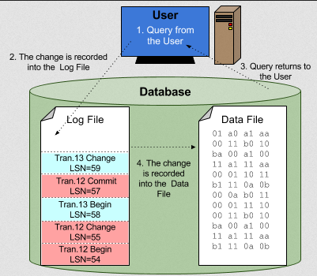

**Main Source:**

- **[Logging (computing) — Wikipedia](<https://en.wikipedia.org/wiki/Logging_(computing)>)**
- **[Transaction log — Wikipedia](https://en.wikipedia.org/wiki/Transaction_log)**
- **[Write-ahead logging — Wikipedia](https://en.wikipedia.org/wiki/Write-ahead_logging)**
- **[Replication (computing) — Wikipedia](<https://en.wikipedia.org/wiki/Replication_(computing)>)**
- **[Schema migration — Wikipedia](https://en.wikipedia.org/wiki/Schema_migration)**
- **Chapter 5, Designing Data Intensive Applications — Martin Kleppmann**

### Logging

**Logging** is the process of recording activities and changes that occur within a computer system. A log can be a problem, error, or just information on current operations.

#### Transaction Log

Database operations are grouped into a unit of [transaction](/database-system/transactions). Transaction log is the log file that contains all the transactions and changes made to the database over time.

Keeping track of database operation can be helpful to maintain data integrity. In the case of system failures, the DBMS can review the log and rolls back the state of database to a consistent state. By replaying the logged transactions, the system can reapply the changes made by committed transactions or undo the changes made by uncommitted or rolled-back transactions.

Database logs are linked together, forming a [linked list](/data-structures-and-algorithms/linked-list). A log record is made up of:

- **Log Sequence Number (LSN)**: LSN is a unique ID of a log record, it is assigned to each transaction record.
- **Prev LSN**: A reference to the previous log record in the linked list structure of the log.
- **Transaction ID**: The associated transaction of a log record.
- **Type**: Type of database log record.
  - **Update**: It can be an update or change to database, it will include a reference to the modified page, length and offset of the page, and size of the page before and after the update.
  - **Compensation**: A log about rollback of particular changes to the database. Each record is associated with the update log record, it also includes the next log record that needs to be undone for the transaction that wrote the last update log record.
  - **Commit**: A decision to commit a transaction, which is a successful completion of a transaction.
  - **Abort**: The decision to abort and rollback a transaction
  - **Checkpoint** Changes made in the memory is called **dirty pages**, a checkpoint is when all the dirty pages has been flushed or written to disk. The checkpoint record contains:
    - redo LSN: Reference for first update after checkpoint, it is the starting point of redo on recovery.
    - undo LSN: Reference to starting point for undoing the changes made by that transaction.
  - **Completion**: Information about all work that has been done, either aborted or committed, for a particular transaction.
- **Actual Information**: Contains the necessary information to describe the changes made by the transaction that causes the log to be written.

  
Source: https://sqlbak.com/academy/transaction-log/

During logging transaction, it can be implemented using the **write-ahead logging (WAL)** technique. This technique write changes to the database to a log file, along with undo and redo information, before they are applied to the actual data pages on disk.

The transaction and logging usually happens periodically. Transaction are written to the log, after some point, the system will perform a checkpoint, writing all the changes to the database and clear the logs.

### Replication

**Replication** is the process of maintaining a copy of data for improved availability, fault-tolerance, and serving more request. When one instance of database fails, we can use the others. Furthermore, with more instance being present, they can help to serve multiple database request. This can be done locally or in a [distributed database](/cloud-computing-and-distributed-systems/distributed-database).

Key concept of data replication:

- Replicated data can be stored in the same device or distributed in multiple device. We typically call an instance of database in distributed system as a **node**.
- Replicated data can be all or some subset of the data.
- The device or system a copy of data is called replica. Replica is updated frequently to ensure data is consistent.
- To synchronize with modification, we can either modify the primary and replicas simultaneously (asynchronous), or modify the primary data first and all the replicas after (synchronous).

Some techniques of replication:

- **Master-Slave Replication**: Also known as leader-follower replication, this approach rely on two types of node. A _master_ database handles write operations, while one or more _slave_ databases replicate the data from the master. The slaves are intended to be read-only, they can only serve read queries from clients. The master should be responsible for propagating the changes to the slaves asynchronously or synchronously in some amount of time.

  The downside of using single master is, it could be overwhelmed by all the write request. Furthermore, it can lead to a single point of failures when the master fails. For that reason, when a master fails, it may be needed to select a new master through algorithm like [leader election](/cloud-computing-and-distributed-systems/distributed-systems-model#leader-election).

- **Multi-Master Replication**: In this approach, multiple master are present in the system. Each master can handle write operations independently, and changes made on one master are replicated to the other masters.

  While multi-master replication solves certain problems of master-slave replication, another [conflict](/database-system/concurrency-control#conflict-serializability) may occur. It arises when two or more master receive conflicting write operations that affect the same piece of data, therefore asking us which write is accepted. One way to resolve conflicts is to abort the operation and rollback to a specific timestamp when a change in one master was made. The choice of timestamp can be based on the **last-writer-wins (LWW)** principle, where the latest write operation is retained (although result in data loss).

- **Multi-Level Replication**: This approach creates a hierarchy of replicas, where changes are propagated through multiple levels of replication. For example, changes made to a primary database are replicated to secondary replicas, which in turn replicate the data to tertiary replicas.

When there is delay for accessing data because of replication (e.g., slow read/write, node fails), we call it **replication lag**. This delay can be bother the system, as various consistency problem may occur.

For instance, a client might update data through the master instance. Later, it reads data from a slave instance. This scenario can happen, for example, when a user submits a form through a web browser, and then refreshes the web browser to view the updated data. However, the slave instance hasn't received the write from the master yet. This can result in unexpected behavior observed by the user.

#### Synchronous vs Asynchronous

In synchronous replication, the master always waits for the slave to update changes with new data until it completes, indicated when the slave sends a message. Consequently, this can be slower, but we can guarantee data consistency. The concern is not the performance, but rather when the slave fails. This could be due to hardware failure or network problems, which frequently encountered in distributed systems. Resolving these issues takes much longer than waiting for the write update. If all the slaves fail, the entire system could even halt entirely.

In asynchronous replication, the master does not wait for the slave, which may lead to data inconsistency. Practically, the downside of synchronous replication is worse the asynchronous replication.

Then there is also a semi-asynchronous approach where one node is made synchronous for maintaining consistent data, while others are made asynchronous. If the synchronous node fails, we can make the asynchronous slave synchronous.

#### RAID

**RAID** is a fault-tolerance technique that involve creating redundancy in computer storage by distributing data across multiple disks.

See [RAID](/operating-system/disk-management#raid).

### Migration

**Migration** is the process of moving or transferring a database from one system or environment to another. Database migration transfer data, schema, and associated objects from the source system to the target system while ensuring data integrity and compatibility.

A migration is needed when a specific changes applied to a database alters its structure. Some scenarios are:

- **Schema Changes**: When modifying the structure of a database, such as adding, modifying, or removing tables, columns, indexes, or constraints.
- **Data Transformations**: This may include data conversions, normalization, denormalization, etc.
- **Version Upgrades**: When upgrading the DBMS to a newer version, a migration is often required to ensure compatibility with the new database software.
- **System Upgrades**: Scenario of system upgrades, or when moving data to a different platform, such as migrating from an on-premises database to a cloud-based solution.
