**Main Source:**

- **Chapter 14 - Database Systems - The Complete Book (2nd Edition)**
- **[What are the differences between B trees and B+ trees? — stackoverflow](https://stackoverflow.com/questions/870218/what-are-the-differences-between-b-trees-and-b-trees)**
- **[The Extensible Hashing Algorithm (implementation details) — CS Emory](http://www.cs.emory.edu/~cheung/Courses/554/Syllabus/3-index/extensible-hashing-new2.html)**

### B-Tree

#### Structure

[B-tree](/data-structures-and-algorithms/tree#b-tree) is a common data structure used to implement database index and the specific variant used is the **b+ tree**.

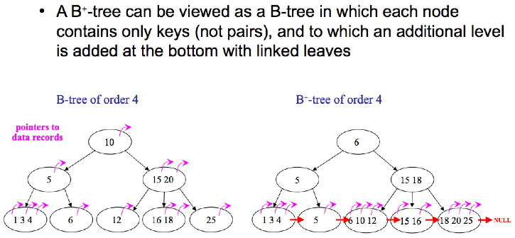  
Source: https://stackoverflow.com/questions/870218/what-are-the-differences-between-b-trees-and-b-trees

B+-tree has linked structure on the leaf nodes, making it possible to traverse the full tree structure in a linear scan. In contrast, original b-tree require us to traverse every level in the tree.

Some key features of b-tree in indexing:

- Balanced tree and also self-balancing, all the path from root to leaf have the same length.
- Index level is automatically adjusted based on the size of file being indexed.

B-tree organize index (key and pointer) as nodes (also called **blocks**) into tree.

In the block of b-tree:

- Each block is maintained between half used and completely full. This means that there is a balance between utilizing the available space efficiently and reducing the need for frequent block splits and merges
- B-tree copies the column used as the keys, and it will be distributed among the leaf nodes in sorted order.
- Each leaf node point to next leaf node on the right.
- Interior nodes, or any nodes that has child, will point to next b-tree block at the lower level. These nodes effectively splits the range of the key, similar to binary search.

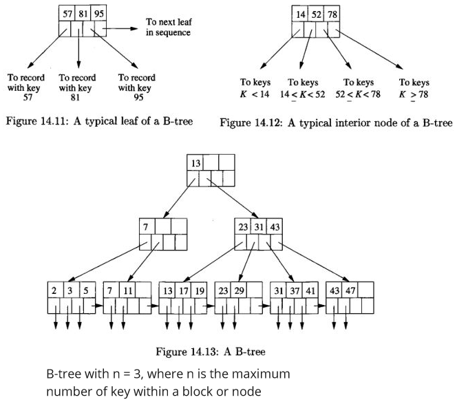  
Source: Book page 635, 636

B-trees can be used for indexing in the scenario of:

- Data file is sorted or unsorted by the primary key, which act as the search key. This will result in a dense index, there will be key-pointer pair for every record in the data file.
- Data file is sorted by its primary key, then the b-tree serves as a sparse index with one key-pointer pair at a leaf for each block of the data file.
- Data file is sorted based on non-key attributes, and is the search key. Each key value will have one key-pointer pair at a leaf node, which will point to the first record with that key value.

:::info
The difference between dense and sparse b-tree lies upon the pointer at the leaf nodes. A leaf node in dense b-tree will point to a record, while in sparse b-tree, it will point to a block.
:::

#### Modification

- **Insertion**: When inserting a key to the node of a b-tree, we will need to find an empty room. If there is, simply just insert there. If not, we will need to split the node into two, and the new key is then inserted into the appropriate new leaf node.

  After the leaf node has been split and the new key has been inserted, the parent node of the leaf node needs to be updated. If there is enough room in the parent node, the new key-pointer pair is simply added to it. If there is not enough room, the parent node may need to be split as well, and the process continues recursively until the appropriate level is reached.

  If the root node needs to be split, then a new root will be created and the old root becomes its child.

  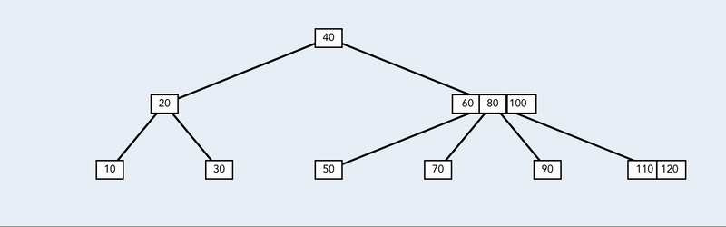  
  Source: https://levelup.gitconnected.com/building-a-b-tree-in-javascript-4482dee083cb

- **Deletion**: We first locate the key and its associated record in a leaf node. We then delete the record from the data file and remove the key-pointer pair from the b-tree. If the leaf node falls below the minimum occupancy, a rebalancing process occurs by borrowing from a sibling node or merging nodes. The process continues recursively until the tree remains balanced.

  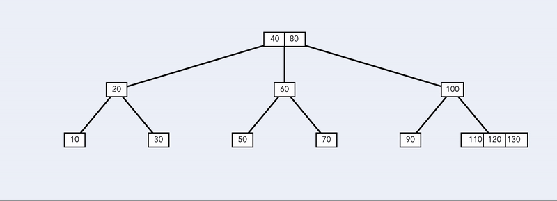  
   Source: https://levelup.gitconnected.com/building-a-b-tree-in-javascript-4482dee083cb

### Hash Table

[Hash table](/data-structures-and-algorithms/hash-table) is another option for creating index.

In the case of main memory index, hash table is very straightforward. We will create an array (called **bucket array**) and each would hold a pointer to linked list, which contains the actual records. A request with specific search key will be hashed, and it will fall to some bucket within the array. We will search the corresponding key in the list of the bucket and find the value.

#### Secondary Storage

For secondary storage, the bucket array will store blocks that contain records. If the blocks can't hold more records, an overflow block. Overflow block holds a pointer that points to the next block, linking them all together and form a chain.

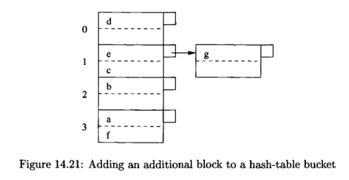  
Source: Book page 650

The image above is an example of hash table in secondary storage, where each block contains maximum of two records.

- **Insertion**: To insert a record, we will get the hash code by applying the hash function into the key. We will then insert the record in the corresponding block of the produced bucket. If there is no room, we will create additional block in the overflow block.
- **Deletion**: We will search for the corresponding key in the bucket produced by the hash function and delete them all. We may also move record to the previous block if needed to reduce the number of blocks.

### Hash Table & B-Tree Comparison

- **I/O Operation**: In b-tree, a large number of keys per node will reduce the I/O operation by a lot. Insertion and deletion will rarely happen, therefore reducing the I/O cost for reorganization. For query, the number of I/O operation will be based on the depth of the tree, this is because a single node is a block which require a single I/O operation.

  A well distributed bucket will reduce I/O operation for query, insertion, and deletion. In the case of bucket holding tons of block, we will need to traverse a long list of blocks, increasing the I/O cost significantly. One may to mitigate is to make the hash table to grow or shrink based on the number of records.

- **Range Queries**: The sorted order of records in a B-tree allows for easy traversal of consecutive keys, making it good for range-based queries. On the other hand, hash table is not sorted at all, and is not ideal for range-based queries.

### Dynamic Hash Table

To enable dynamic hashing, or the method to remove bucket on demand, there are two methods.

#### Extensible Hash Tables

In extensible hashing, the bucket array in the hash table is organized as a directory of pointers that points to the actual data blocks. Each bucket can hold multiple records, and the number of buckets can dynamically grow or shrink as needed (typically in power of two). The directory provides indirection to the appropriate bucket based on the hash value of the key. This method minimizes the need for data reorganization when the size of the hash table increases.

The hashing is kinda different with traditional hash table. The hash function will produce a sequence of $k$ bits. The number of bucket will be based on $2^i$, where $i$ is taken from the last $i$ bits of $k$.

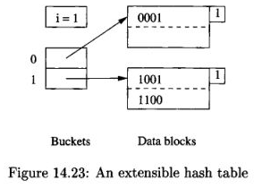  
Source: Book page 653

The above is an example of extensible hash table where $k = 4$ and $i = 1$. The number associated with the bucket determine which block should it holds. The bucket 0 will hold all the block that store with the bit 0, similar to bucket 1. We still use linked list and overflow block in extensible hash table.

For searching, we will hash the search key to find the location of which bucket does the search key fall into. We will then extract $i$ subset of bits from the produced hash.

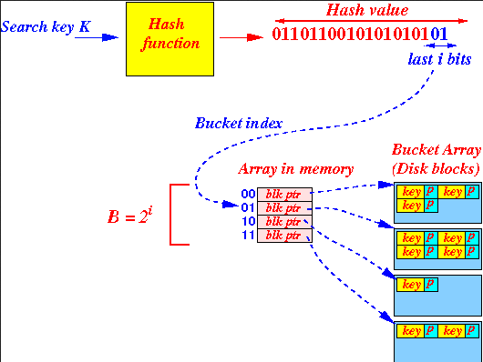  
Source: http://www.cs.emory.edu/~cheung/Courses/554/Syllabus/3-index/extensible-hashing-new2.html

In some case, we may not need the entire $i$ bits to identify the data blocks. For example, bit 01 is enough to distinguish between 0000 and 0100. The minimum number of bits used in the hash value to locate the keys in the block is denoted by $j$.

- **Insertion**: We do the similar thing as search and insert the record if there is room in the block. If not, there are two possibilities, when $j < i$ and $j = i$. When insertion happens, we do not insert directly, we instead check whether $j < i$ or $j = i$ first.

  First possibility, we can locate the block with less than the number of bits used in the overall bucket size, thus we don't need to change the bucket array. We will need to split the block into two, and distribute the records inside it to the two blocks. The distribution will be like, if the key has 0 in it, then stay in the old block, else move it to the new block. Finally, we will need to adjust the pointer in the bucket array so the record that formerly points to old block is pointed into the new block.

  Second possibility, we will need to increase the number of bucket, so we will increment $i$ by 1. In this case, when we want to insert, we must take the number of bits equal to $i$. In other word, the sequence of bits produced by hash function, denoted as $w$, must equal to $i$ bits. After incrementing $i$, the bucket array will be extended, and the entries indexed by $w$ will be extended by 0 and 1, becoming $w0$ and $w1$. Now they will point to the same block, and the block doesn't change. After that, we will now do the actual insertion, and we will get the first possibility, which will split the block.

  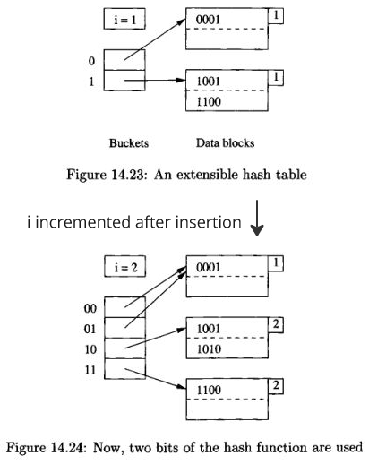  
  Source: Book page 653, 654

#### Linear Hash Tables

Extensible hash table has some drawbacks. One disadvantage arises during insertion when there is a need to expand the number of buckets. This expansion process can involve splitting a significant number of blocks, particularly when the level $i$ becomes substantial. In some cases, doubling the array size may result in the hash table exceeding the available main memory capacity, requiring additional disk I/O operations to relocate the hash table.

Linear hash tables has different strategy:

- The number of buckets is chosen to ensure that the average number of records per bucket remains fixed, e.g., 80% of the number of records that can fill one block.
- Overflow block is allowed to hold additional records. The average number of overflow blocks per bucket is typically less than 1.
- The number of bits used to number the entries of the bucket array is equal to $\log_2(n)$, where $n$ represents the current number of buckets. These bits are always taken from the right (low-order) end of the bit sequence generated by the hash function.

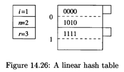  
Source: Book page 657

Example of linear hash table with $i = 1$ (number of bits of the hash function currently are used), $n = 2$ (current number of buckets), and $r = 3$ (current number of records). The rate of average number of records per bucket is represented as ratio $r/n$.

- **Insertion**: When a new record needs to be inserted, the hash function is applied to its key to compute the hash value. Next, a number of bits $i$, are extracted from the end of the hash value to determine the bucket number, $m$. If $m$ is less than the total number of buckets, denoted as $n$, the record is placed in bucket $m$. However, if $m$ is greater than $n$, the record is placed in bucket $m - 2^{(i-1)}$. If there is no room, then create an overflow and put it there.

  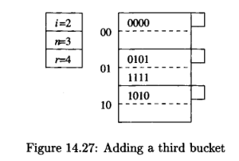  
   Source: Book page 658

  After insertion, if the $r/n$ exceed our limit, we will add another bucket, and all the previous bucket get additional 0 bit.

### Multidimensional Index

**Multidimensional Index** is an index that is based on multiple search key (two or more). One of the implementation of multidimensional index is the **grid files**.

Grid files divide the multidimensional space (represented as coordinate) into a grid of cells, where each cell corresponds to a bucket that contains the data points falling within that cell. The grid structure allows for efficient lookup by determining the cell in which a data point falls, and then searching within that cell.

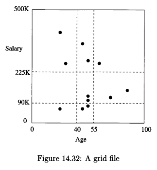  
Source: Book page 666

The above is an example of grid files in 2-dimensional space with 12 points. The dotted lines represent range queries taking point that range between 40 and 55, and the salary between 90K and 225K.

Each of the regions into which a space is partitioned is considered as a bucket. The points that fall in the region has its record placed in a block belonging to that bucket.

To determine the appropriate bucket for a point, we need to know the list of values at which the grid lines occur in each dimension. These values help in identifying the specific region or grid cell where the point belongs.

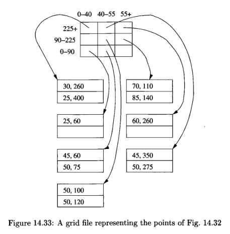  
Source: Book page 667

For insertion, we can either add overflow blocks to the bucket, or reorganize the structure by adding or moving the grid lines.

#### Performance & Application

Multidimensional index is useful for queries like:

- **Partial-match queries**: Partial match queries are the type of query where we specify values for one or more dimensions and search for all points that partially match those specified values in those dimensions. The ability to slice regions using grid lines is useful for partial match queries.
- **Range queries**: Grid files partition the space of points into regions using grid lines. This partitioning enables efficient range queries by identifying the relevant regions and retrieving the data within those regions.
- **Nearest-neighbor queries**: Nearest-neighbor queries involve finding the data points that are closest to a given reference point in multiple dimensions. Grid files can efficiently support nearest-neighbor queries by identifying and retrieving data points within the closest regions or buckets.
- **Where-am-I queries**: Grid files partition the space of points using grid lines, with each point falling into the stripe for which the corresponding grid line is the lower boundary. Analyzing the grid lines would efficiently answer where-am-I queries.

As the dimension get larger, the number of bucket grows exponentially, and may not be well distributed. The number of disk I/O operation depends on the dimensions and the type of query.

For example, in partial-match query, such as "find all customers aged 50", we will need to look either at the row or column of the grid. The number of disk I/O can be quite high if there are many buckets in a row or column, but only a small fraction of all the buckets will be accessed.
