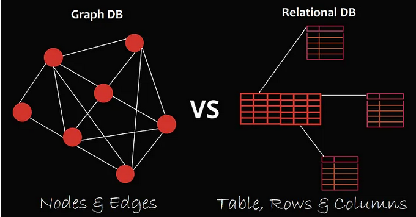

**Main Source :**

- **[Database - Wikipedia](https://en.wikipedia.org/wiki/Database)**

### Introduction to Database

Database is an organized collection of structured data that is stored and managed electronically. It is designed to store, retrieve, update, and manage large amounts of information.

Database is managed by the **database management system (DBMS)**. The DBMS is a software system responsible for creating, modifying, and retrieving the database. The underlying component that power DBMS is called a **database engine** or **database server**.

Database on its own is just a collection of data, there are many choice for storing the data. Small databases can be stored on a file system, such as disk storage on our device. Larger databases are stored in a cloud storage, which is a specialized storage on remote network.

In addition, the place where we store the data also affect the performance of retrieving the data. For instance, choosing to store data in the [main memory (RAM)](/computer-and-programming-fundamentals/memory) allows for quicker retrieval, but it comes at the expense of storage capacity since RAM is typically smaller than a disk storage.

Database is typically classified to relational and non-relational. Relational database is when data is organized into tables with columns and rows, and a unique identifier (called key) within each row.

A format in which database is structured and organized is called **[database model](database-system/database-model)**. The relational database is an example of a database model.

The purpose of having specific model is to suit with the application's requirement. For example, in a social network, we may use database that is modeled in a [graph](/data-structures-and-algorithms/graph) structure. This way, we can easily represent complex relationship between users, such as their common preferences or friendship connection, which we can use to make recommendation system.

  
Source : https://medium.com/@saad.jameel1992/graph-vs-relational-databases-62ecc5902eb2

### All pages

Some sources are from the book **Database Systems - The Complete Book (2nd Edition)**.

- [Relational Data](database-system/relational-data)
- [Query Language](database-system/query-language)
- Database Management
  - Database Design
    - [Database Model](database-system/database-model)
    - [Normalization](database-system/normalization)
    - [Transactions](database-system/transactions)
    - [Trigger & Constraints](database-system/trigger-and-constraints)
  - [Logging & Recovery](database-system/logging-and-recovery)
  - [Index](database-system/index)
  - [Database Optimization](database-system/database-optimization)
- [NoSQL](database-system/nosql)
- Database Implementation
  - [Storage Management](database-system/storage-management)
  - [Index Implementation](database-system/index-implementation)
  - [Query Processing](database-system/query-processing)
  - [Concurrency Control](database-system/concurrency-control)
