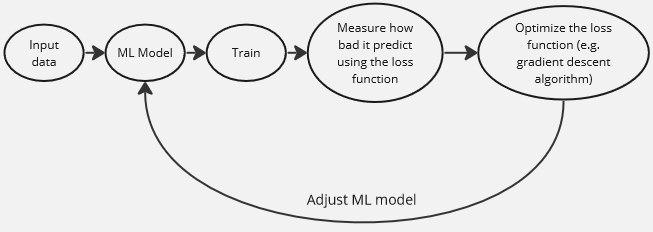
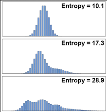
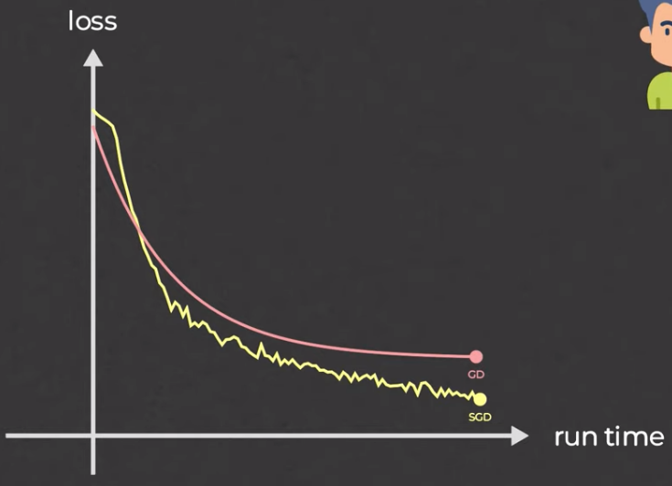
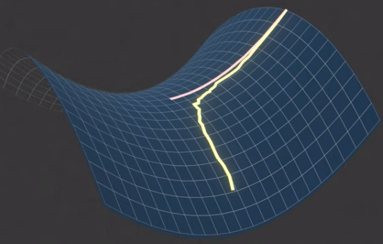
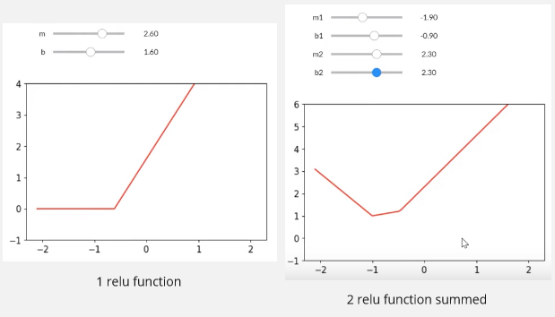
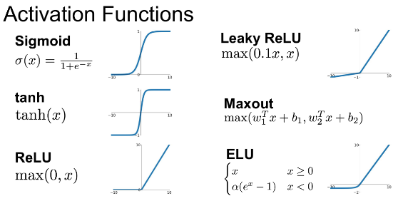
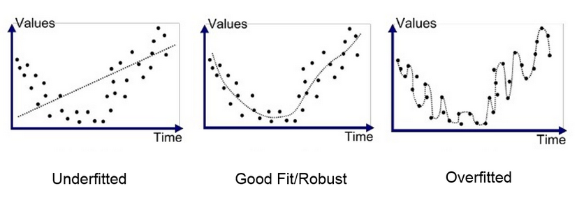

**Main Source :**

- **[Mengenal Cross Entropy Loss - Anak AI](https://youtu.be/rBKWVHhFqGU?si=K8imDow_FIeEfvXq)**
- **[Deep learning lesson 3 - fastai](https://youtu.be/hBBOjCiFcuo?si=DZdZmAXYcw_M49zC)**
- **[The Unreasonable Effectiveness of Stochastic Gradient Descent (in 3 minutes) - Visually Explained](https://youtu.be/UmathvAKj80?si=_OhMXYlZYrCc0xIp)**
- **[Deep Learning Crash Course for Beginners - freeCodeCamp](https://youtu.be/VyWAvY2CF9c?si=254TjhySXqspex_B)**

### Loss Function

**Loss function** is a function that measure how well does a machine learning model performs. Loss function is typically calculated from mathematical function that takes actual or true output and the predicted output from the model. For example, a simple loss function in machine learning is the Mean Squared Error (MSE) function, commonly used in [linear regression](/machine-learning/linear-regression).

  
Source : https://suboptimal.wiki/explanation/mse/

The model predict what may be the y value for specific x value. It sums all the error or the difference between actual and predicted value and then square it and get the average. In the case of MSE, the larger means the worse performance and the lower means the better.

The point of machine learning is we keep measuring the performance of our model and adjust our model to make it performs better. The less result we get from the loss function (or more depending on the loss function itself) reflect of how our model performs. We need to optimize the loss function, there are many way to optimize it, such as the [gradient descent algorithm](/machine-learning/linear-regression#gradient-descent)

### Entropy

In machine learning, entropy is a measure of uncertainty or randomness in a set of data. It is often used as a criterion to quantify the impurity or disorder within a group of samples.

The formula for entropy is (base of the log can vary) :

$E = - \Sigma (p_{i} \log_{2} (p_{i}))$

Entropy is calculated from a set of data or event, each of it has a probability of occuring which is the $p_i$ or the probability of event $i$.

A higher entropy means the data is uncertain, it's the opposite when entropy is low.

For example, an equally likely probabilities of coin flip has high entropy. If probabilities of getting head and tail is same, it's hard to predict what happen next. If the head has an odds of 0.9 and the tail has an odds of 0.1, then entropy will be lower.

Entropy can be thought as calculating the disorder of probability distribution of the event. Probability distribution describes the probability of all different outcomes in an event.

  
Source : https://twitter.com/page_eco/status/1631267143890407426

#### Cross Entropy

Cross entropy has a similar concept with entropy, the difference is cross entropy calculate the disorder of 2 probability distribution of an event instead.

The formula for cross entropy is :

$H(P, Q) = - \Sigma (P(x) \log (Q(x)))$

Machine learning is typically used for prediction, the prediction output can be probabilities. Cross entropy is used in the context of machine learning, the probability distribution included is the actual probability $P(x)$ and the predicted probabilities by the machine learning model $Q(x)$.

#### Cross Entropy Loss

Loss function in machine learning, measure how well a model performs in a training. Knowing how well it performs make us able to train the model to improve it.

The cross entropy function explained before can be used to calculate a loss function, typically for classification tasks that outputs probabilities. It still use the same formula, however, the notation for actual probability is typically denoted as $y$ and the prediction is denoted as $\hat{y}$.

#### Binary Cross Entropy Loss

Binary cross entropy loss is another form of cross entropy loss which is used for binary classifcation, or a classification that only has 2 output. The formula is below :

$L(y, \hat{y}) = - (y \log(\hat{y}) + (1 - y) \log(1 - \hat{y}))$

### Stochastic Gradient Descent

In traditional gradient descent, model's parameter (e.g. the slope and y-intercept in linear regression) are updated every iteration, this can be slow for large datasets. Traditional gradient descent "walks" slowly, it may reach a bad local minima or even stuck at saddle point.

**Stochastic Gradient Descent (SGD)** is a variant of [gradient descent](/machine-learning/linear-regression#gradient-descent) which is suited for larger datasets. The idea of SGD is, instead of considering all dataset to calculate the gradient and update the parameters, SGD randomly selects a single data point (or a small batch of data points) at each iteration and calculate that particular gradient and use it to update the model's parameters.

By not considering all the data, SGD may not be stable. However, with the faster computation, we can update more and eventually catch up with traditional gradient descent.

  
Source : https://youtu.be/UmathvAKj80?si=jHExCTVk7diEA6_6&t=92

With randomness, SGD able to escape saddle point or bad local minima, this is because it allows the algorithm to explore different directions and not get stuck in a single negative curvature.

  
Source : https://youtu.be/UmathvAKj80?si=Tpo1K5_hXo94UGJh&t=107

#### Adam

Adaptive Moment Estimation (Adam) is an upgrade to SGD. In high-level, Adam is able to adapt the model learning to different case we are facing. Adam have several parameters, these parameters will be adjusted based on past gradients.

Adam uses several adaptation technique including :

- **Adaptive Learning Rate** : SGD has a fixed learning rate which is set before model training begins. Adam is able to adjust the learning rate for each parameter based on their past gradients.
- **Momentum** : Momentum is a configuration that helps us goes into minimum region like saddle point in the loss function faster by making the model adjust the parameter in the successful direction.
- **Bias Correction** : During the early training, we typically set the parameters of our model (weight and bias) to some specific value. This may make our model biased toward that specific value, in simple term, Adam adjust our estimation based on the number of iterations or epochs.

### Activation Function

While predicting in machine learning, we often find that the relationship between dependent and independent variable is non-linear. Sometimes, it can't be easily approximated using line in linear regression. Remember that the point is to predict by fitting a line, so we must construct a complex function that fits the data.

We can construct any complex function that captures non-linear relationship by summing up several function or lines. However, we may not achieve a desired function just by summing up all the line.

This is where an **activation function** comes, an activation function is used to filter or "decide" which line should we sum, this way we control the sum and make any function we want. This is when we use activation function to introduce non-linearity and constructing complex function.

There are many activation function, for example **Rectified Linear Unit (ReLU)** is a simple linear activation function that defined as : $\text{ReLU(x)} = \text{max(0, x)}$, in other word, it filters any negative value.

In image below, we summed 2 relu function, it now looks like an elbow like graph which obviously can't be constructed by linear function. However, if we sum all the linear function and only takes what we need, we may be able to construct it.

The relu line is defined with the $mx + b$, we can sum as many relu as we want, and in a more complex problem, the equation may also involve more variable.

  
Source : https://youtu.be/hBBOjCiFcuo?si=B8PDlJRj4QTa99k-&t=2721

  
Source : https://medium.com/@shrutijadon/survey-on-activation-functions-for-deep-learning-9689331ba092

### Terminology

- **Hyperparameter** : Settings or configuration choices that are set before the learning process begins. They are not learned from the data but are determined by the practitioner or researcher. For example, learning rate is a hyperparameter that controls rate at which a model adjusts its parameters during training (e.g. used in gradient descent). After we trained the model and evaluate it, we may want to adjust the hyperparameter to explore if there is a more optimal result, this is called **hyperparameter tuning**.

- **Epoch** : Sometimes, training data is used more than one times while training model. The number of how many iteration pass through the entire dataset is called epoch. For example, when we say 5 epoch, it means that we are training the model with the same dataset for 5 times. Epoch is considered as hyperparameter as it is set before learning process.

- **Batch** : Batch is the number of samples or data points that is processed together in a single learning process. If we have 1000 data and we used batch of 32, it means during each iteration, we will process 32 at each time.

- **Iteration** : Iteration is the number of time we want to repeat each batch. It is different with epoch, epoch is the iteration of whole dataset, while this is just an iteration of a batch.

- **Metric** : Metric is a measure of the quality of model's predictions. Metric is different with loss function, loss function is used to train while metric is used to evaluate the prediction. By evaluating the models, we can compare with different model or configuration. For example, a simple metric is accuracy, it is defined as the number of correct predictions divided by the total number of predictions.

- **Data Split** : Data is typically split into 3 :

  - **Training Data** : Training data is the part of data used to train the machine learning model, the model will learn from this data by adjusting its parameters (weight and bias) based on the actual data.
  - **Test Data** : Test data is the data used to evaluate performance of the model after the training is done.
  - **Validation Data** : Validation data is a subset of training data used to validate or assess model's performance, this way we can adjusts the hyperparamater if required.

- **Fine Tuning** : Fine tuning is the process of training a pre-trained model, typically with a smaller dataset or new task. The purpose of fine-tuning is to leverage the knowledge and learned representations from the pre-trained model and adapt it to the new task or dataset.

- **Overfitting** : Overfitting, also known as high variance, is a situation where a model learns too much from the training data, making it becomes too specialized and performs poorly on new, unseen data. This is the same when you practice alot on a math problem without studying the concept and only memorizing it, turns out the actual exam asked different questions. For a machine learning model, the concept is the pattern of the data, it is important to capture the broader patterns rather than a specific example.

- **Underfitting** : Underfitting, also known as high bias, is where the model is too simple or didn't capture the underlying patterns in the data. It fails to learn the relevant relationships or make a very general assumptions for the training data.

    
   Source : https://medium.com/greyatom/what-is-underfitting-and-overfitting-in-machine-learning-and-how-to-deal-with-it-6803a989c76

- **Optimizer** : An optimizer is an algorithm or method used to optimize the loss function. Example of optimizer are [gradient descent](/machine-learning/linear-regression#gradient-descent), [stochastic gradient descent](/deep-learning/deep-learning-foundation#stochastic-gradient-descent), Adam, and etc.

- **Regularization** : In simple term, regularization is a technique to make model prediction simpler (prevent overfitting) by forcing some feature coefficients to be 0. In other word, we exclude some variable contribution to our prediction. The features we are excluding are the one that has low influence toward the overall prediction. This way we can focus on the more important and influential features.

- **Data Augmentation** : Data augmentation is the process of increasing the diversity and variability of the training data, to make our model more generalized to unseen data. This technique is typically used when our data is limited or in an image classification task. For example, while training a dog or cat classifier, with the same image data, we can do some transformation such as rotating the image, skew it, flip, scale, or adjust its color in order to create more variety of data to reduce overfitting.
