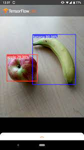
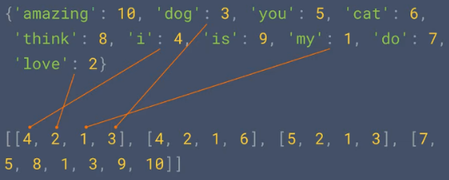
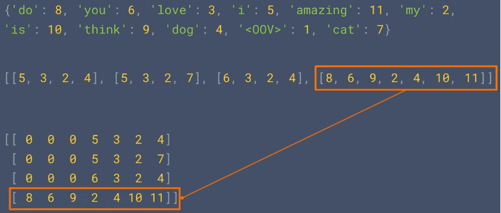
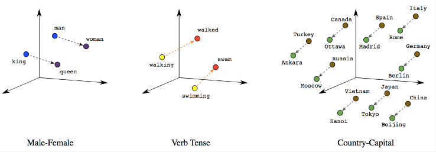
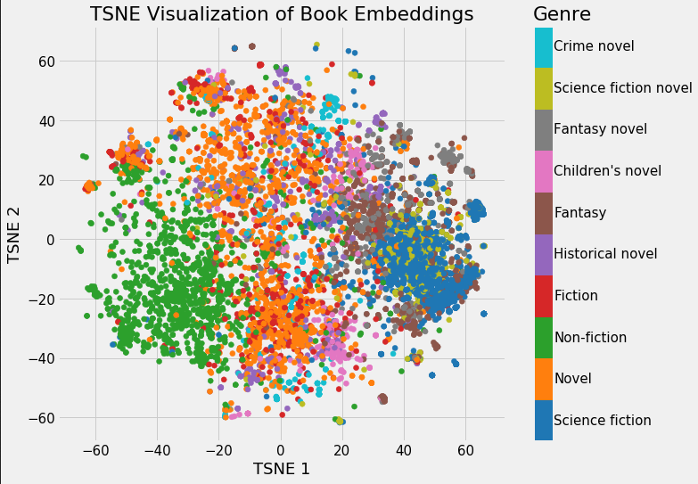

**Main Source :**

- **[Computer Vision: Crash Course Computer Science #35](https://youtu.be/-4E2-0sxVUM?si=esiowhAGazbKCE69)**
- **[Natural Language Processing (NLP) Zero to Hero - TensorFlow](https://youtube.com/playlist?list=PLQY2H8rRoyvzDbLUZkbudP-MFQZwNmU4S&si=OiQ5WW7RD5bJ0UZ8)**

**Computer Vision (CV)** and **Natural Language Processing (NLP)**, they are two common applications of deep learning. While traditional machine learning techniques are capable of these tasks, deep learning model is often used to capture the pattern of complex data. This notes explain the big idea of these two task.

### Computer Vision (CV)

**Computer Vision (CV)** is the study of enabling computer to understand and analyze visual data such as images and videos. Computer vision uses various algorithm from traditional technique like [image filters](/computer-graphics/signal-processing#image-filters) to a more advanced technique that uses deep learning.

:::note
Common deep learning architecture for CV: [CNN](/deep-learning/cnn), [ResNet](/deep-learning/resnet), and [GAN](/deep-learning/gan).
:::

#### Image Detection

The idea of computer recognizing image is achieved through identifying via color of the image. For example, image below shows a simple image detection that detects whether an object is apple or banana. This is very simple because these two object have distinct color. Apple is red colored, while banana is yellow colored. Computer will scan the image color pixel by pixel, if it finds red-ish color, we can assume it's a apple.

  
Source : https://www.tensorflow.org/lite/examples/object_detection/overview

#### Edge Detection

Another technique of computer vision is to detect edge in an image. Edge detection can be useful to segment object in an image. For example, in self-driving cars, we need to distinguish between cars, pedestrians, road boundaries, and other obstacles.

Edge detection works by analyzing the change of color intensity between neighbouring pixel. A significant change might be an indication of edges or boundaries. This is typically done by converting the image into grayscale color first, this is useful to simplify intensity detection.

  
Source : https://www.semanticscholar.org/paper/Object-Detection-using-the-Canny-Edge-Detector-George-Lakshmi/fe51b808b33783bbde5dbf19f00c6f56c5dcd446

### Natural Language Processing (NLP)

**Natural Language Processing (NLP)** is a field of AI that focuses on the interaction between computers and human language. Deep learning technique can be applied to NLP, the idea is to turn human language into numbers that can be processed in the neural network.

:::note
Common deep learning architecture for NLP: [RNN](/deep-learning/rnn), [LSTM](/deep-learning/lstm), [GRU](/deep-learning/gru), and [Transformers](/deep-learning/transformers/transformers-intro).
:::

Here are the high-level overview of NLP :

1. **Tokenization** : Text, sound, or any form of human language data will be broken down into smaller units called **tokens**. Token are obtained from dividing a sentence into individual word. For example, the sentence "I love natural language processing" would be tokenized into the following tokens: ["I", "love", "natural", "language", "processing"]. Other component such as punctuation will be ignored.

2. **Numericalization** : This is the process of encoding each token to some number, to be able to be processed by the machine learning model. For example, if we have these token : ["apple", "banana", "orange"], we might assign indices like {"apple": 0, "banana": 1, "orange": 2}.

3. **Sequencing** : Sequencing is the process of turning sentences into data using the encoded token before. This image below illustrate how turning sentence into data looks like, it uses multi-dimensional array to separate each sentences.

     
   Source : https://youtu.be/r9QjkdSJZ2g?si=LZXkR6HOyXbVGNbO&t=90

   During the actual usage of the model, we may encounter words that are not present in the vocabulary. These words are referred to as OOV words. OOV words can arise due to several reasons, such as encountering new or rare words that were not seen during training, misspellings, slang, or domain-specific terminology.

   We may also pad out the sequence data with general value so it can be easily processed by the model.

     
   Source : https://youtu.be/r9QjkdSJZ2g?si=pGM_9okSjJR4Wxmp&t=295

4. **Embedding** : We now has produced a sequence of word in form of number, but how will the model actually understand what a word means? This is where **embedding** come, embedding is a technique that involves grouping together words that are similar or commonly used in similar contexts. The model won't understand a word, but at least it knows how to use these words.

   Word embedding are usually done by representing each word in a vector inside a vector space, where words with similar meanings or usage patterns are located close to each other. This way we can capture what is the meaning of a word while also having a numerical representation by representing it in vector.

     
   Source : https://towardsdatascience.com/a-guide-to-word-embeddings-8a23817ab60f?gi=fc122b70f34a

     
   Source : https://devopedia.org/word-embedding

5. **Deep Learning Model** : After all the preprocessing technique, we can now use the sequence of word in number as input for the deep learning model. The exact process of how will it works depends on the model architecture.
