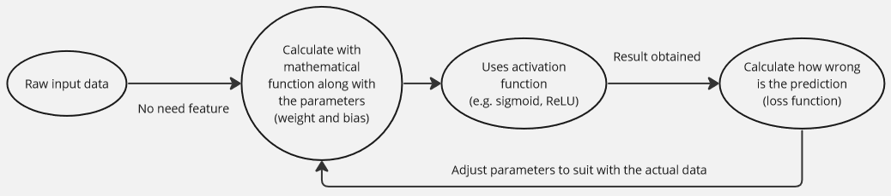
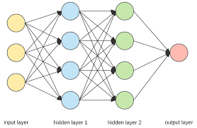
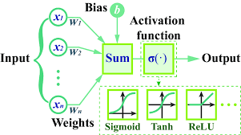
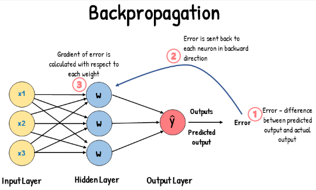

**Main Source :**

- **[Deep Learning Crash Course for Beginners - freeCodeCamp](https://youtu.be/VyWAvY2CF9c?si=qNn4Le63wJgabACo)**
- **[Backpropagation calculus | Chapter 4, Deep learning - 3Blue1Brown](https://youtu.be/tIeHLnjs5U8?si=SZTyeJz7utdJLjV8)**

### Neural Network Idea

In traditional machine learning, the features of the data needs to be extracted manually by the researcher. The process involve extracting relevant features and identifying relationship or patterns. After that, the data with the corresponding feature can be feed to the machine learning model.

**Neural Network** is a method of machine learning inspired by the human brain to teach computer without needing many human assistance. Neural network is able to learn automatically and capture the relationship and underlying patterns in the data.

A neural network is built upon a mathematical function that takes input data. This function has variables or parameters called weights and biases, which are used with input data to somehow suit with the actual data to make prediction.

In high-level, the network processes the input data by calculating the mathematical function with the given weights and biases. The resulting output is then compared to the actual data. The network measures how wrong the predictions are and aims to minimize this error by adjusting the weights and biases. The adjustment can use algorithm like [stochastic gradient descent](/deep-learning/deep-learning-foundation#stochastic-gradient-descent).

To capture complex relationships and patterns in the data, the network utilizes [activation functions](/deep-learning/deep-learning-foundation#activation-function). The process of calculating the mathematical function, utilizing activation functions, and adjusting the weights and biases is repeated multiple times during training. With each iteration, the network learns from its mistakes and updates the parameters to improve its predictions.

### Neural Network Architecture

A neural network consists several network called neuron, in each neuron will have connection between them. The overall architecture consists of several layer of neuron, including input layer, hidden layer, and output layer.

- **Input Layer** : The input layer receives the raw input data and passes it to next layer for further processing. The number of neuron in input layer represent the dimensionality of the input data.

- **Hidden Layers** : Hidden layers are intermediate layer between input and output layer. The hidden layer is the actual process in neural network, it involves recognizing patterns of the data and using mathematical function as explained before. It also applies activation function to decide if a specific result of a particular neuron matters to the prediction or not. Number of hidden layers and neuron in each layer can vary depending on the complexity of the problem. For example,

- **Output Layer** : The output layer produces the predictions based on the computations performed in the preceding layers. The number of neurons in the output layer depends on the nature of the task. For example, a binary classification task may have a single neuron in the output layer, representing yes or no.

    
   Source : https://towardsdatascience.com/everything-you-need-to-know-about-neural-networks-and-backpropagation-machine-learning-made-easy-e5285bc2be3a

### Neural Network Learning Process

#### Forward Propagation

Forward Propagation is where the input data is processed and forwarded into hidden layer and finally to output layer. This involves calculating mathematical function with the input data. The mathematical function used is $\Sigma \space  w_ix_i + b$, where $w_i$ is the weight, the weight for each neuron can be different with each other, $x_i$ is input data except for the further layer, the $x_i$ is the result from previous layer, and $b$ is bias.

Basically the neuron in the front will receive input from all the neuron in the previous layer, it will use the above formula, multiply each input with weight and sum up all the result with additional value from bias.

The result is represented as $z$ :  
$z = (w_1 \cdot x_1) + (w_2 \cdot x_2) + ... + (w_n \cdot x_n) + b$

After that, the $z$ (called weighted sum) will be applied to activation function resulting in another variable called $a$ : $a = f(z)$. The activation function can vary depending on the use case, for example, if we use sigmoid function : $a = \sigma(z)$.

  
Source : https://www.researchgate.net/figure/The-forward-propagation-of-a-neural-network-a-the-operating-process-of-neural-networks_fig1_355876971

The weight is the coefficient of corresponding input data, it can be interpreted as how important is the neuron. The bias term is used to shift the activation function (similar to how we shift function in algebra), it controls how the function behave filtering a specific neuron.

#### Backpropagation

Backpropagation or backward pass is where all the learning process occurs. After getting result from all the preceding layers, the output layers is used to predict. The prediction will then be compared with actual data, the difference will be calculated in some [loss function](/deep-learning/deep-learning-foundation#loss-function).

Same like traditional machine learning, we want to minimize the loss function, we can use the same principle as using [gradient descent to minimize the loss in linear regression](/machine-learning/linear-regression#gradient-descent), where we calculate the gradient of the loss function with respect to slope and y-intercept. Remember that gradient shows us which direction to go to the minima of the loss function.

Backpropagation process is similar with some difference, it relies on principles of calculus, specifically the chain rule.

The gradient of loss function will be calculated with respect to weight and bias. The weight affects the $z$ variable before $wx + b$ and the $z$ itself affects the $a$ variable which is $z$ applied to activation function. The $a$ variable is the output from the previous layer and used to predict, which means it affect the loss function and it is the actual things we take the gradient of.

This is where the chain rule comes, it allows us to decompose the contribution of weight to the loss function. The same also applies for calculating gradient of loss function with respect bias.

The output layer get its result from the preceding layer, it is affected by the previous layer. The previous layer itself is also based on the previous layer again, this is why its called backward pass, as it will adjust each weight and biases on each neuron of the preceding layers.

After calculating the gradient, now it's time to adjust of weight and bias. The adjustment is similar to the traditional linear regression, but now we adjust for weight and bias instead of slope and y-intercept. We can also use algorithm like [stochastic gradient descent](/deep-learning/deep-learning-foundation#stochastic-gradient-descent).

For example, after predicting, the loss function calculated results in a large value. The loss function is affected by specific neuron on the previous layer, basically that particular neuron "messed up" our prediction. By calculating the gradient of weight and bias and adjusting it based on the optimization algorithm, we can controls the behavior of that particular neuron. We can make the weight smaller to indicate that neuron shouldn't contribute much to our prediction or we can adjust the bias so that the activation function can decide whether to contribute the output of that neuron to the next layers or not.

This learning process will be repeated for many times based on the hyperparameter (e.g. batch, epoch, iteration).

  
Source : https://www.analyticsvidhya.com/blog/2023/01/gradient-descent-vs-backpropagation-whats-the-difference/

### Conclusion/addition
