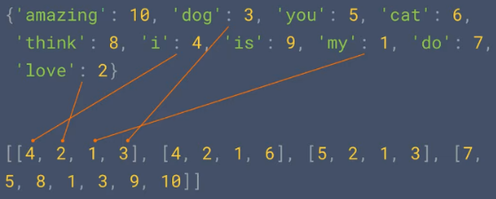
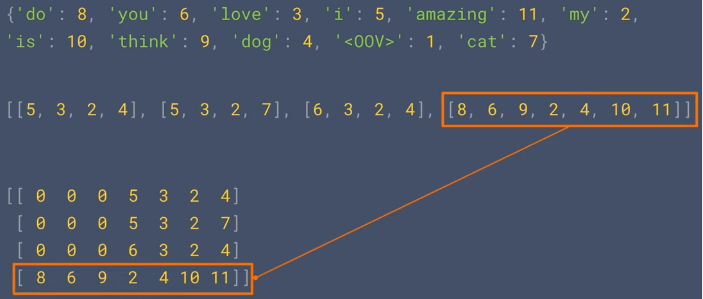

**Natural Language Processing (NLP)** is a field of AI that focuses on the interaction between computers and human language. Deep learning technique can be applied to NLP, the idea is to turn human language into numbers that can be processed in the neural network.

### NLP Process

1. **Tokenization** : Text, sound, or any form of human language data will be broken down into smaller units called **tokens**. Token are obtained from dividing a sentence into individual word. For example, the sentence "I love natural language processing" would be tokenized into the following tokens: ["I", "love", "natural", "language", "processing"]. Other component such as punctuation will be ignored.

2. **Numerical Encoding** : This is the process of encoding each token to some number, to be able to be processed by the machine learning model. For example, if we have these token : ["apple", "banana", "orange"], we might assign indices like {"apple": 0, "banana": 1, "orange": 2}.

3. **Sequencing** : Sequencing is the process of turning sentences into data using the encoded token before. This image below illustrate how turning sentence into data looks like, it uses multi-dimensional array to separate each sentences.

     
   Source : https://youtu.be/r9QjkdSJZ2g?si=LZXkR6HOyXbVGNbO&t=90

   During the actual usage of the model, we may encounter words that are not present in the vocabulary. These words are referred to as OOV words. OOV words can arise due to several reasons, such as encountering new or rare words that were not seen during training, misspellings, slang, or domain-specific terminology.

   We may also pad out the sequence data with general value so it can be easily processed by the model.

     
   Source : https://youtu.be/r9QjkdSJZ2g?si=pGM_9okSjJR4Wxmp&t=295

  
Source : https://towardsdatascience.com/a-guide-to-word-embeddings-8a23817ab60f?gi=fc122b70f34a

### All pages

- [RNN](natural-language-processing/rnn)
- [LSTM](natural-language-processing/lstm)
- [GRU](natural-language-processing/gru)
- [Transformers (NLP)](natural-language-processing/transformers-nlp)
  - [example 1](natural-language-processing/transformers-nlp/example1)
- [LLM](natural-language-processing/llm)
  - [GPT](natural-language-processing/llm/gpt)
