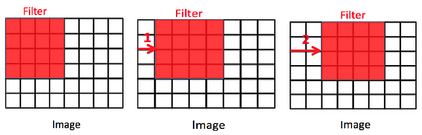

**Main Source :**

- [Deep learning lesson 8 - fast.ai](https://youtu.be/htiNBPxcXgo?si=qlgBDGouIRZRMArx)

**Convolutional Neural Network(CNN)** is a type of [neural network](/deep-learning/neural-network) that is specifically designed for processing grid-like data such as images.

### Convolution

Convolution is the process of combining two function to produce a third function. In the context of image processing, a mathematical function will be applied to an image and it will produce another image.

The function applied to image is called **kernel** or **[filters](/computer-graphics/signal-processing#image-filters)**. The function is a small square matrix with some numerical values. Convolution operation is when the kernel is applied to image by sliding it and performing a multiplication (dot product) between the number in matrix and the pixel value in the image. The resulting product wil be summed up and it will result in another image.

  
Source : https://towardsdatascience.com/computer-vision-convolution-basics-2d0ae3b79346

Following the nature of dot product, the choice of values in matrix will determine the result of convolution process. For example, the sharpen filters has high value in the central pixel and negative values in the neighbouring pixels. This enhances the difference between central pixel and its neighbours, making it receive higher emphasis leading to a sharpened appearance.

  
Source : https://en.wikipedia.org/wiki/Kernel_(image_processing)

#### Stride

While doing convolution, we can adjust how the process is done. **Stride** is the hyperparameter used to determine the movement of the kernel while doing the convolution operation, it can be thought as the step size.

Like the image below, stride is used to skip some pixel value, this will make the resulting image size different.

  
Source : https://www.codingninjas.com/studio/library/convolution-layer-padding-stride-and-pooling-in-cnn

### CNN

#### Pooling

Pooling is the process of downsampling or reducing the dimension of features. Color of image is considered as features, as it provide information about image. In the case of CNN, pooling is done to reduce the image size, this is done by taking the representation of image. Example of pooling technique is the max-pooling, which takes the largest values in a region.

Reducing the features is useful in CNN to help it focuses on some patterns and relationship between features.

  
Source : https://www.geeksforgeeks.org/cnn-introduction-to-pooling-layer/

#### Dense Layer
#### Dropout

dropout is a techinique to "deactivate" some neuron in cnn. dropout works by discarding some random color in an image. the idea of dropout is, we human, still able to recognize corrupted image like below. Computer should also know how to recognize these.

Image classification example

### ResNet
