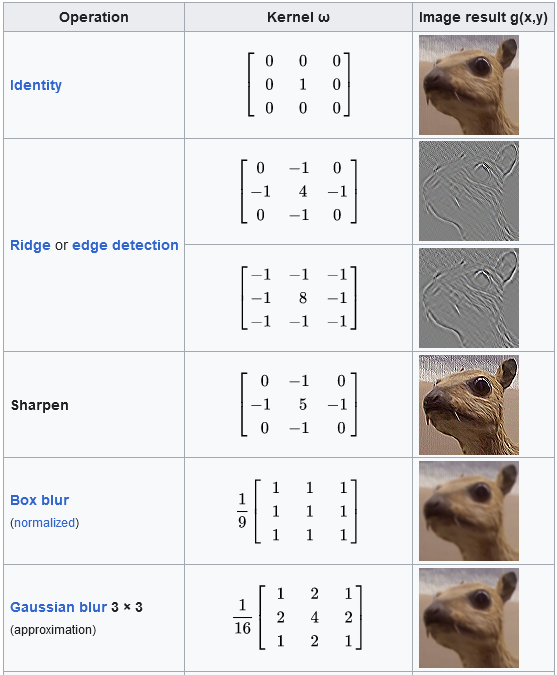
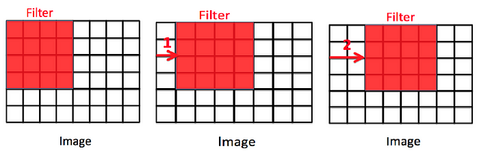
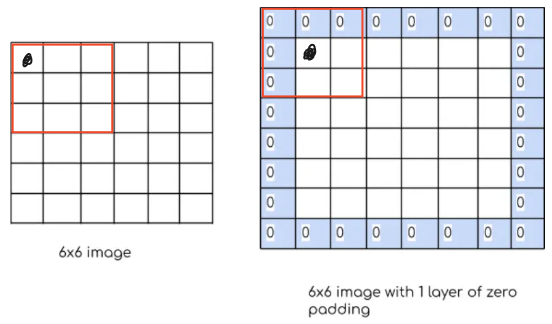
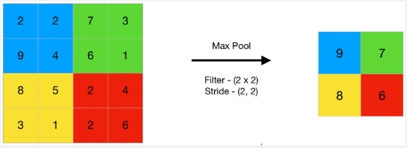
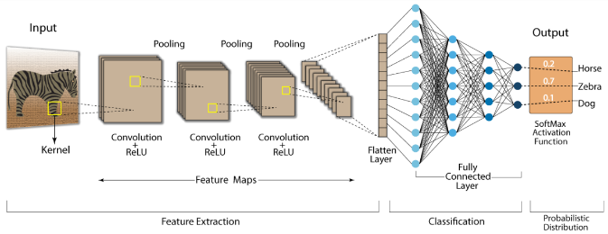
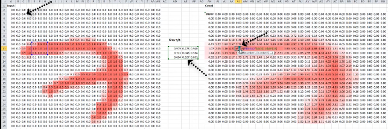
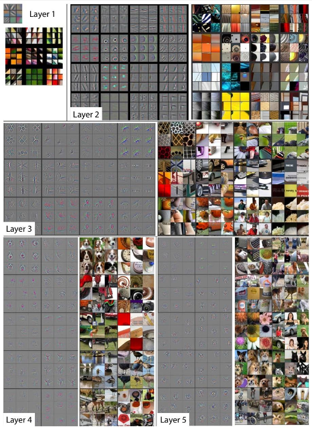
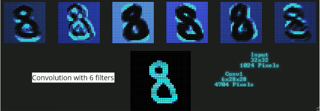
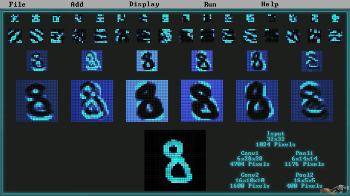
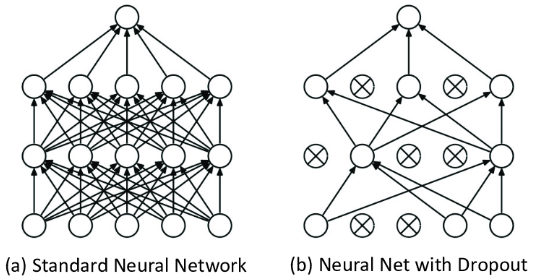

**Main Source :**

- **[Deep learning lesson 8 - fast.ai](https://youtu.be/htiNBPxcXgo?si=qlgBDGouIRZRMArx)**
- **[Convolutional Neural Networks (CNNs) explained - deeplizard](https://youtu.be/YRhxdVk_sIs?si=Y3nwjS7h7hPpLCKa)**
- **[CNN: Convolutional Neural Networks Explained - Computerphile](https://youtu.be/py5byOOHZM8?si=vOrMlnIPxELIyORA)**

**Convolutional Neural Network(CNN)** is a type of [neural network](/deep-learning/neural-network) that is specifically designed for processing grid-like data such as images.

### Convolution

Convolution is the process of combining two function to produce a third function. In the context of image processing, a mathematical function will be applied to an image and it will produce another image.

The function applied to image is called **kernel** or **[filters](/computer-graphics/signal-processing#image-filters)**. The function is a small square matrix with some numerical values. Convolution operation is when the kernel is applied to image by sliding it and performing a multiplication (dot product) between the number in matrix and the pixel value in the image. The resulting product wil be summed up and it will result in another image.

  
Source : https://towardsdatascience.com/computer-vision-convolution-basics-2d0ae3b79346

Following the nature of dot product, the choice of values in matrix will determine the result of convolution process. For example, the sharpen filters has high value in the central pixel and negative values in the neighbouring pixels. This enhances the difference between central pixel and its neighbours, making it receive higher emphasis leading to a sharpened appearance.

  
Source : https://en.wikipedia.org/wiki/Kernel_(image_processing)

#### Stride

While doing convolution, we can adjust how the process is done. **Stride** is the hyperparameter used to determine the movement of the kernel while doing the convolution operation, it can be thought as the step size.

Like the image below, stride is used to skip some pixel value, this will make the resulting image size different.

  
Source : https://www.codingninjas.com/studio/library/convolution-layer-padding-stride-and-pooling-in-cnn

#### Padding

Another hyperparamter of convolution is padding. Padding is additional pixel added around the image. The pixels at border have less neighbour than other pixels in the center, this can make the resulting image biased towards the central pixels. By adding padding, pixels in the border can be more balance.

Another purpose is to reduce information loss, while applying kernel to the image, the border pixels can't be on the center of the kernel, this can result in information loss at the borders.

  
Source : https://www.numpyninja.com/post/how-padding-helps-in-cnn (with modification)

#### Pooling

Pooling is the process of downsampling or reducing the dimension of features. Color of image is considered as features, as it provide information about image. In the case of CNN, pooling is done to reduce the image size, this is done by taking the representation of image. Example of pooling technique is the max-pooling, which takes the largest values in a region.

Reducing the features is useful in CNN to help it focuses on some patterns and relationship between features.

  
Source : https://www.geeksforgeeks.org/cnn-introduction-to-pooling-layer/

### CNN

CNN is specialized type of neural network used for image analysis, CNN typically consists of 4 different layer. Same as traditional neural network, these layer are connected together and will pass its result to next layer.

- **Input Layer** : Input of CNN is an image in the form of number which is the representation of the image color. Input layer typically expect : [batch_size, channels, width, height], where width and height is the size of image, channels represent how many color channel in the image (e.g. RGB image means 3 channel), and batch_size is the number of image processed together in a single forward and backward pass.

- **Convolutional Layer** : Which is the layer that performs convolution operation explained above. So instead of multiplying input data by weights as we did in traditional neural network, CNN does convolution process to the input data which is the image in numerical representation then pass it onto the next layer that does convolution again. The convolution layer may also include an [activation function](/deep-learning/deep-learning-foundation#activation-function).

- **Pooling Layer** : Pooling layer that does the pooling process to reduce the image dimension. The pooling layer reduce image size but it also take the representation of the overall image. Each neuron in pooling layer will capture different representation of image depending on the input.

- **Fully Connected Layer** : The fully connected layers are the same layers as the traditional neural network. After extracting the information from image from convolution and pooling layer, this layer is responsible for making prediction.

  
Source : https://developersbreach.com/convolution-neural-network-deep-learning/

#### Convolution

The input data will be an image in the form of its pixel colors. Convolution process will be done into the input data, however, the filter used here is a matrix that consist of random numbers. The convolution process is the same as above explanation, this will produce another image.

These filter allows us to detect low-level patterns. The first convolution process may won't be able to capture important patterns or features. However, these numbers will be adjusted later to improve the detection.

  
Source : https://youtu.be/YRhxdVk_sIs?si=ZLAexy3x4VYMjQ0E&t=347

Some of the filters in the convolution maybe are supposed to detect edges, other may supposed to detect curve, and etc.

  
Source : https://www.analyticsvidhya.com/blog/2022/03/basic-introduction-to-convolutional-neural-network-in-deep-learning/

The number of output image depends on the number of filter use. When we say 32 filter, this mean we have 32 distinct matrix with its own numbers. Each filter will be applied to the image, therefore producing 32 different image, the result is called **feature maps** as it is actually not a separate image, just a different form of image. (note: each conv layer can have different number of filter)

When we connect the layer together, we may have than 1 input image or feature maps. In this case, the convolution process works by applying a single filter in the next layer to all the feature maps from the previous layer, and the results are summed to generate a single feature map. This process is repeated for each filter in the second layer.

The notation for convolution layer is (numberOfFilter x imageWidth x imageHeight). The input image image is typically separated by its color channel, so red, green, and blue color of the image is processed separately.

  
Source : https://youtu.be/pj9-rr1wDhM?si=-7Fnrb2DpTa71Jo8&t=450

#### Pooling

Pooling is done to reduce the image dimension, which also reduces the features of the image. It can be thought as summarizing the whole image in a smaller dimension that consist of pixel that represent the overall image or called **feature extraction**.

This layer doesn't have adjustable parameters, it is a fixed process.

  
Source : https://youtu.be/pj9-rr1wDhM?si=-7Fnrb2DpTa71Jo8&t=450

#### Prediction

After receiving result from the last layer convolution or pooling layer, the fully connected layer will make prediction. The result from previous layer will first be flattened into one-dimensional vector. This will combine the result from all the filter that does different detection.

From now on, how will the network works is same as traditional neural network, it consist of weight, bias, and activation function. After reaching the last layers, it can now make prediction. In this step, [loss function](/deep-learning/deep-learning-foundation#loss-function) will be calculated, the specific function depends on the task.

After calculating the loss, it's time for the model to learn with backpropagation technique. Gradient of the loss function will be calculated with respect to each parameters, including fully connected layer weights and the coefficient in the filter matrix. Gradients with respect to the filters are calculated and used to update the filter weights.

The input in the fully connected layer is based on the previous layer, the previous layer is also based on the previous layer, backward pass will be done adjusting all adjustable parameter.

#### Dropout

**Dropout** is a data augmentation techinique to reduce overfitting in neural network by deactivating some neuron in the layer. Dropout can be thought as discarding some random color in an image. The idea of dropout is, we human, still able to recognize corrupted image. Computer should also know how to recognize these.

  
Source : https://www.researchgate.net/figure/9-An-illustration-of-the-dropout-mechanism-within-the-proposed-CNN-a-Shows-a_fig23_317277576
