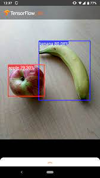
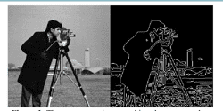

**Source Below : [Computer Vision: Crash Course Computer Science #35](https://youtu.be/-4E2-0sxVUM?si=esiowhAGazbKCE69)**

**Computer Vision** is the study of enabling computer to understand and analyze visual data such as images and videos. Computer vision uses various algorithm from traditional technique like [image filters](/computer-graphics/signal-processing#image-filters) to a more advanced technique that uses deep learning.

#### Image Detection

The idea of computer recognizing image is achieved through identifying via color of the image. For example, image below shows a simple image detection that detects whether an object is apple or banana. This is very simple because these two object have distinct color. Apple is red colored, while banana is yellow colored. Computer will scan the image color pixel by pixel, if it finds red-ish color, we can assume it's a apple.

  
Source : https://www.tensorflow.org/lite/examples/object_detection/overview

#### Edge Detection

Another technique of computer vision is to detect edge in an image. Edge detection can be useful to segment object in an image. For example, in self-driving cars, we need to distinguish between cars, pedestrians, road boundaries, and other obstacles.

Edge detection works by analyzing the change of color intensity between neighbouring pixel. A significant change might be an indication of edges or boundaries. This is typically done by converting the image into grayscale color first, this is useful to simplify intensity detection.

  
Source : https://www.semanticscholar.org/paper/Object-Detection-using-the-Canny-Edge-Detector-George-Lakshmi/fe51b808b33783bbde5dbf19f00c6f56c5dcd446

### All pages

- [CNN](computer-vision/cnn)
- [GAN](computer-vision/gan)
- [Stable Diffusion](computer-vision/stable-diffusion)
