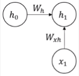
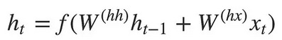
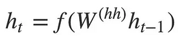
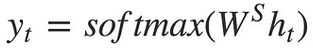
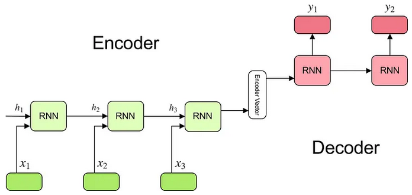

**Main Source :**

- **[Pengenalan RNN (Recurrent Neural Network) - Anak AI](https://youtu.be/2GgGu6kMSqE?si=GiV5lSch1BvTjJXU)**
- **[Illustrated Guide to Recurrent Neural Networks: Understanding the Intuition - The A.I. Hacker - Michael Phi](https://youtu.be/LHXXI4-IEns?si=OhEctrxL4P6svPoP)**
- **[Understanding Encoder-Decoder Sequence to Sequence Model by Simeon Kostadinov - Medium](https://towardsdatascience.com/understanding-encoder-decoder-sequence-to-sequence-model-679e04af4346)**

**Recurrent Neural Network (RNN)** is a type of [neural network](/deep-learning/neural-network) specifically designed for processing sequential data or data that needs to be processed in specific order such as [NLP](/deep-learning/deep-learning-tasks#natural-language-processing-nlp) data.

The goal of NLP is to understand, interpret, or generate human language. In natural languages, each words, phrase, and sentences depend on each other. Without processing them in order, we would loss important context or information.

Consider this sentence : "The movie is not good, but I liked it after the first half."
If the words are processed in an unsequential manner, the model might only focus on the negative sentiment of "not good" and miss the positive "liked it."

### Limitation of Neural Network

Traditional neural network is not capable of processing sequential data :

- **Lack of Memory** : Neural networks takes an input data, process it, and output a result, they do not have memory or the ability to remember information from previous steps. We can't use it to remember words that we have processed before, each input is treated independently.

- **Fixed Input Size** : They expect a fixed-size inputs. Processing sequences of words with various lengths becomes challenging.

- **Inability to Capture Long-Term Dependencies** : This is related to the [vanishing gradient problem](/deep-learning/neural-network#vanishing-gradient-problem), when processing a sequence, each input is treated independently without considering the relationship with previous inputs. As the sequence length increases, the influence of earlier inputs on the current prediction diminishes as the network keep learning new information and forget the older one.

- **Parameters** : Indepenent input causes another issue, because they are independent, it means each word will have different parameters. As the network receive many input, the network will also need many parameter, making it computationally expensive.

In natural langauge, there are many word that may have different meaning depending on the context. For example, the word "bank" have three different meaning, place where people deposit and withdraw money, side of a river, or an action of bouncing a ball off the backboard in basketball.

This makes the word "bank" has different parameter depending on another input.

### RNN Architecture

RNN introduces the concept of **recurrent connection**, which enable the network to maintain memory or context of previous inputs. This is done by combining the output from previous steps with the new input from current steps. This process will be repeated for each input in the sequence. The output from previous steps can be thought as the context for current steps, this way we can process the input dependently.

#### RNN Process

The concept of memory or output from previous step is stored in something called **hidden state**. It represents the network's memory or internal representation of the information it has encountered in previous time steps.

1. **Input to hidden state** : First, RNN takes an input data. The input will be multiplied by an **Input-to-Hidden** weight ($W_{xh}$).

     
   Source : https://youtu.be/2GgGu6kMSqE?si=qTrSLRydaD2AMiTS&t=58

2. **Combined with previous hidden state** : As explained before, we will combine the result of current state with the previous state. The previous hidden state will be multiplied by another weight called **Hidden-to-Hidden** weight ($W_h$). If we are at the starting point, the previous hidden state which is $h_0$ can be 0.

     
   Source : https://youtu.be/2GgGu6kMSqE?si=qTrSLRydaD2AMiTS&t=58

3. **Bias term & activation function** : The result from step 1 and 2 along with a bias term (**hidden bias** [$b_h$]) will be added together and goes into some activation function (e.g. tanh). The result of it define the current hidden state ($h_1$).

     
   Source : https://youtu.be/2GgGu6kMSqE?si=qTrSLRydaD2AMiTS&t=58

4. **Result of a time step** : A single time step represent the single processing of an input with its hidden state. The result of a time step is produced by multiplying the current hidden state ($h_1$) with the **Hidden-to-Output** weight ($W_{hy}$), added with another bias term (output bias [$b_y$]), and transformed into another activation function.

     
   Source : https://youtu.be/2GgGu6kMSqE?si=qTrSLRydaD2AMiTS&t=58

This will be repeated together for each input in the sequence, the architecture can also be simplified with a loop. As each time step produces output, which output to use depend on the task. For example, in a text interpretation task, the output used may be the last output considering it contains the most information from all the sequence.

It doesn't have to be the last output, another mechanism called **[attention](/deep-learning/transformers/attention-mechanism)** captures the only important or relevant information, which isn't always the last.

  
Source : https://youtu.be/2GgGu6kMSqE?si=XuJlH_-vVmjZQeup&t=164

The learning process of RNN is similar to traditional neural network. It differs in the backpropagation process. First, it calculates the loss at the last output after the prediction. The gradient of loss function will be calculated with respect to RNN parameters that takes account each input and their hidden state. This process is called **Backpropagation Through Time (BPTT)** since it involves propagating the gradients backward through the entire sequence of time steps.

  
Source : https://dennybritz.com/posts/wildml/recurrent-neural-networks-tutorial-part-3/

### Vanishing Gradient

Same as the traditional neural network, RNN still run into the vanishing gradient problem. The gradients used to update the RNN's parameters during backpropagation diminish exponentially as they propagate from the output layer to the earlier layers. This makes learning slower and also making it difficult to learn long-term dependencies.

  
Source : https://youtu.be/LHXXI4-IEns?si=BnLAKYkQ54MRrH_l&t=505

### Type of RNN

There are type of RNN architecture based on how many input and output are involved.

- **One to One** : Takes one input and produce one output at a single time step
- **One to Many** : Only takes a single input but still produce many output
- **Many to One** : Takes many input but only produce single output at the last time step
- **Many to Many** : The number of input is same as the number of output

  
Source : https://iq.opengenus.org/types-of-rnn/

### RNN Encoder-Decoder

A standard RNN (the one explained above) is suited for tasks that involve taking an input and outputting a specific element. The example of the tasks are sequence classification or sentiment analysis where we predict or classify the input into some label, such as classifying whether a review is positive or negative or predicting a single word that will come up next.

**RNN Encoder-Decoder** is an architecture designed for sequence-to-sequence tasks, where the input and output sequences have different lengths or meanings. Examples include machine translation, text summarization, or chatbot systems. Using standard RNN for task like translation wouldn't always work, as human language can't be translated word by word.

The architecture consist of an **encoder** and a **decoder**. The encoder is the one that takes input and responsible for summarizing the input information. The decoder takes the summarized input and generates the output sequence, this is done step by step just like standard RNN, where current step depends on previous output.

In high level, this is the process of RNN encoder-decoder architecture :

1. **Encoder takes input** : As explained before, encoder is the one that summarizes or captures the input. The encoder can be a standard RNN model, the output of it or the final hidden state can be thought as the summarized information from the input sequence. The output of encoder is often called **context vector**.

   The formula for hidden state inside is :

     
   Source : https://towardsdatascience.com/understanding-encoder-decoder-sequence-to-sequence-model-679e04af4346

   Hidden state is calculated by considering the previous hidden state, which is multiplied by the **hidden-to-hidden weight** ($W^{(hh)}$), added with the current input multiplied by **hidden-to-input weight** ($W^{(hx)}$), also fed into activation function.

2. **Decoder initialization** : The decoder can also be a standard RNN model, the context vector serve as the initial hidden state. The decoder however, doesn't take additional input, it simply calculates current hidden state from the previous hidden state. In the formula below, the second term from the encoder's formula is removed.

     
   Source : https://towardsdatascience.com/understanding-encoder-decoder-sequence-to-sequence-model-679e04af4346

   Each decoder connection produces output at time step $t$, it will stop producing an output or final output will be generated when a token called **end-of-sequence (EOS)** is produced that marks as the completion of the output sequence.

     
   Source : https://towardsdatascience.com/understanding-encoder-decoder-sequence-to-sequence-model-679e04af4346

   The output multiplies hidden state at time $t$ with some weight and it goes into the [softmax activation function](/deep-learning/neural-network#softmax-activation-function).

Overall, RNN encoder-decoder is basically just two RNN working together, with one component serve as the one that captures information and the other component serve as the one that keep producing output until the desired sequence is produced.

  
Source : https://towardsdatascience.com/understanding-encoder-decoder-sequence-to-sequence-model-679e04af4346

:::note
By standard RNN model, it can also be other type of RNN like [LSTM](/deep-learning/lstm) and [GRU](/deep-learning/gru).
:::
