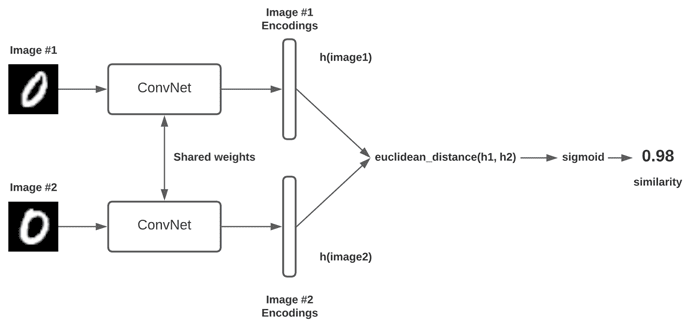
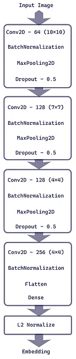
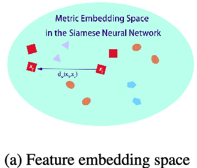
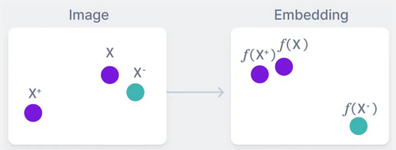
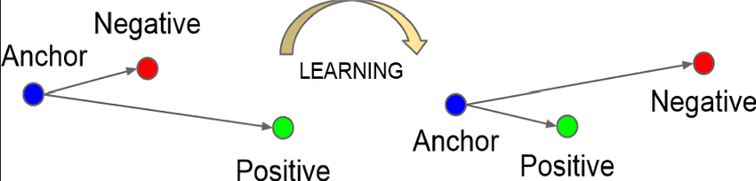

**Main Source:**

- **[C4W4L03 Siamese Network — DeepLearningAI](https://youtu.be/6jfw8MuKwpI?si=5bIxLyoAe8QQ_bBS)**
- **[Illustrated Guide to Siamese Network by Pranjal Gupta — Medium](https://towardsdatascience.com/illustrated-guide-to-siamese-network-3939da1b0c9d)**
- **[Triplet Loss: Intro, Implementation, Use Cases](https://www.v7labs.com/blog/triplet-loss)**
- **[Siamese Networks Introduction and Implementation by Aditya Dutt — Medium](https://towardsdatascience.com/siamese-networks-introduction-and-implementation-2140e3443dee)**

**Siamese Network** is a type of [neural network](/deep-learning/neural-network) architecture designed to compare and measure similarity between pair of input data, one of the use case is to verify signature like fingerprint.

### Basic Idea

The basic idea of how siamese network works is there will be two identical network, called **twins** or **branches** which has the shared weights and architecture. The input data will go into both twins, the network will process it and give the input some score based on its features. If the score are close, it means they are similar, and vice versa.

The pair of input will be provided along with the label (whether they are similar or not), the network will adjust its parameters to make sure similar input will also have similar score.

  
Source: https://pyimagesearch.com/2020/11/30/siamese-networks-with-keras-tensorflow-and-deep-learning/

### Architecture

Siamese networks share the same architecture, if the task is to recognize similar image, then they will have the identical [convolutional networks](/deep-learning/cnn). The convolution network will flatten its data at the last layer before it goes into the fully-connected layer, same as the original CNN. However, the classifier in the fully-connected layer will not be included. It will go into the next layer called **embedding layer**.

#### Embedding Layer

This is where we give each input its corresponding score, it works by mapping the input data with many features into a lower-dimensional space so that the similarity can be easily measured.

The input which comes from the previous layer will be represented in vectors. They will be transformed into vector by applying a normalization operation, which is an operation to transform data into some scale. The normalization is called **L2 normalization** or **Euclidean normalization**.

This process is also called **image encoding**, where we transform input into a compact representation or embedding that captures its charateristics. The embedding process is similar to the embedding in [NLP](/deep-learning/deep-learning-tasks#natural-language-processing-nlp).

  
Source: https://towardsdatascience.com/illustrated-guide-to-siamese-network-3939da1b0c9d

#### Calculating Distance

After they are represented in a lower-dimensional space, the inputs are compared in the space using technique like **Euclidean distance** or **cosine similarity**. The result distance is the measure of how similar are the input, the model will predict by categorizing the input as similar or not similar based on some threshold.

After the prediction is done, the learning process will be the same as traditional network which includes loss calculation, backpropagation, and parameters update. The goal is to make our embedding better, we should map similar samples to have small distances between their embeddings and dissimilar samples to have large distances.

  
Source: https://www.researchgate.net/figure/Improving-the-similarity-distance-in-an-embedding-space_fig1_346902941

### Triplet-based Siamese Network

There is a variant of siamese network called **triplet-based Siamese network**, which uses 3 types of sample in the training process.

- **Anchor**: Specific sample that serves as the reference point for comparison.
- **Positive**: Positive sample is the input which is a similar to the anchor.
- **Negative**: Negative sample is the input which is not similar to the anchor.

Compared to standard siamese network, the triplet-based approach provides a more fine-grained learning signal. It enables the network to learn to rank or order examples based on their similarity to the anchor, rather than just predicting similar or not. By using the anchor as a reference, the network can learn to focus on the specific characteristics that distinguish positive examples from negative examples.

In this context, a good embedding mean that we successfully map the positive sample and the anchor sample close while the negative is distinguished from these two.

  
Source: https://www.v7labs.com/blog/triplet-loss

#### Triplet Loss

The loss function used for triplet-based siamese network is called the **triplet loss**. It involve calculating the distance of positive and negative sample with the anchor point. Triplet loss measure how correct our embedding is, we will aim to minimize the loss. We will minimize the distance between positive and anchor while maximizing the distance between negative and the anchor.

The formula for triplet loss is:

$L = \text{max}(d(A, P) - d(A, N) + \text{margin}, 0)$

Where:

$d(A, P)$: Distance between anchor and positive example in the embedding space.  
$d(A, N)$: Distance between anchor and negative example in the embedding space.  
margin: Hyperparameter that defines the minimum desired difference between the distances of the anchor-positive pair and the anchor-negative pair.

  
Source: https://www.researchgate.net/figure/Distances-among-anchor-positive-and-negative-samples-during-training-using-Siamese_fig2_358019630

#### Triplet Mining

Triplet mining is the strategy used in triplet-based networks to select which dataset should we choose as the anchor, positive, or negative sample. The goal is to find the dataset that contribute the most to the learning process.

It can be categorized into two based on when the triplet is generated:

- **Online Mining**: Dynamically generates triplets sample during training process, we can adapt the samples to suit the model performance.
- **Offline Mining**: Pre-selected before the training process, it will be more efficient.

Three category based on how hard is the train triplet:

- **Hard Triplet Mining**: Negative sample is closer to anchor than the positive.
- **Semi-Hard Triplet Mining**: Negative is close to the anchor, but not a zero distance.
- **Easy Triplet Mining**: Positive sample is close to anchor while negative is far.
- **Random Triplet Mining**: Randomly selected without considering their distance.
